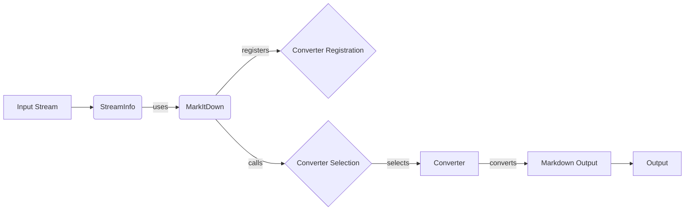

```markdown


**Component: Input Stream**
*Description*: Represents the input data to be converted. This can be a file, a URI, or a stream of data.
*Interaction*: Provides the initial data to the `StreamInfo` component.
*Relevant source files*:
N/A

**Component: StreamInfo**
*Description*: Stores metadata about the input stream, such as mimetype, extension, and encoding. This information is used to select the appropriate converter.
*Interaction*: Receives the input stream and provides metadata to the `MarkItDown` component.
*Relevant source files*:
[repos.markitdown.packages.markitdown.src.markitdown._stream_info.StreamInfo](https://github.com/CodeBoarding/GeneratedOnBoardings/blob/main/markitdown//Stream%20Information%20Handling.md)

**Component: MarkItDown**
*Description*: The main class responsible for orchestrating the conversion process. It manages converter registration, stream information handling, and invokes the selected converter.
*Interaction*: Receives `StreamInfo`, registers converters from `Converter Registration`, selects a converter from `Converter Selection`, and calls the selected `Converter`.
*Relevant source files*:
[repos.markitdown.packages.markitdown.src.markitdown._markitdown.MarkItDown](https://github.com/CodeBoarding/GeneratedOnBoardings/blob/main/markitdown//Core%20Conversion%20Engine.md)

**Component: Converter Registration**
*Description*: Stores the registered converters and their priorities. This allows `MarkItDown` to select the most appropriate converter for a given input stream.
*Interaction*: Receives converter registrations from `MarkItDown`.
*Relevant source files*:
N/A

**Component: Converter Selection**
*Description*: Selects the appropriate converter based on the stream information. It iterates through the registered converters and calls the `accepts` method of each converter until a suitable converter is found.
*Interaction*: Receives stream information from `MarkItDown` and selects a `Converter`.
*Relevant source files*:
N/A

**Component: Converter**
*Description*: Performs the actual conversion of the input stream to markdown. Each converter is responsible for handling a specific file type.
*Interaction*: Receives the input stream from `Converter Selection` and produces markdown output.
*Relevant source files*:
[repos.markitdown.packages.markitdown.src.markitdown.converters._plain_text_converter.PlainTextConverter](https://github.com/CodeBoarding/GeneratedOnBoardings/blob/main/markitdown//Converters.md),
[repos.markitdown.packages.markitdown.src.markitdown.converters._zip_converter.ZipConverter](https://github.com/CodeBoarding/GeneratedOnBoardings/blob/main/markitdown//Converters.md),
[repos.markitdown.packages.markitdown.src.markitdown.converters._html_converter.HtmlConverter](https://github.com/CodeBoarding/GeneratedOnBoardings/blob/main/markitdown//Converters.md),
[repos.markitdown.packages.markitdown.src.markitdown.converters._rss_converter.RssConverter](https://github.com/CodeBoarding/GeneratedOnBoardings/blob/main/markitdown//Converters.md),
[repos.markitdown.packages.markitdown.src.markitdown.converters._wikipedia_converter.WikipediaConverter](https://github.com/CodeBoarding/GeneratedOnBoardings/blob/main/markitdown//Converters.md),
[repos.markitdown.packages.markitdown.src.markitdown.converters._youtube_converter.YouTubeConverter](https://github.com/CodeBoarding/GeneratedOnBoardings/blob/main/markitdown//Converters.md),
[repos.markitdown.packages.markitdown.src.markitdown.converters._bing_serp_converter.BingSerpConverter](https://github.com/CodeBoarding/GeneratedOnBoardings/blob/main/markitdown//Converters.md),
[repos.markitdown.packages.markitdown.src.markitdown.converters._docx_converter.DocxConverter](https://github.com/CodeBoarding/GeneratedOnBoardings/blob/main/markitdown//Converters.md),
[repos.markitdown.packages.markitdown.src.markitdown.converters._xlsx_converter.XlsxConverter](https://github.com/CodeBoarding/GeneratedOnBoardings/blob/main/markitdown//Converters.md),
[repos.markitdown.packages.markitdown.src.markitdown.converters._xlsx_converter.XlsConverter](https://github.com/CodeBoarding/GeneratedOnBoardings/blob/main/markitdown//Converters.md),
[repos.markitdown.packages.markitdown.src.markitdown.converters._pptx_converter.PptxConverter](https://github.com/CodeBoarding/GeneratedOnBoardings/blob/main/markitdown//Converters.md),
[repos.markitdown.packages.markitdown.src.markitdown.converters._audio_converter.AudioConverter](https://github.com/CodeBoarding/GeneratedOnBoardings/blob/main/markitdown//Converters.md),
[repos.markitdown.packages.markitdown.src.markitdown.converters._image_converter.ImageConverter](https://github.com/CodeBoarding/GeneratedOnBoardings/blob/main/markitdown//Converters.md),
[repos.markitdown.packages.markitdown.src.markitdown.converters._ipynb_converter.IpynbConverter](https://github.com/CodeBoarding/GeneratedOnBoardings/blob/main/markitdown//Converters.md),
[repos.markitdown.packages.markitdown.src.markitdown.converters._pdf_converter.PdfConverter](https://github.com/CodeBoarding/GeneratedOnBoardings/blob/main/markitdown//Converters.md),
[repos.markitdown.packages.markitdown.src.markitdown.converters._outlook_msg_converter.OutlookMsgConverter](https://github.com/CodeBoarding/GeneratedOnBoardings/blob/main/markitdown//Converters.md),
[repos.markitdown.packages.markitdown.src.markitdown.converters._epub_converter.EpubConverter](https://github.com/CodeBoarding/GeneratedOnBoardings/blob/main/markitdown//Converters.md),
[repos.markitdown.packages.markitdown.src.markitdown.converters._csv_converter.CsvConverter](https://github.com/CodeBoarding/GeneratedOnBoardings/blob/main/markitdown//Converters.md),
[repos.markitdown.packages.markitdown.src.markitdown.converters._doc_intel_converter.DocumentIntelligenceConverter](https://github.com/CodeBoarding/GeneratedOnBoardings/blob/main/markitdown//Converters.md)

**Component: Markdown Output**
*Description*: The markdown output generated by the converter.
*Interaction*: Provides the converted markdown to the `Output` component.
*Relevant source files*:
N/A

**Component: Output**
*Description*: Represents the final output of the conversion process. This can be a file, a string, or a stream of data.
*Interaction*: Receives the markdown output from the `Markdown Output` component.
*Relevant source files*:
N/A
```