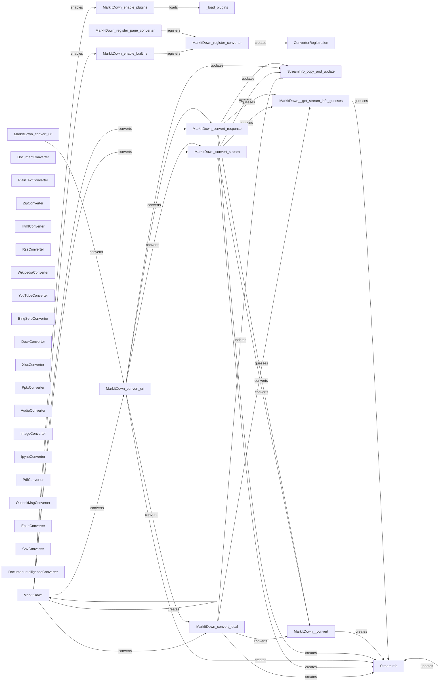

## Component Details

### MarkItDown
The central class that orchestrates the conversion process. It manages converter registration, stream information, and delegates the conversion to appropriate converters based on the input type and content.
- **Related Classes/Methods**: `repos.markitdown.packages.markitdown.src.markitdown._markitdown.MarkItDown`

### StreamInfo
A data class that holds metadata about the input stream, such as MIME type, file extension, character set, filename, local path, and URL. It provides context to the converters.
- **Related Classes/Methods**: `repos.markitdown.packages.markitdown.src.markitdown._stream_info.StreamInfo`

### ConverterRegistration
A data class that associates a DocumentConverter with a priority. This allows the MarkItDown class to manage the order in which converters are attempted during the conversion process.
- **Related Classes/Methods**: `repos.markitdown.packages.markitdown.src.markitdown._markitdown.ConverterRegistration`

### DocumentConverter
An abstract base class for all converters. Concrete converters inherit from this class and implement the `accepts` and `convert` methods.
- **Related Classes/Methods**: _None_

### PlainTextConverter
A concrete converter for plain text files.
- **Related Classes/Methods**: `repos.markitdown.packages.markitdown.src.markitdown.converters._plain_text_converter.PlainTextConverter`

### ZipConverter
A concrete converter for zip files.
- **Related Classes/Methods**: `repos.markitdown.packages.markitdown.src.markitdown.converters._zip_converter.ZipConverter`

### HtmlConverter
A concrete converter for HTML files.
- **Related Classes/Methods**: `repos.markitdown.packages.markitdown.src.markitdown.converters._html_converter.HtmlConverter`

### RssConverter
A concrete converter for RSS feeds.
- **Related Classes/Methods**: `repos.markitdown.packages.markitdown.src.markitdown.converters._rss_converter.RssConverter`

### WikipediaConverter
A concrete converter for Wikipedia pages.
- **Related Classes/Methods**: `repos.markitdown.packages.markitdown.src.markitdown.converters._wikipedia_converter.WikipediaConverter`

### YouTubeConverter
A concrete converter for YouTube videos.
- **Related Classes/Methods**: `repos.markitdown.packages.markitdown.src.markitdown.converters._youtube_converter.YouTubeConverter`

### BingSerpConverter
A concrete converter for Bing search results.
- **Related Classes/Methods**: `repos.markitdown.packages.markitdown.src.markitdown.converters._bing_serp_converter.BingSerpConverter`

### DocxConverter
A concrete converter for DOCX files.
- **Related Classes/Methods**: `repos.markitdown.packages.markitdown.src.markitdown.converters._docx_converter.DocxConverter`

### XlsxConverter
A concrete converter for XLSX files.
- **Related Classes/Methods**: `repos.markitdown.packages.markitdown.src.markitdown.converters._xlsx_converter.XlsxConverter`

### PptxConverter
A concrete converter for PPTX files.
- **Related Classes/Methods**: `repos.markitdown.packages.markitdown.src.markitdown.converters._pptx_converter.PptxConverter`

### AudioConverter
A concrete converter for audio files.
- **Related Classes/Methods**: `repos.markitdown.packages.markitdown.src.markitdown.converters._audio_converter.AudioConverter`

### ImageConverter
A concrete converter for image files.
- **Related Classes/Methods**: `repos.markitdown.packages.markitdown.src.markitdown.converters._image_converter.ImageConverter`

### IpynbConverter
A concrete converter for Jupyter Notebook files.
- **Related Classes/Methods**: `repos.markitdown.packages.markitdown.src.markitdown.converters._ipynb_converter.IpynbConverter`

### PdfConverter
A concrete converter for PDF files.
- **Related Classes/Methods**: `repos.markitdown.packages.markitdown.src.markitdown.converters._pdf_converter.PdfConverter`

### OutlookMsgConverter
A concrete converter for Outlook message files.
- **Related Classes/Methods**: `repos.markitdown.packages.markitdown.src.markitdown.converters._outlook_msg_converter.OutlookMsgConverter`

### EpubConverter
A concrete converter for EPUB files.
- **Related Classes/Methods**: `repos.markitdown.packages.markitdown.src.markitdown.converters._epub_converter.EpubConverter`

### CsvConverter
A concrete converter for CSV files.
- **Related Classes/Methods**: `repos.markitdown.packages.markitdown.src.markitdown.converters._csv_converter.CsvConverter`

### DocumentIntelligenceConverter
A concrete converter that uses document intelligence.
- **Related Classes/Methods**: `repos.markitdown.packages.markitdown.src.markitdown.converters._doc_intel_converter.DocumentIntelligenceConverter`

### _load_plugins
A function to load plugins.
- **Related Classes/Methods**: `repos.markitdown.packages.markitdown.src.markitdown._markitdown._load_plugins`
