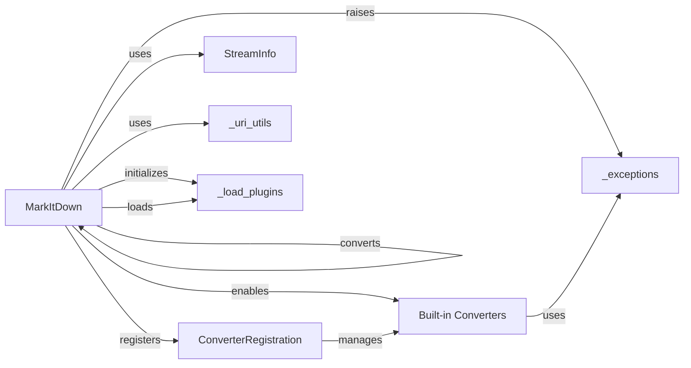

## Component Details

### MarkItDown
The central class responsible for managing the conversion process from various file formats to markdown. It handles initialization, plugin loading, converter registration, and orchestrates the overall conversion workflow. It acts as a facade, simplifying the conversion process for the application entry point.
- **Related Classes/Methods**: `repos.markitdown.packages.markitdown.src.markitdown._markitdown.MarkItDown`

### ConverterRegistration
A class that handles the registration and management of different converters within the MarkItDown class. It maintains a registry of available converters and provides methods for adding, removing, and retrieving converters based on file type or other criteria.
- **Related Classes/Methods**: `repos.markitdown.packages.markitdown.src.markitdown._markitdown.ConverterRegistration`

### StreamInfo
A class that encapsulates information about the input stream, such as its type and encoding. It's used to help determine the appropriate converter to use. It analyzes the stream to identify its format and characteristics, providing valuable context for the conversion process.
- **Related Classes/Methods**: `repos.markitdown.packages.markitdown.src.markitdown._stream_info.StreamInfo`

### _uri_utils
A module containing utility functions for handling URIs, such as converting file URIs to paths and parsing data URIs. It provides tools for working with different types of URIs and extracting relevant information from them.
- **Related Classes/Methods**: `repos.markitdown.packages.markitdown.src.markitdown._uri_utils`

### _exceptions
A module defining custom exception classes for handling conversion errors, such as unsupported formats or failed conversion attempts. It provides a structured way to handle errors that may occur during the conversion process, ensuring that the application can gracefully recover from unexpected situations.
- **Related Classes/Methods**: `repos.markitdown.packages.markitdown.src.markitdown._exceptions`

### Built-in Converters
A collection of classes, each responsible for converting a specific file format (e.g., HTML, DOCX, PDF) to markdown. These converters implement the logic for transforming the content of different file types into markdown format.
- **Related Classes/Methods**: `repos.markitdown.packages.markitdown.src.markitdown.converters._plain_text_converter.PlainTextConverter`, `repos.markitdown.packages.markitdown.src.markitdown.converters._zip_converter.ZipConverter`, `repos.markitdown.packages.markitdown.src.markitdown.converters._html_converter.HtmlConverter`, `repos.markitdown.packages.markitdown.src.markitdown.converters._rss_converter.RssConverter`, `repos.markitdown.packages.markitdown.src.markitdown.converters._wikipedia_converter.WikipediaConverter`, `repos.markitdown.packages.markitdown.src.markitdown.converters._youtube_converter.YouTubeConverter`, `repos.markitdown.packages.markitdown.src.markitdown.converters._bing_serp_converter.BingSerpConverter`, `repos.markitdown.packages.markitdown.src.markitdown.converters._docx_converter.DocxConverter`, `repos.markitdown.packages.markitdown.src.markitdown.converters._xlsx_converter.XlsxConverter`, `repos.markitdown.packages.markitdown.src.markitdown.converters._xlsx_converter.XlsConverter`, `repos.markitdown.packages.markitdown.src.markitdown.converters._pptx_converter.PptxConverter`, `repos.markitdown.packages.markitdown.src.markitdown.converters._audio_converter.AudioConverter`, `repos.markitdown.packages.markitdown.src.markitdown.converters._image_converter.ImageConverter`, `repos.markitdown.packages.markitdown.src.markitdown.converters._ipynb_converter.IpynbConverter`, `repos.markitdown.packages.markitdown.src.markitdown.converters._pdf_converter.PdfConverter`, `repos.markitdown.packages.markitdown.src.markitdown.converters._outlook_msg_converter.OutlookMsgConverter`, `repos.markitdown.packages.markitdown.src.markitdown.converters._epub_converter.EpubConverter`, `repos.markitdown.packages.markitdown.src.markitdown.converters._csv_converter.CsvConverter`, `repos.markitdown.packages.markitdown.src.markitdown.converters._doc_intel_converter.DocumentIntelligenceConverter`

### _load_plugins
A module or function responsible for loading external plugins that extend the functionality of MarkItDown. It allows users to add custom converters or modify the behavior of the existing ones.
- **Related Classes/Methods**: `repos.markitdown.packages.markitdown.src.markitdown._markitdown._load_plugins`
