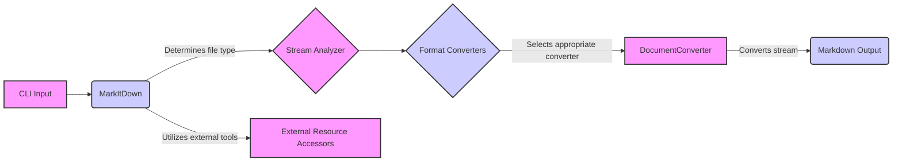

### Component Descriptions:

- **CLI Input**: Represents the initial input to the system, such as a file path, URL, or stream. It triggers the conversion process.
    - *Purpose*: Receives the input from the user.
    - *Functionality*: Accepts file paths, URLs, or streams.
    - *Interaction*: Sends the input to the `MarkItDown` component.
    - *Relevant source files*: N/A

- **MarkItDown**: The main class responsible for orchestrating the conversion process. It receives the input, determines the file type, selects the appropriate converter, and manages the overall flow.
    - *Purpose*: Orchestrates the conversion of various file types to Markdown.
    - *Functionality*: Handles input from local files, URLs, and streams; selects and applies appropriate converters.
    - *Interaction*: Receives input from CLI, uses Stream Analyzer, interacts with Format Converters and External Resource Accessors, and produces Markdown output.
    - *Relevant source files*: `repos.markitdown.packages.markitdown.src.markitdown._markitdown.MarkItDown`

- **Stream Analyzer**: Analyzes the input stream to determine the file type and encoding. This information is used to select the appropriate converter.
    - *Purpose*: Determines the file type and encoding of the input stream.
    - *Functionality*: Uses `magika` to identify the file type from the stream content.
    - *Interaction*: Receives input from `MarkItDown`, provides file type information to `MarkItDown`.
    - *Relevant source files*: `repos.markitdown.packages.markitdown.src.markitdown._markitdown.MarkItDown._get_stream_info_guesses`

- **Format Converters**: A collection of concrete `DocumentConverter` implementations for various file types, such as HTML, PDF, DOCX, and more. These converters are enabled by default and provide a wide range of conversion capabilities.
    - *Purpose*: Provides a set of converters for different file formats.
    - *Functionality*: Implements the `DocumentConverter` interface for various file types.
    - *Interaction*: Selected by `MarkItDown` based on the file type, converts the stream to Markdown, and returns the result to `MarkItDown`.
    - *Relevant source files*: `repos.markitdown.packages.markitdown.src.markitdown.converters`

- **DocumentConverter**: An abstract base class for all converters. It defines the interface that all converters must implement, including methods for accepting a stream and converting it to markdown.
    - *Purpose*: Defines the interface for all converters.
    - *Functionality*: Accepts a stream and converts it to Markdown.
    - *Interaction*: Implemented by concrete converters in Format Converters, used by `MarkItDown` to convert the stream.
    - *Relevant source files*: `repos.markitdown.packages.markitdown.src.markitdown._base_converter.DocumentConverter`

- **Markdown Output**: The final Markdown content produced by the conversion process.
    - *Purpose*: Represents the converted Markdown content.
    - *Functionality*: Stores the Markdown content.
    - *Interaction*: Produced by `DocumentConverter` and returned to `MarkItDown`.
    - *Relevant source files*: N/A

- **External Resource Accessors**: Provides access to external tools or resources that may be needed for the conversion process, such as OCR engines or web scraping libraries.
    - *Purpose*: Provides access to external tools or resources.
    - *Functionality*: Interacts with external tools or resources.
    - *Interaction*: Used by `MarkItDown` to access external tools or resources.
    - *Relevant source files*: N/A
