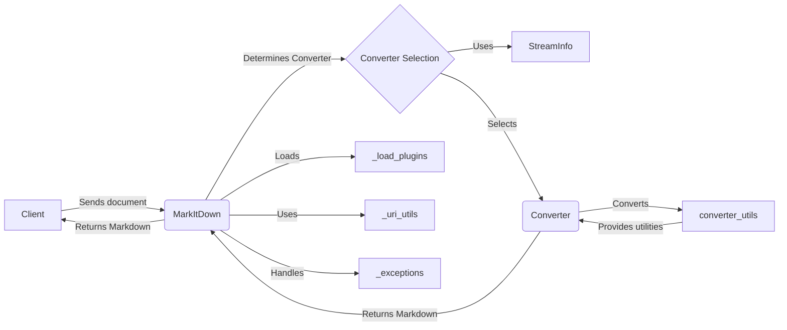

## Component Descriptions:

- **Client:**
    - *Description*: The entity that initiates the conversion process by sending a document to the `MarkItDown` component.
    - *Functionality*: Sends documents for conversion and receives the converted markdown output.
    - *Source Files*: N/A (External entity)

- **MarkItDown:**
    - *Description*: The central component responsible for orchestrating the conversion process. It handles stream input, converter registration, and selection of the appropriate converter based on file type or URI, delegating the actual conversion to specialized converter components.
    - *Functionality*: Receives documents, determines the appropriate converter, orchestrates the conversion, and returns the markdown output. It also loads plugins and uses URI utilities.
    - *Source Files*: `repos.markitdown.packages.markitdown.src.markitdown._markitdown.MarkItDown`

- **Converter Selection:**
    - *Description*: Determines which converter to use based on the input document's type.
    - *Functionality*: Uses `StreamInfo` to get information about the input stream and selects the appropriate `Converter`.
    - *Source Files*: `repos.markitdown.packages.markitdown.src.markitdown._markitdown.MarkItDown._convert`, `repos.markitdown.packages.markitdown.src.markitdown._markitdown.MarkItDown._get_stream_info_guesses`

- **StreamInfo:**
    - *Description*: A data class that holds information about the input stream, such as filename, mimetype, and encoding.
    - *Functionality*: Provides information about the input stream to the `Converter Selection` component.
    - *Source Files*: `repos.markitdown.packages.markitdown.src.markitdown._stream_info.StreamInfo`

- **Converter:**
    - *Description*: Abstract class for converters. Each converter is responsible for converting a specific file format to markdown.
    - *Functionality*: Converts a specific file format to markdown using utilities from `converter_utils`.
    - *Source Files*: `repos.markitdown.packages.markitdown.src.markitdown.converters._base_converter`, `repos.markitdown.packages.markitdown.src.markitdown.converters._plain_text_converter.PlainTextConverter`, `repos.markitdown.packages.markitdown.src.markitdown.converters._zip_converter.ZipConverter`, `repos.markitdown.packages.markitdown.src.markitdown.converters._html_converter.HtmlConverter`, `repos.markitdown.packages.markitdown.src.markitdown.converters._rss_converter.RssConverter`, `repos.markitdown.packages.markitdown.src.markitdown.converters._wikipedia_converter.WikipediaConverter`, `repos.markitdown.packages.markitdown.src.markitdown.converters._youtube_converter.YouTubeConverter`, `repos.markitdown.packages.markitdown.src.markitdown.converters._bing_serp_converter.BingSerpConverter`, `repos.markitdown.packages.markitdown.src.markitdown.converters._docx_converter.DocxConverter`, `repos.markitdown.packages.markitdown.src.markitdown.converters._xlsx_converter.XlsxConverter`, `repos.markitdown.packages.markitdown.src.markitdown.converters._pptx_converter.PptxConverter`, `repos.markitdown.packages.markitdown.src.markitdown.converters._audio_converter.AudioConverter`, `repos.markitdown.packages.markitdown.src.markitdown.converters._image_converter.ImageConverter`, `repos.markitdown.packages.markitdown.src.markitdown.converters._ipynb_converter.IpynbConverter`, `repos.markitdown.packages.markitdown.src.markitdown.converters._pdf_converter.PdfConverter`, `repos.markitdown.packages.markitdown.src.markitdown.converters._outlook_msg_converter.OutlookMsgConverter`, `repos.markitdown.packages.markitdown.src.markitdown.converters._epub_converter.EpubConverter`, `repos.markitdown.packages.markitdown.src.markitdown.converters._csv_converter.CsvConverter`, `repos.markitdown.packages.markitdown.src.markitdown.converters._doc_intel_converter.DocumentIntelligenceConverter`

- **converter_utils:**
    - *Description*: Provides utilities used by the converters.
    - *Functionality*: Offers utility functions to the `Converter` components.
    - *Source Files*: `repos.markitdown.packages.markitdown.src.markitdown.converter_utils`

- **_load_plugins:**
    - *Description*: Function to load plugins.
    - *Functionality*: Loads plugins that can extend the functionality of the converter.
    - *Source Files*: `repos.markitdown.packages.markitdown.src.markitdown._markitdown._load_plugins`

- **_uri_utils:**
    - *Description*: Utilities for handling URIs, including file URI to path conversion and data URI parsing.
    - *Functionality*: Provides URI handling utilities to the `MarkItDown` component.
    - *Source Files*: `repos.markitdown.packages.markitdown.src.markitdown._uri_utils`

- **_exceptions:**
    - *Description*: Custom exceptions raised during the conversion process.
    - *Functionality*: Handles exceptions raised during the conversion process.
    - *Source Files*: `repos.markitdown.packages.markitdown.src.markitdown._exceptions`