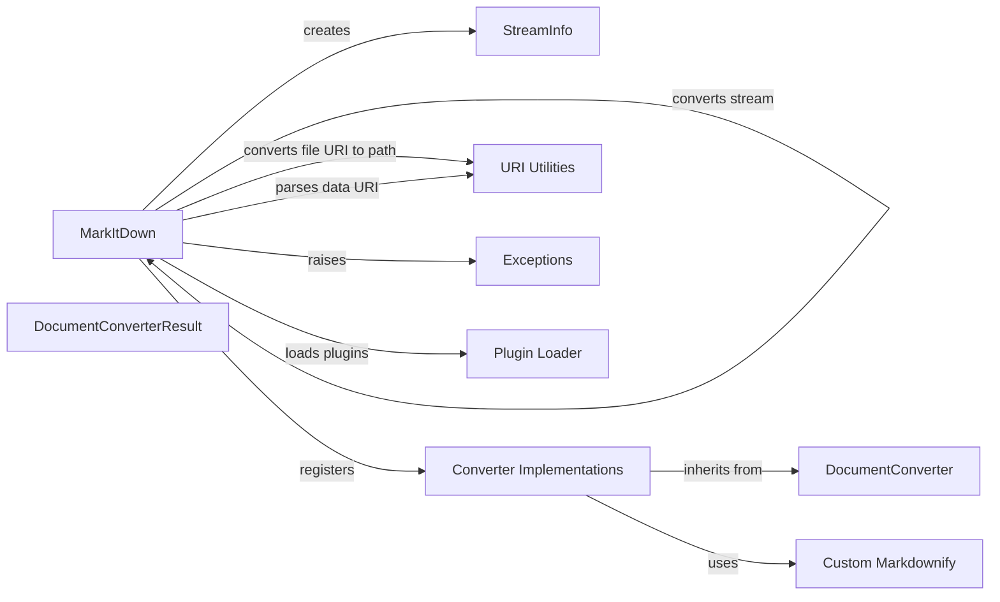

## Component Details

### MarkItDown
The central class responsible for managing the conversion process. It handles converter registration, plugin loading, and delegates the actual conversion based on input type (stream, URI, local file, response). It acts as the entry point for conversion operations, orchestrating the process from input handling to output generation.
- **Related Classes/Methods**: `repos.markitdown.packages.markitdown.src.markitdown._markitdown.MarkItDown`, `repos.markitdown.packages.markitdown.src.markitdown._markitdown.MarkItDown.__init__`, `repos.markitdown.packages.markitdown.src.markitdown._markitdown.MarkItDown.convert`, `repos.markitdown.packages.markitdown.src.markitdown._markitdown.MarkItDown.convert_local`, `repos.markitdown.packages.markitdown.src.markitdown._markitdown.MarkItDown.convert_stream`, `repos.markitdown.packages.markitdown.src.markitdown._markitdown.MarkItDown.convert_uri`, `repos.markitdown.packages.markitdown.src.markitdown._markitdown.MarkItDown.convert_response`, `repos.markitdown.packages.markitdown.src.markitdown._markitdown.MarkItDown._convert`, `repos.markitdown.packages.markitdown.src.markitdown._markitdown.MarkItDown.enable_builtins`, `repos.markitdown.packages.markitdown.src.markitdown._markitdown.MarkItDown.enable_plugins`, `repos.markitdown.packages.markitdown.src.markitdown._markitdown.MarkItDown.register_converter`, `repos.markitdown.packages.markitdown.src.markitdown._markitdown.MarkItDown.register_page_converter`, `repos.markitdown.packages.markitdown.src.markitdown._markitdown.MarkItDown._get_stream_info_guesses`

### StreamInfo
A data class that stores information about the input stream, such as file name, extension, MIME type, and charset. It's used to pass stream metadata between different conversion stages, ensuring that converters have the necessary context to process the input correctly.
- **Related Classes/Methods**: `repos.markitdown.packages.markitdown.src.markitdown._stream_info.StreamInfo`

### DocumentConverter
Base class for all converters. It defines the interface that all converters must implement, ensuring a consistent way to perform conversions across different document types. It provides a common structure for handling input and producing output.
- **Related Classes/Methods**: `repos.markitdown.packages.markitdown.src.markitdown._base_converter.DocumentConverter`

### DocumentConverterResult
Data class that represents the result of a conversion. It encapsulates the converted content and any associated metadata, providing a structured way to return the output of the conversion process.
- **Related Classes/Methods**: `repos.markitdown.packages.markitdown.src.markitdown._base_converter.DocumentConverterResult`

### Converter Implementations
A collection of classes, each responsible for converting a specific document type (e.g., HTML, DOCX, PDF) to Markdown. These converters inherit from DocumentConverter and implement the conversion logic specific to their respective document types.
- **Related Classes/Methods**: `repos.markitdown.packages.markitdown.src.markitdown.converters._plain_text_converter.PlainTextConverter`, `repos.markitdown.packages.markitdown.src.markitdown.converters._zip_converter.ZipConverter`, `repos.markitdown.packages.markitdown.src.markitdown.converters._html_converter.HtmlConverter`, `repos.markitdown.packages.markitdown.src.markitdown.converters._rss_converter.RssConverter`, `repos.markitdown.packages.markitdown.src.markitdown.converters._wikipedia_converter.WikipediaConverter`, `repos.markitdown.packages.markitdown.src.markitdown.converters._youtube_converter.YouTubeConverter`, `repos.markitdown.packages.markitdown.src.markitdown.converters._bing_serp_converter.BingSerpConverter`, `repos.markitdown.packages.markitdown.src.markitdown.converters._docx_converter.DocxConverter`, `repos.markitdown.packages.markitdown.src.markitdown.converters._xlsx_converter.XlsxConverter`, `repos.markitdown.packages.markitdown.src.markitdown.converters._pptx_converter.PptxConverter`, `repos.markitdown.packages.markitdown.src.markitdown.converters._audio_converter.AudioConverter`, `repos.markitdown.packages.markitdown.src.markitdown.converters._image_converter.ImageConverter`, `repos.markitdown.packages.markitdown.src.markitdown.converters._ipynb_converter.IpynbConverter`, `repos.markitdown.packages.markitdown.src.markitdown.converters._pdf_converter.PdfConverter`, `repos.markitdown.packages.markitdown.src.markitdown.converters._outlook_msg_converter.OutlookMsgConverter`, `repos.markitdown.packages.markitdown.src.markitdown.converters._epub_converter.EpubConverter`, `repos.markitdown.packages.markitdown.src.markitdown.converters._csv_converter.CsvConverter`, `repos.markitdown.packages.markitdown.src.markitdown.converters._doc_intel_converter.DocumentIntelligenceConverter`

### URI Utilities
Utilities for working with URIs, including converting file URIs to paths and parsing data URIs. These utilities provide essential functionality for handling different types of URIs, ensuring that the conversion process can access and process content from various sources.
- **Related Classes/Methods**: `repos.markitdown.packages.markitdown.src.markitdown._uri_utils`

### Exceptions
Defines custom exception classes used within the markitdown library. These exceptions provide a structured way to handle errors and exceptional situations that may occur during the conversion process, ensuring that errors are properly reported and handled.
- **Related Classes/Methods**: `repos.markitdown.packages.markitdown.src.markitdown._exceptions`

### Plugin Loader
Function responsible for loading external plugins to extend the conversion capabilities of MarkItDown. This allows for dynamic addition of new converters and functionalities, making the system extensible and adaptable to new document types and conversion requirements.
- **Related Classes/Methods**: `repos.markitdown.packages.markitdown.src.markitdown._markitdown._load_plugins`

### Custom Markdownify
Custom Markdownify class for converting HTML to Markdown. This component provides specialized HTML-to-Markdown conversion capabilities, tailored to the specific needs of the markitdown library.
- **Related Classes/Methods**: `repos.markitdown.packages.markitdown.src.markitdown.converter_utils._markdownify._CustomMarkdownify`
