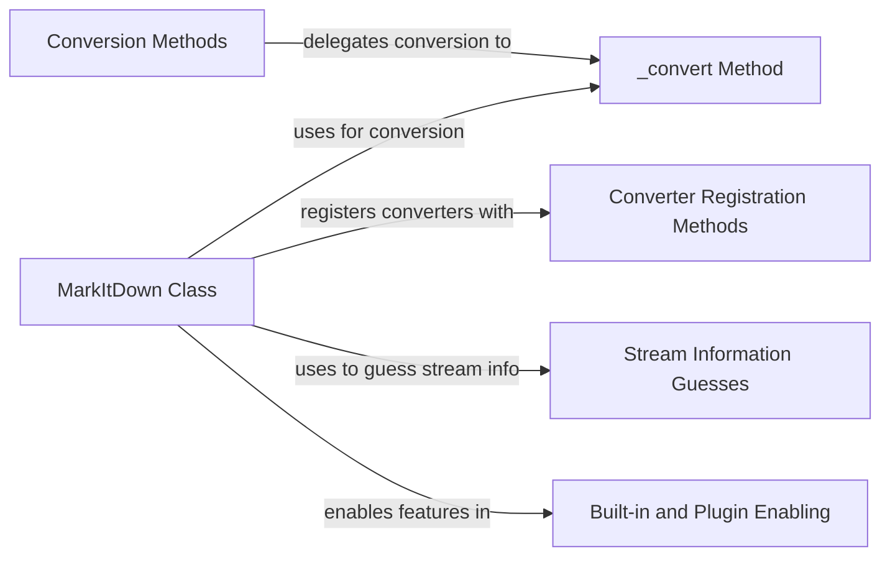

## Component Details

The MarkItDown component orchestrates the conversion of markdown content from various sources into different output formats. It manages the registration and selection of appropriate converters, handles input from strings, files, streams, URLs, and HTTP responses, and provides a central point for customizing the conversion process through plugins and custom converters. The core of the conversion logic resides within the `_convert` method, which is responsible for parsing the markdown and applying the necessary transformations.

### MarkItDown Class
The central class responsible for managing the entire conversion process. It handles initialization, enabling built-in features and plugins, registering custom converters, and orchestrating the conversion itself. It acts as a container for all conversion-related functionalities.
- **Related Classes/Methods**: `markitdown.packages.markitdown.src.markitdown._markitdown.MarkItDown` (93:771)

### Conversion Methods
These methods serve as the entry points for converting markdown from various sources, including strings, local files, streams, URLs, URIs, and HTTP responses. They delegate the actual conversion process to the internal `_convert` method, providing a consistent interface for different input types.
- **Related Classes/Methods**: `markitdown.packages.markitdown.src.markitdown._markitdown.MarkItDown:convert` (243:291), `markitdown.packages.markitdown.src.markitdown._markitdown.MarkItDown:convert_local` (293:328), `markitdown.packages.markitdown.src.markitdown._markitdown.MarkItDown:convert_stream` (330:375), `markitdown.packages.markitdown.src.markitdown._markitdown.MarkItDown:convert_url` (377:394), `markitdown.packages.markitdown.src.markitdown._markitdown.MarkItDown:convert_uri` (396:455), `markitdown.packages.markitdown.src.markitdown._markitdown.MarkItDown:convert_response` (457:527)

### _convert Method
This method contains the core logic for performing the markdown conversion. It handles parsing the markdown input, applying registered converters and plugins, and generating the final output format. It is the engine that drives the conversion process.
- **Related Classes/Methods**: `markitdown.packages.markitdown.src.markitdown._markitdown.MarkItDown:_convert` (529:619)

### Converter Registration Methods
These methods provide the functionality to register custom converters, allowing users to extend and customize the conversion process. They enable the addition of new conversion rules and functionalities beyond the built-in options.
- **Related Classes/Methods**: `markitdown.packages.markitdown.src.markitdown._markitdown.MarkItDown:register_page_converter` (621:627), `markitdown.packages.markitdown.src.markitdown._markitdown.MarkItDown:register_converter` (629:659)

### Stream Information Guesses
This method is responsible for determining the encoding and other relevant information from a stream of data. It uses a series of guesses to identify the correct encoding, ensuring that the input is processed correctly regardless of its source.
- **Related Classes/Methods**: `markitdown.packages.markitdown.src.markitdown._markitdown.MarkItDown:_get_stream_info_guesses` (661:760)

### Built-in and Plugin Enabling
These methods enable the built-in functionalities and external plugins, configuring the MarkItDown converter with pre-defined and user-provided extensions. They allow for easy activation of default features and custom functionalities.
- **Related Classes/Methods**: `markitdown.packages.markitdown.src.markitdown._markitdown.MarkItDown:enable_builtins` (132:221), `markitdown.packages.markitdown.src.markitdown._markitdown.MarkItDown:enable_plugins` (223:241)