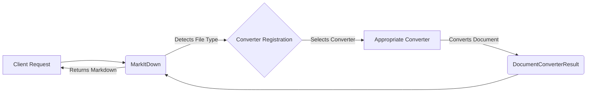

**Component: Client Request**
*Description*: Represents the initial request to convert a document. This could be a file upload, a URL, or direct text input.
*Interaction*: Initiates the conversion process by sending the document to the `MarkItDown` component.
*Relevant source files*: N/A

**Component: MarkItDown**
*Description*: The central component responsible for orchestrating the document conversion process. It manages converter registration, stream information handling, and invokes the appropriate converters based on file type detection.
*Interaction*: Receives the document from the client, detects the file type, selects the appropriate converter, and returns the converted markdown.
*Relevant source files*: `markitdown._markitdown.MarkItDown`

**Component: Converter Registration**
*Description*: Holds the mapping between file types and their corresponding converters. It allows the `MarkItDown` component to dynamically select the correct converter for a given document.
*Interaction*: Provides the `MarkItDown` component with the appropriate converter based on the detected file type.
*Relevant source files*: `markitdown._markitdown.ConverterRegistration`

**Component: Appropriate Converter**
*Description*: One of the specific converters (e.g., `PlainTextConverter`, `HtmlConverter`, `PdfConverter`, `DocxConverter`, `EpubConverter`, `ImageConverter`, `XlsxConverter`, `YouTubeConverter`, `ZipConverter`) responsible for converting a specific file type to markdown.
*Interaction*: Receives the document from the `MarkItDown` component and converts it to markdown.
*Relevant source files*: `markitdown.converters._plain_text_converter.PlainTextConverter`, `markitdown.converters._html_converter.HtmlConverter`, `markitdown.converters._pdf_converter.PdfConverter`, `markitdown.converters._docx_converter.DocxConverter`, `markitdown.converters._epub_converter.EpubConverter`, `markitdown.converters._image_converter.ImageConverter`, `markitdown.converters._xlsx_converter.XlsxConverter`, `markitdown.converters._youtube_converter.YouTubeConverter`, `markitdown.converters._zip_converter.ZipConverter`

**Component: DocumentConverterResult**
*Description*: Represents the result of the document conversion, containing the markdown output and any relevant metadata.
*Interaction*: Returns the converted markdown to the `MarkItDown` component.
*Relevant source files*: `markitdown._base_converter.DocumentConverterResult`
