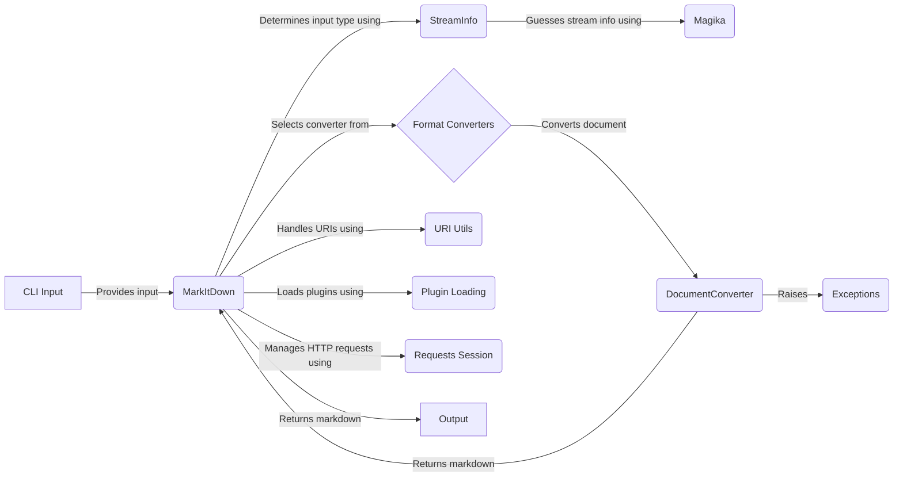

```mermaid
graph LR
    A[CLI Input] -- Provides input --> B(MarkItDown) 
    B -- Determines input type using --> C(StreamInfo) 
    C -- Guesses stream info using --> D(Magika)
    B -- Selects converter from --> E{Format Converters}
    E -- Converts document --> F(DocumentConverter)
    B -- Handles URIs using --> G("URI Utils")
    B -- Loads plugins using --> H("Plugin Loading")
    B -- Manages HTTP requests using --> I("Requests Session")
    F -- Raises --> J(Exceptions)
    F -- Returns markdown --> B
    B -- Returns markdown --> K[Output]


```