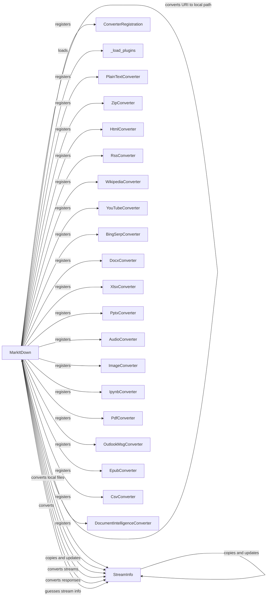

## Component Details

### MarkItDown
The main class responsible for converting various file types to markdown. It orchestrates the conversion process by registering converters, loading plugins, and handling different input types (files, streams, URIs).
- **Related Classes/Methods**: `repos.markitdown.packages.markitdown.src.markitdown._markitdown.MarkItDown`

### StreamInfo
A class that holds information about the input stream, such as encoding and mime type. It helps in determining the correct converter to use and how to process the input data.
- **Related Classes/Methods**: `repos.markitdown.packages.markitdown.src.markitdown._stream_info.StreamInfo`

### ConverterRegistration
A class that registers available converters. It allows the `MarkItDown` class to discover and use the appropriate converter for a given input type.
- **Related Classes/Methods**: `repos.markitdown.packages.markitdown.src.markitdown._markitdown.ConverterRegistration`

### _load_plugins
A function that loads plugins, extending the functionality of the `MarkItDown` class with additional converters or input handlers.
- **Related Classes/Methods**: `repos.markitdown.packages.markitdown.src.markitdown._markitdown._load_plugins`

### PlainTextConverter
A converter for plain text files. It extracts the text content and formats it as markdown.
- **Related Classes/Methods**: `repos.markitdown.packages.markitdown.src.markitdown.converters._plain_text_converter.PlainTextConverter`

### ZipConverter
A converter for zip files. It extracts the contents of the zip file and converts each entry to markdown.
- **Related Classes/Methods**: `repos.markitdown.packages.markitdown.src.markitdown.converters._zip_converter.ZipConverter`

### HtmlConverter
A converter for HTML files. It parses the HTML content and converts it to markdown.
- **Related Classes/Methods**: `repos.markitdown.packages.markitdown.src.markitdown.converters._html_converter.HtmlConverter`

### RssConverter
A converter for RSS files. It extracts the content from RSS feeds and converts it to markdown.
- **Related Classes/Methods**: `repos.markitdown.packages.markitdown.src.markitdown.converters._rss_converter.RssConverter`

### WikipediaConverter
A converter for Wikipedia pages. It retrieves the content of a Wikipedia page and converts it to markdown.
- **Related Classes/Methods**: `repos.markitdown.packages.markitdown.src.markitdown.converters._wikipedia_converter.WikipediaConverter`

### YouTubeConverter
A converter for YouTube videos. It extracts information about a YouTube video and converts it to markdown.
- **Related Classes/Methods**: `repos.markitdown.packages.markitdown.src.markitdown.converters._youtube_converter.YouTubeConverter`

### BingSerpConverter
A converter for Bing search results. It extracts the search results from Bing and converts them to markdown.
- **Related Classes/Methods**: `repos.markitdown.packages.markitdown.src.markitdown.converters._bing_serp_converter.BingSerpConverter`

### DocxConverter
A converter for DOCX files. It extracts the text and formatting from a DOCX file and converts it to markdown.
- **Related Classes/Methods**: `repos.markitdown.packages.markitdown.src.markitdown.converters._docx_converter.DocxConverter`

### XlsxConverter
A converter for XLSX files. It extracts the data from an XLSX file and converts it to markdown.
- **Related Classes/Methods**: `repos.markitdown.packages.markitdown.src.markitdown.converters._xlsx_converter.XlsxConverter`

### PptxConverter
A converter for PPTX files. It extracts the text and images from a PPTX file and converts it to markdown.
- **Related Classes/Methods**: `repos.markitdown.packages.markitdown.src.markitdown.converters._pptx_converter.PptxConverter`

### AudioConverter
A converter for audio files. It extracts metadata from audio files and converts it to markdown.
- **Related Classes/Methods**: `repos.markitdown.packages.markitdown.src.markitdown.converters._audio_converter.AudioConverter`

### ImageConverter
A converter for image files. It extracts metadata from image files and converts it to markdown.
- **Related Classes/Methods**: `repos.markitdown.packages.markitdown.src.markitdown.converters._image_converter.ImageConverter`

### IpynbConverter
A converter for Jupyter Notebook files. It extracts the code and output from a Jupyter Notebook and converts it to markdown.
- **Related Classes/Methods**: `repos.markitdown.packages.markitdown.src.markitdown.converters._ipynb_converter.IpynbConverter`

### PdfConverter
A converter for PDF files. It extracts the text and images from a PDF file and converts it to markdown.
- **Related Classes/Methods**: `repos.markitdown.packages.markitdown.src.markitdown.converters._pdf_converter.PdfConverter`

### OutlookMsgConverter
A converter for Outlook message files. It extracts the content from an Outlook message and converts it to markdown.
- **Related Classes/Methods**: `repos.markitdown.packages.markitdown.src.markitdown.converters._outlook_msg_converter.OutlookMsgConverter`

### EpubConverter
A converter for EPUB files. It extracts the content from an EPUB file and converts it to markdown.
- **Related Classes/Methods**: `repos.markitdown.packages.markitdown.src.markitdown.converters._epub_converter.EpubConverter`

### CsvConverter
A converter for CSV files. It extracts the data from a CSV file and converts it to markdown.
- **Related Classes/Methods**: `repos.markitdown.packages.markitdown.src.markitdown.converters._csv_converter.CsvConverter`

### DocumentIntelligenceConverter
A converter using Document Intelligence. It uses an external Document Intelligence service to extract content and convert it to markdown.
- **Related Classes/Methods**: `repos.markitdown.packages.markitdown.src.markitdown.converters._doc_intel_converter.DocumentIntelligenceConverter`
