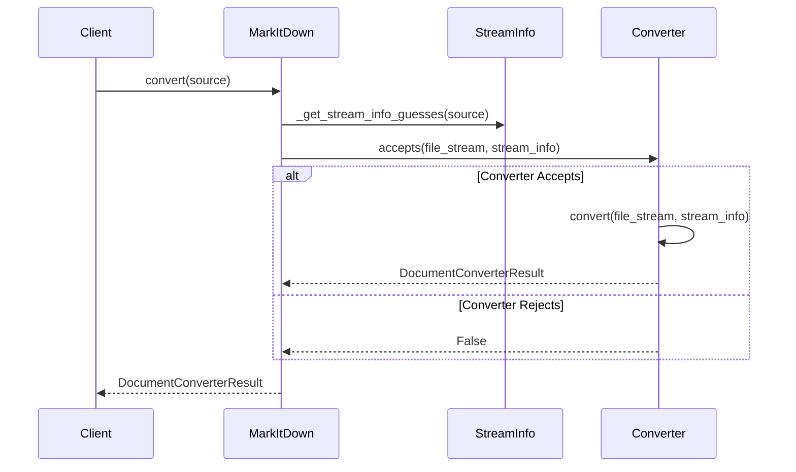
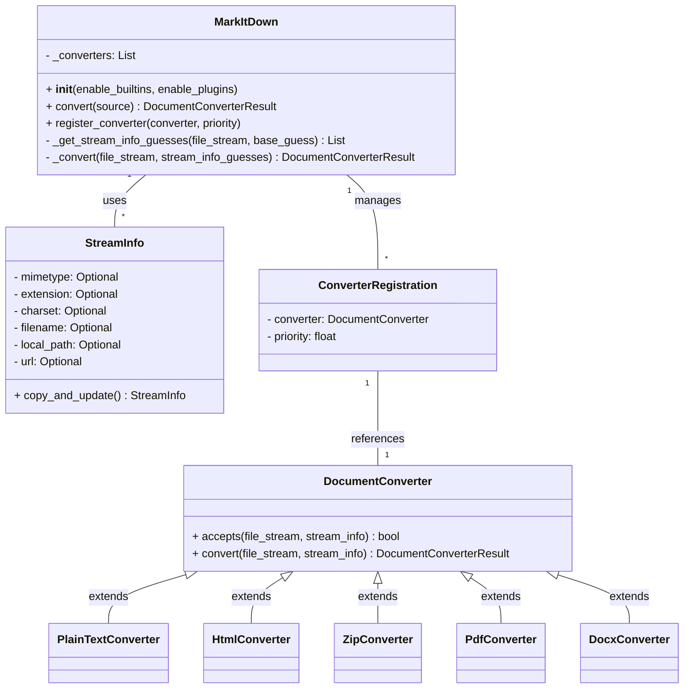

Based on the information gathered, here's a refined overview of the `Core Conversion Orchestration` component:

**Component Description:**

The `Core Conversion Orchestration` component is responsible for managing the conversion of various document formats into Markdown. It handles file input from different sources (local files, URLs, streams), determines the file type, selects the appropriate converter, and orchestrates the conversion process. The central class is `MarkItDown`, which manages converter registration and selection.

**Main Classes and Their Purposes:**

1.  **`MarkItDown`**: The main class responsible for orchestrating the conversion process. It manages the registration of `DocumentConverter` instances, determines the appropriate converter for a given input, and performs the conversion.
2.  **`DocumentConverter`**: An abstract base class for all converters. Subclasses implement the `accepts` method to determine if they can handle a given file type and the `convert` method to perform the actual conversion.
3.  **`StreamInfo`**: A data class that holds metadata about the input stream, such as MIME type, file extension, charset, filename, local path, and URL. This information is used to determine the appropriate converter and to provide context for the conversion process.
4.  **`ConverterRegistration`**: A data class that associates a `DocumentConverter` with a priority. This is used to determine the order in which converters are tried.

**Main Flow (Sequence Diagram):**

**Component Structure (Class Diagram):**

