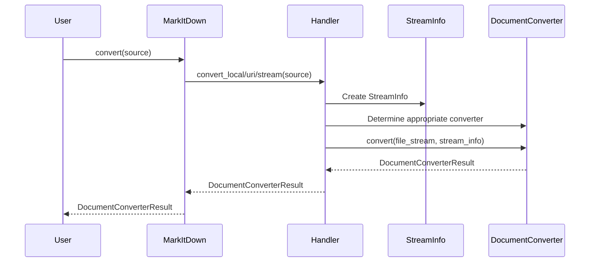
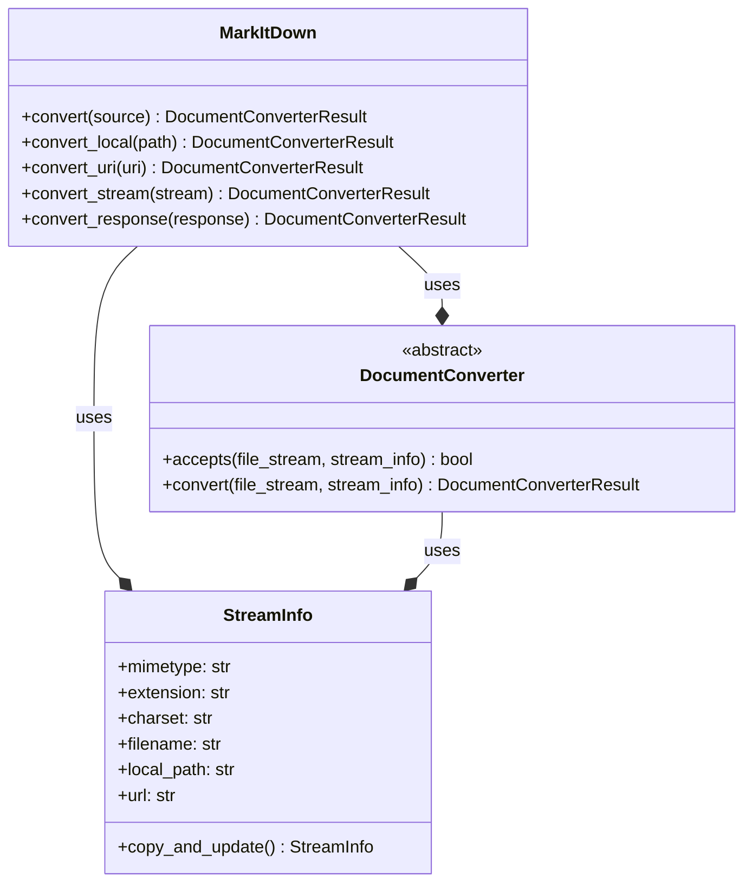

Based on the provided information, here's an overview of the `Core Conversion Orchestration` component:

**Description:**

The `Core Conversion Orchestration` component is responsible for managing the entire document conversion process in `markitdown`. It takes a source document (local file, URL, stream, etc.) as input, determines the appropriate converter based on the file type, and outputs the converted Markdown content. The component handles various input types and delegates the actual conversion to specialized `DocumentConverter` implementations.

**Main Classes and Their Purpose:**

*   **`MarkItDown`**: This class acts as the central orchestrator. It provides the main `convert` method, which accepts different types of input sources (file path, URL, stream) and dispatches the conversion to the appropriate handler (`convert_local`, `convert_uri`, `convert_stream`, `convert_response`).
*   **`DocumentConverter`**: This is an abstract base class for all document converters. Subclasses implement the `accepts` method to determine if they can handle a specific document type and the `convert` method to perform the actual conversion.
*   **`StreamInfo`**: A data class that holds metadata about the input stream, such as MIME type, file extension, character set, filename, local path, and URL. This information is used to select the appropriate `DocumentConverter`.

**Main Flow:**

1.  The `MarkItDown.convert` method receives the source document (path, URL, stream).
2.  `MarkItDown.convert` determines the type of input source.
3.  `MarkItDown.convert` calls the appropriate handler method (`convert_local`, `convert_uri`, `convert_stream`, or `convert_response`).
4.  The handler method creates a `StreamInfo` object based on the input source.
5.  The handler method determines the appropriate `DocumentConverter` based on the `StreamInfo`.
6.  The handler method calls the `convert` method of the selected `DocumentConverter`.
7.  The `DocumentConverter` performs the conversion and returns a `DocumentConverterResult`.
8.  The handler method returns the `DocumentConverterResult` to `MarkItDown.convert`.
9.  `MarkItDown.convert` returns the `DocumentConverterResult`.

**Sequence Diagram (Mermaid Format):**

**Class Diagram (Mermaid Format):**

