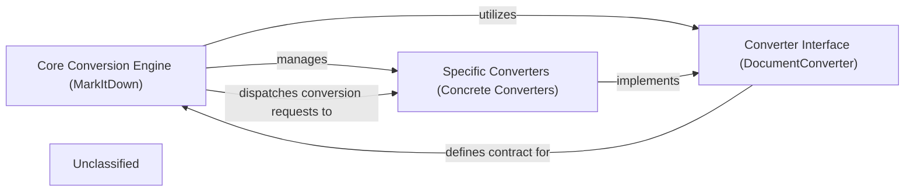

## Details

The MarkItDown subsystem is designed around a flexible and extensible conversion architecture. The Core Conversion Engine (MarkItDown) acts as the central hub, responsible for initializing and managing a collection of Specific Converters (Concrete Converters). It dynamically registers these converters, including built-in and plugin-provided implementations, and prioritizes them for efficient processing. When a conversion request is received, the MarkItDown engine analyzes the input stream's metadata to determine the most suitable Concrete Converter. All Concrete Converters adhere to the Converter Interface (DocumentConverter), which defines a standardized contract for accepting and converting various document types into Markdown. This clear separation of concerns allows for easy addition of new conversion capabilities without altering the core logic of the engine, making the system highly adaptable to diverse input formats.

### Core Conversion Engine (MarkItDown)
The central orchestrator of Markitdown. It manages available converters, dispatches conversion requests, and handles the dynamic loading and registration of plugin converters, ensuring extensibility. This component acts as a facade for the entire conversion process, determining the appropriate converter based on input stream information.

**Related Classes/Methods**:

- <a href="https://github.com/microsoft/markitdown/blob/mainpackages/markitdown/src/markitdown/_markitdown.py#L93-L776" target="_blank" rel="noopener noreferrer">`markitdown._markitdown.MarkItDown`:93-776</a>

### Converter Interface (DocumentConverter)
An abstract base class defining the common interface and contract for all specialized content converters within the MarkItDown system. It ensures a standardized way for the `Core Conversion Engine` to interact with diverse conversion implementations through `accepts` and `convert` methods.

**Related Classes/Methods**:

- <a href="https://github.com/microsoft/markitdown/blob/mainpackages/markitdown/src/markitdown/_base_converter.py#L42-L105" target="_blank" rel="noopener noreferrer">`markitdown._base_converter.DocumentConverter`:42-105</a>

### Specific Converters (Concrete Converters)
A collection of specialized converter implementations, each responsible for transforming a specific input format (e.g., DOCX, PDF, Audio, Document Intelligence output) into Markdown. These components encapsulate the format-specific conversion logic and adhere to the `DocumentConverter` interface.

**Related Classes/Methods**:

- `markitdown.converters.DocxConverter`:1-10
- `markitdown.converters.PdfConverter`:1-10
- <a href="https://github.com/microsoft/markitdown/blob/mainpackages/markitdown/src/markitdown/converters/_audio_converter.py#L23-L101" target="_blank" rel="noopener noreferrer">`markitdown.converters.AudioConverter`:23-101</a>
- `markitdown.converters.DocumentIntelligenceConverter`

### Unclassified
Component for all unclassified files and utility functions (Utility functions/External Libraries/Dependencies)

**Related Classes/Methods**: _None_

### [FAQ](https://github.com/CodeBoarding/GeneratedOnBoardings/tree/main?tab=readme-ov-file#faq)