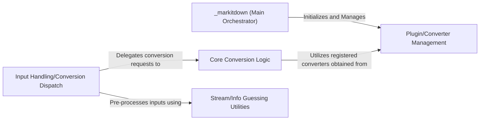

## Details

The Core Conversion Engine subsystem is primarily encapsulated within the packages.markitdown.src.markitdown._markitdown.py module. It serves as the central orchestrator for document conversion, embodying both the Facade pattern for the overall process and the Microkernel for plugin management.

### _markitdown (Main Orchestrator)
Acts as the primary API (Facade) for the entire conversion process. It initializes the system, manages the overall flow, and dispatches conversion requests. This component embodies the Microkernel aspect by providing the foundational framework for plugin management.

**Related Classes/Methods**:

- `packages.markitdown.src.markitdown._markitdown._markitdown`
- `packages.markitdown.src.markitdown._markitdown._markitdown:__init__`

### Plugin/Converter Management
Handles the discovery, loading, enabling, and registration of various document converters (plugins). This component is crucial for the system's extensibility, allowing new converters to be integrated seamlessly into the conversion pipeline.

**Related Classes/Methods**:

- `packages.markitdown.src.markitdown._markitdown._markitdown:_load_plugins`
- `packages.markitdown.src.markitdown._markitdown._markitdown:enable_builtins`
- `packages.markitdown.src.markitdown._markitdown._markitdown:enable_plugins`
- `packages.markitdown.src.markitdown._markitdown._markitdown:register_converter`
- `packages.markitdown.src.markitdown._markitdown._markitdown:register_page_converter`

### Input Handling/Conversion Dispatch
Provides a unified interface for processing different input sources (e.g., URI, stream, local file, URL, HTTP response). It pre-processes these inputs and dispatches the conversion request to the core conversion logic, abstracting away the specifics of input acquisition.

**Related Classes/Methods**:

- `packages.markitdown.src.markitdown._markitdown._markitdown:convert`
- `packages.markitdown.src.markitdown._markitdown._markitdown:convert_uri`
- `packages.markitdown.src.markitdown._markitdown._markitdown:convert_stream`
- `packages.markitdown.src.markitdown._markitdown._markitdown:convert_local`
- `packages.markitdown.src.markitdown._markitdown._markitdown:convert_response`
- `packages.markitdown.src.markitdown._markitdown._markitdown:convert_url`

### Core Conversion Logic
Contains the central algorithm responsible for performing the actual document transformation. It orchestrates the application of registered converters based on the input type and the desired output format.

**Related Classes/Methods**:

- `packages.markitdown.src.markitdown._markitdown._markitdown:_convert`

### Stream/Info Guessing Utilities
Provides helper methods that pre-process input streams, intelligently guess content types (e.g., MIME type, encoding), and normalize character sets to ensure consistent and accurate processing by subsequent components.

**Related Classes/Methods**:

- `packages.markitdown.src.markitdown._markitdown._markitdown:_get_stream_info_guesses`
- `packages.markitdown.src.markitdown._markitdown._markitdown:_normalize_charset`

### [FAQ](https://github.com/CodeBoarding/GeneratedOnBoardings/tree/main?tab=readme-ov-file#faq)