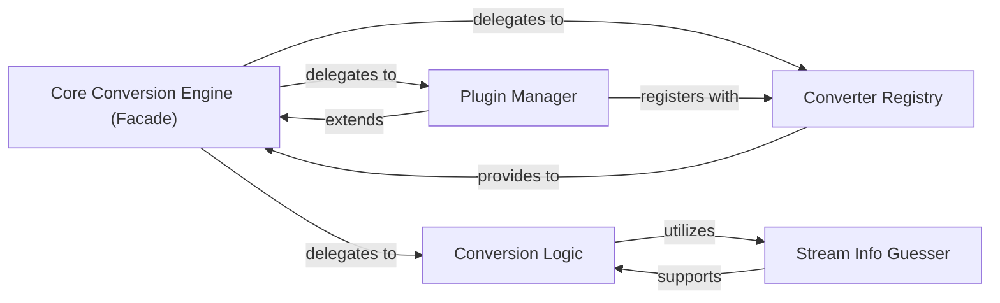

## Details

The Core Conversion Engine subsystem is primarily encapsulated within the markitdown._markitdown class, which serves as the central orchestrator for all document conversion operations.

### Core Conversion Engine (Facade)
This is the central orchestrator and the primary facade for the entire MarkItDown conversion process. It exposes simplified `convert` methods (`convert_local`, `convert_stream`, `convert_uri`, `convert_response`) to the external world, abstracting the underlying complexity of converter selection, plugin management, and actual conversion execution. It acts as the main entry point for all conversion requests.

**Related Classes/Methods**:

- `markitdown._markitdown:convert_local`
- `markitdown._markitdown:convert_stream`
- `markitdown._markitdown:convert_uri`
- `markitdown._markitdown:convert_response`

### Plugin Manager
Responsible for dynamically extending the capabilities of the Core Conversion Engine. It handles the loading and enabling of external plugins, allowing the system to incorporate new converters or functionalities without modifying the core codebase.

**Related Classes/Methods**:

- `markitdown._markitdown:enable_plugins`
- `markitdown._markitdown:_load_plugins`

### Converter Registry
Manages the registration and lookup of various document converters (both built-in and plugin-provided). It maintains a collection of available conversion strategies, allowing the Core Conversion Engine to select the appropriate converter based on the input document type or user-defined preferences.

**Related Classes/Methods**:

- `markitdown._markitdown:enable_builtins`
- `markitdown._markitdown:register_converter`
- `markitdown._markitdown:register_page_converter`

### Conversion Logic
Encapsulates the core transformation logic for converting documents. This component orchestrates the actual parsing, processing, and output generation, delegating specific tasks to registered converters as needed. It handles the flow of data through the conversion pipeline.

**Related Classes/Methods**:

- `markitdown._markitdown:_convert`
- `markitdown._markitdown:convert_local`
- `markitdown._markitdown:convert_stream`
- `markitdown._markitdown:convert_uri`
- `markitdown._markitdown:convert_response`

### Stream Info Guesser
A utility component that supports the Conversion Logic by analyzing input streams to determine crucial information such as file type, encoding, or other metadata. This information is vital for the Conversion Logic to correctly identify and process the input, ensuring accurate conversion.

**Related Classes/Methods**:

- `markitdown._markitdown:_get_stream_info_guesses`
- `markitdown._markitdown:_normalize_charset`

### [FAQ](https://github.com/CodeBoarding/GeneratedOnBoardings/tree/main?tab=readme-ov-file#faq)