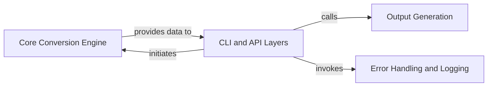

## Details

Updated architectural analysis of the `markitdown` project based on corrected source code references.

### Core Conversion Engine [[Expand]](./Core_Conversion_Engine.md)
The primary component responsible for managing the entire conversion lifecycle. It registers available converters, dispatches input data to the correct converter based on its type or format, and orchestrates the sequence of transformations. It embodies the "Core Conversion Engine" and "Facade Pattern" by providing a simplified interface to the underlying conversion complexities.

**Related Classes/Methods**:

- <a href="https://github.com/microsoft/markitdown/blob/main/packages/markitdown/src/markitdown/_markitdown.py" target="_blank" rel="noopener noreferrer">`markitdown._markitdown`</a>

### CLI and API Layers
Serves as the external interface for the `markitdown` utility, handling user input (e.g., command-line arguments) and initiating the data transformation process. It interacts directly with the `Core Conversion Engine` to trigger conversions and manages the overall application execution flow. This component aligns with the "CLI and API Layers" pattern.

**Related Classes/Methods**:

- <a href="https://github.com/microsoft/markitdown/blob/main/packages/markitdown/src/markitdown/__main__.py" target="_blank" rel="noopener noreferrer">`markitdown.__main__`</a>

### Output Generation
Manages the final disposition of the processed data after conversion. This includes writing the output to various destinations such as files, printing to the console, or preparing the data for further programmatic consumption. This component directly supports the "Output Generation" aspect.

**Related Classes/Methods**:

- <a href="https://github.com/microsoft/markitdown/blob/main/packages/markitdown/src/markitdown/__main__.py" target="_blank" rel="noopener noreferrer">`markitdown.__main__`</a>

### Error Handling and Logging
Provides a centralized and standardized mechanism for detecting, handling, and reporting errors that occur during the application's execution. It ensures graceful degradation and controlled exits, enhancing the robustness of the utility. This component directly supports the "Error Handling and Logging" pattern.

**Related Classes/Methods**:

- <a href="https://github.com/microsoft/markitdown/blob/main/packages/markitdown/src/markitdown/__main__.py" target="_blank" rel="noopener noreferrer">`markitdown.__main__`</a>

### [FAQ](https://github.com/CodeBoarding/GeneratedOnBoardings/tree/main?tab=readme-ov-file#faq)