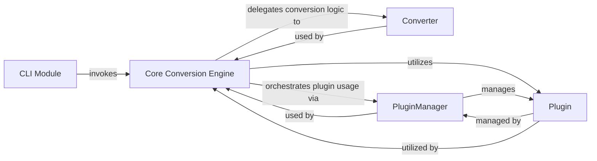

## Details

Analysis of the `markitdown` library's core components and their relationships, including source code references and identified areas for further investigation.

### Core Conversion Engine [[Expand]](./Core_Conversion_Engine.md)
The central orchestrator and facade for all document conversion tasks, managing the lifecycle from input parsing to markdown output. It acts as the primary entry point for the `markitdown` library, abstracting complex internal operations and providing a simplified Python API. It is responsible for integrating and utilizing plugins to extend conversion capabilities and abstracts the complexity of underlying format-specific `Converter` implementations.

**Related Classes/Methods**:

- <a href="https://github.com/microsoft/markitdown/blob/main/packages/markitdown/src/markitdown/_markitdown.py#L93-L771" target="_blank" rel="noopener noreferrer">`markitdown._markitdown.MarkItDown`:93-771</a>

### Converter
Handles format-specific transformations, converting various input document formats into an intermediate representation or directly to markdown. These components embody the "Pipes and Filters" pattern within the conversion pipeline.

**Related Classes/Methods**:

- <a href="https://github.com/microsoft/markitdown/blob/main/packages/markitdown/src/markitdown/_base_converter.py#L42-L105" target="_blank" rel="noopener noreferrer">`markitdown._base_converter.DocumentConverter`:42-105</a>

### PluginManager
Manages the discovery, loading, and lifecycle of plugins. It provides the mechanism for `markitdown._markitdown.MarkItDown` to interact with and leverage custom extensions.

**Related Classes/Methods**:

- <a href="https://github.com/microsoft/markitdown/blob/main/packages/markitdown/src/markitdown/_markitdown.py#L65-L82" target="_blank" rel="noopener noreferrer">`markitdown._markitdown._load_plugins`:65-82</a>
- <a href="https://github.com/microsoft/markitdown/blob/main/packages/markitdown/src/markitdown/_markitdown.py#L223-L241" target="_blank" rel="noopener noreferrer">`markitdown._markitdown.enable_plugins`:223-241</a>

### Plugin
Represents a custom extension point, allowing users to inject custom logic for pre-processing, post-processing, or custom conversion steps within the `markitdown` pipeline.

**Related Classes/Methods**: _None_

### CLI Module
Provides the command-line interface for the `markitdown` library, allowing users to invoke the `Core Conversion Engine` to execute conversion tasks from the terminal.

**Related Classes/Methods**: _None_

### [FAQ](https://github.com/CodeBoarding/GeneratedOnBoardings/tree/main?tab=readme-ov-file#faq)