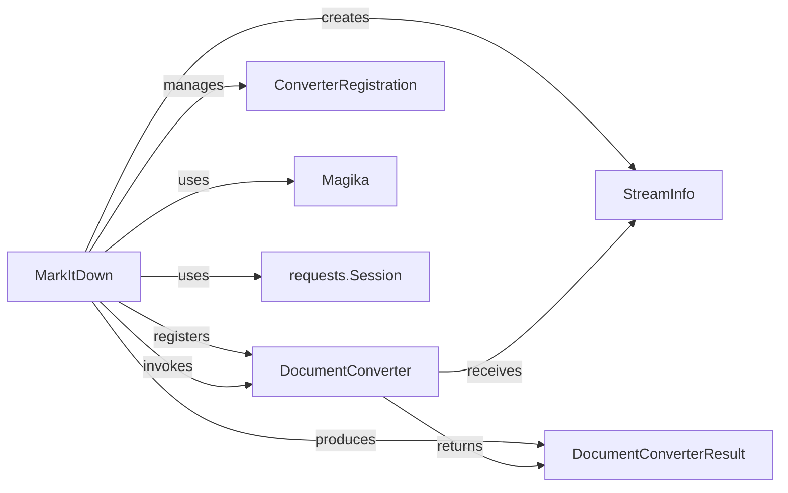

## Details

The `markitdown` subsystem is a central document conversion engine with a pluggable architecture. It orchestrates conversions by identifying input types, selecting appropriate converters, and producing standardized Markdown output. It leverages `Magika` for type detection and `requests.Session` for URL fetching.

### MarkItDown
The central orchestrator of the conversion process. It manages the registration and prioritization of `DocumentConverter` instances, handles various input sources (files, URLs, streams), performs initial content analysis, and dispatches conversion tasks. It provides the unified API for the conversion engine.

**Related Classes/Methods**:

- <a href="https://github.com/microsoft/markitdown/blob/main/packages/markitdown/src/markitdown/_markitdown.py#L92-L770" target="_blank" rel="noopener noreferrer">`markitdown._markitdown.MarkItDown`:92-770)</a>

### DocumentConverter
Defines the abstract interface for all specific document conversion logic. Concrete implementations must provide `accepts` (to determine if they can handle a given `StreamInfo`) and `convert` (to perform the actual conversion to Markdown, returning a `DocumentConverterResult`). This component embodies the plugin architecture.

**Related Classes/Methods**:

### ConverterRegistration
A data structure used by `MarkItDown` to manage and prioritize `DocumentConverter` instances. It pairs a `DocumentConverter` with a priority value, ensuring that more specific converters are attempted before generic ones during the conversion dispatch.

**Related Classes/Methods**:

- <a href="https://github.com/microsoft/markitdown/blob/main/packages/markitdown/src/markitdown/_markitdown.py#L84-L89" target="_blank" rel="noopener noreferrer">`markitdown.ConverterRegistration`:84-89)</a>

### StreamInfo
Encapsulates comprehensive metadata about the input stream, such as its path, URL, filename, extension, MIME type, and character set. This information is crucial for `MarkItDown` to select the appropriate converter and for converters to process the content correctly.

**Related Classes/Methods**:

### DocumentConverterResult
Holds the outcome of a successful document conversion, primarily the `text_content` in Markdown format. It serves as the standardized output from any `DocumentConverter` and is ultimately returned by the `MarkItDown` orchestrator.

**Related Classes/Methods**:

### Magika
An external utility integrated into the Core Conversion Engine to provide robust file type identification based on the content of a binary stream. This is a critical step for `MarkItDown` to determine the most suitable `DocumentConverter`.

**Related Classes/Methods**: _None_

### requests.Session
An external library component used by the Core Conversion Engine to manage HTTP connections and requests. It enables `MarkItDown` to efficiently and reliably fetch content from URLs, acting as a crucial input mechanism for remote documents.

**Related Classes/Methods**: _None_

### [FAQ](https://github.com/CodeBoarding/GeneratedOnBoardings/tree/main?tab=readme-ov-file#faq)