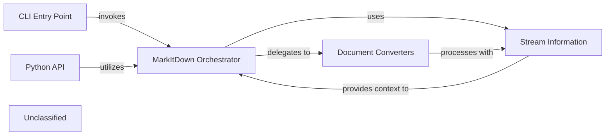

## Details

The `markitdown` subsystem provides a flexible and extensible framework for converting diverse document formats into Markdown. At its core, the `MarkItDown` orchestrator (`markitdown._markitdown.MarkItDown`) manages the entire conversion lifecycle, from plugin discovery and input type inference to delegating content processing. Users can interact with the system through a command-line interface (`markitdown.__main__`) or programmatically via the `MarkItDown` class itself, which serves as the Python API. The system leverages a collection of specialized `Document Converters` (found in `markitdown.converters`) to handle various input formats, transforming them into a standardized intermediate representation before generating the final Markdown output. Crucial metadata about the input stream is captured and conveyed by `StreamInfo` objects (`markitdown._stream_info.StreamInfo`), enabling intelligent routing and processing decisions throughout the conversion pipeline.

### MarkItDown Orchestrator
The `MarkItDown` class serves as the central orchestrator and facade for the document conversion process. It manages the end-to-end lifecycle, including plugin discovery and loading, input type inference, dispatching tasks to input adapters, routing content to processors for enhancements, and passing processed content to the Markdown renderer for final output. It also provides a high-level interface to external systems.

**Related Classes/Methods**:

- <a href="https://github.com/microsoft/markitdown/blob/mainpackages/markitdown/src/markitdown/_markitdown.py#L93-L776" target="_blank" rel="noopener noreferrer">`markitdown._markitdown.MarkItDown`:93-776</a>

### Stream Information
The `StreamInfo` class encapsulates metadata and content details of the input stream or document. It provides essential context for the `MarkItDown` orchestrator to make decisions regarding input type inference and processing throughout the conversion process.

**Related Classes/Methods**:

- <a href="https://github.com/microsoft/markitdown/blob/mainpackages/markitdown/src/markitdown/_stream_info.py#L5-L32" target="_blank" rel="noopener noreferrer">`markitdown._stream_info.StreamInfo`:5-32</a>

### CLI Entry Point
Provides a command-line interface for users to interact with the `MarkItDown` conversion engine, initiating conversion tasks via command-line arguments.

**Related Classes/Methods**:

- `markitdown.__main__`:13-200

### Python API
Exposes a programmatic Python interface for developers to integrate the `MarkItDown` conversion capabilities into other Python applications.

**Related Classes/Methods**:

- <a href="https://github.com/microsoft/markitdown/blob/mainpackages/markitdown/src/markitdown/_markitdown.py#L93-L776" target="_blank" rel="noopener noreferrer">`markitdown._markitdown.MarkItDown`:93-776</a>

### Document Converters [[Expand]](./Document_Converters.md)
A collection of components responsible for understanding and parsing various input document formats (e.g., PDF, DOCX, audio, video) and converting them into a standardized intermediate representation for the `MarkItDown` engine, ultimately producing Markdown.

**Related Classes/Methods**:

- `markitdown.converters`

### Unclassified
Component for all unclassified files and utility functions (Utility functions/External Libraries/Dependencies)

**Related Classes/Methods**: _None_

### [FAQ](https://github.com/CodeBoarding/GeneratedOnBoardings/tree/main?tab=readme-ov-file#faq)