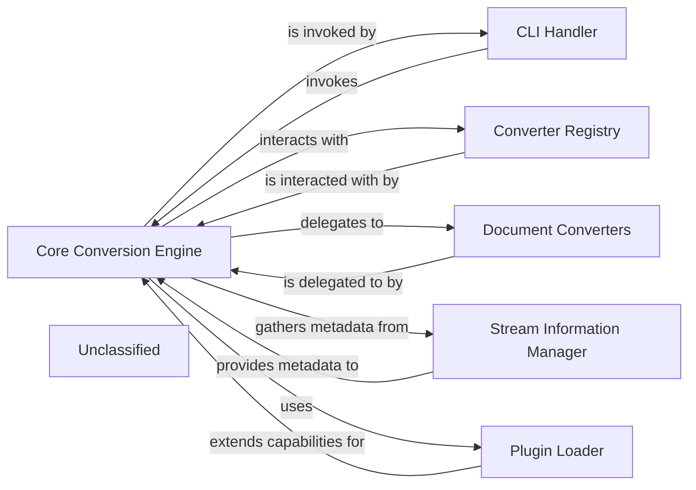

## Details

The `Core Conversion Engine` acts as the central coordinator within this subsystem. The `CLI Handler` serves as the external trigger, initiating operations on the `Core Conversion Engine`. Upon receiving a conversion request, the `Core Conversion Engine` first consults the `Stream Information Manager` to understand the characteristics of the input data. With this information, it then queries the `Converter Registry` to identify and retrieve the appropriate `Document Converter` for the task. The actual transformation is then delegated to the selected `Document Converter`. Furthermore, the `Plugin Loader` extends the system's capabilities by dynamically adding new `Document Converters` or other processing steps, which are then integrated and managed by the `Core Conversion Engine`, often by registering them with the `Converter Registry`. This forms a pipeline-oriented processing flow, with the `Core Conversion Engine` managing the chain of responsibility.

### Core Conversion Engine [[Expand]](./Core_Conversion_Engine.md)
The central orchestrator of the `markitdown` system. It manages the lifecycle of converters, dispatches conversion tasks, and coordinates the overall data flow. It acts as the primary interface for the CLI Handler, embodying a Facade pattern for the conversion process.

**Related Classes/Methods**:

- <a href="https://github.com/microsoft/markitdown/blob/main/packages/markitdown/src/markitdown/_markitdown.py#L93-L776" target="_blank" rel="noopener noreferrer">`markitdown._markitdown.MarkItDown`:93-776</a>
- <a href="https://github.com/microsoft/markitdown/blob/main/packages/markitdown/src/markitdown/_markitdown.py" target="_blank" rel="noopener noreferrer">`markitdown._markitdown:register_converter`</a>
- <a href="https://github.com/microsoft/markitdown/blob/main/packages/markitdown/src/markitdown/_markitdown.py" target="_blank" rel="noopener noreferrer">`markitdown._markitdown:enable_plugins`</a>
- <a href="https://github.com/microsoft/markitdown/blob/main/packages/markitdown/src/markitdown/_markitdown.py" target="_blank" rel="noopener noreferrer">`markitdown._markitdown:_load_plugins`</a>

### CLI Handler
Provides the command-line interface for users to interact with the `markitdown` utility. It parses user commands and arguments, then invokes the `Core Conversion Engine` to execute the requested conversion.

**Related Classes/Methods**:

- <a href="https://github.com/microsoft/markitdown/blob/main/packages/markitdown/src/markitdown/__main__.py" target="_blank" rel="noopener noreferrer">`packages.markitdown.src.markitdown.__main__`</a>

### Converter Registry
Manages the registration and retrieval of various `Document Converters`. It provides a lookup mechanism for the `Core Conversion Engine` to select the appropriate converter based on input and output formats.

**Related Classes/Methods**:

- <a href="https://github.com/microsoft/markitdown/blob/main/packages/markitdown/src/markitdown/_markitdown.py" target="_blank" rel="noopener noreferrer">`packages.markitdown.src.markitdown._markitdown`</a>

### Document Converters [[Expand]](./Document_Converters.md)
A collection of specialized components, each responsible for converting documents from one specific format to another (e.g., PDF to Markdown, HTML to Markdown). They encapsulate the actual transformation logic, acting as Adapters for various document types.

**Related Classes/Methods**:

- <a href="https://github.com/microsoft/markitdown/blob/main/packages/markitdown/src/markitdown/converters/_html_converter.py" target="_blank" rel="noopener noreferrer">`packages.markitdown.src.markitdown.converters._html_converter`</a>
- <a href="https://github.com/microsoft/markitdown/blob/main/packages/markitdown/src/markitdown/converters/_pptx_converter.py" target="_blank" rel="noopener noreferrer">`packages.markitdown.src.markitdown.converters._pptx_converter`</a>
- <a href="https://github.com/microsoft/markitdown/blob/main/packages/markitdown/src/markitdown/converters/_doc_intel_converter.py" target="_blank" rel="noopener noreferrer">`packages.markitdown.src.markitdown.converters._doc_intel_converter`</a>

### Stream Information Manager
Responsible for analyzing input streams (local files, URIs, raw data) to determine their type, format, and other relevant metadata. This information is vital for the `Core Conversion Engine` to select the correct `Document Converter`.

**Related Classes/Methods**:

- <a href="https://github.com/microsoft/markitdown/blob/main/packages/markitdown/src/markitdown/_stream_info.py#L5-L32" target="_blank" rel="noopener noreferrer">`packages.markitdown.src.markitdown._stream_info.StreamInfo`:5-32</a>

### Plugin Loader
Handles the discovery, loading, and activation of external plugins that extend the `markitdown` system's capabilities, such as new `Document Converters` or additional processing steps.

**Related Classes/Methods**:

- <a href="https://github.com/microsoft/markitdown/blob/main/packages/markitdown/src/markitdown/_markitdown.py#L65-L82" target="_blank" rel="noopener noreferrer">`packages.markitdown.src.markitdown._markitdown._load_plugins`:65-82</a>
- <a href="https://github.com/microsoft/markitdown/blob/main/packages/markitdown/src/markitdown/_markitdown.py" target="_blank" rel="noopener noreferrer">`markitdown._markitdown:enable_plugins`</a>

### Unclassified
Component for all unclassified files and utility functions (Utility functions/External Libraries/Dependencies)

**Related Classes/Methods**: _None_

### [FAQ](https://github.com/CodeBoarding/GeneratedOnBoardings/tree/main?tab=readme-ov-file#faq)