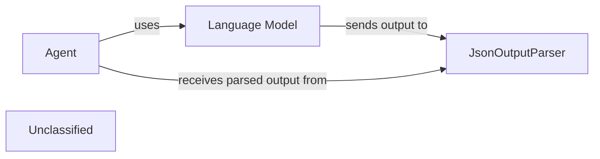

## Details

This graph represents the core functionality of a LangChain agent that uses a `JsonOutputParser` to process the output from a language model. The main flow involves an agent executing a task, receiving a JSON string as output, and then parsing this JSON string into a structured format for further use. The purpose is to demonstrate how to integrate a custom output parser within a LangChain agent's workflow.

### Agent
The LangChain agent responsible for executing tasks and interacting with the language model.

**Related Classes/Methods**:

- `langchain.agents.AgentExecutor`

### Language Model
The large language model that generates text output, expected to be in JSON format.

**Related Classes/Methods**:

- `langchain_core.language_models.llms.BaseLLM`

### JsonOutputParser
A component that parses a JSON string output from the language model into a structured Python object.

**Related Classes/Methods**:

- `langchain_core.output_parsers.JsonOutputParser`
- `langchain_core.output_parsers.JsonOutputParser:parse`

### Unclassified
Component for all unclassified files and utility functions (Utility functions/External Libraries/Dependencies)

**Related Classes/Methods**: _None_

### [FAQ](https://github.com/CodeBoarding/GeneratedOnBoardings/tree/main?tab=readme-ov-file#faq)