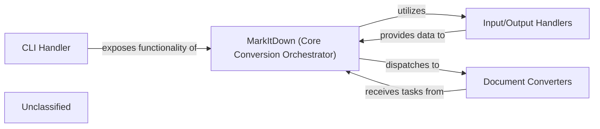

## Details

The `MarkItDown` project is structured around a central `MarkItDown (Core Conversion Orchestrator)` component, which acts as the primary control for document conversion. This orchestrator leverages `Input/Output Handlers` to intelligently process and detect the type of incoming data, preparing it for conversion. Once the input is understood, the orchestrator dispatches the conversion task to specialized `Document Converters`, each responsible for transforming specific document formats. User interaction is facilitated through a `CLI Handler`, which serves as the external interface, exposing the core conversion capabilities of the `MarkItDown` orchestrator. This architecture promotes modularity and extensibility, allowing for easy integration of new input types and conversion formats.

### MarkItDown (Core Conversion Orchestrator)
The central component managing the entire document conversion process, including converter registration, input type detection, and dispatching tasks to appropriate converters. It also holds global configurations. This component embodies the Facade/Adapter pattern by providing a unified interface to various conversion capabilities and the Plugin Architecture by managing pluggable converters.

**Related Classes/Methods**:

- <a href="https://github.com/microsoft/markitdown/blob/main/packages/markitdown/src/markitdown/_markitdown.py" target="_blank" rel="noopener noreferrer">`packages.markitdown.src.markitdown._markitdown.MarkItDown`</a>
- <a href="https://github.com/microsoft/markitdown/blob/main/packages/markitdown/src/markitdown/_markitdown.py" target="_blank" rel="noopener noreferrer">`packages.markitdown.src.markitdown._markitdown.convert`</a>

### CLI Handler [[Expand]](./CLI_Handler.md)
The command-line interface component that exposes the core conversion functionality of the `MarkItDown` orchestrator to end-users. It acts as the primary user-facing entry point for the utility.

**Related Classes/Methods**:

- <a href="https://github.com/microsoft/markitdown/blob/main/packages/markitdown/src/markitdown/_markitdown.py" target="_blank" rel="noopener noreferrer">`MarkItDown:convert`</a>

### Input/Output Handlers
A collection of utilities and classes responsible for analyzing input streams, detecting their types, and extracting relevant metadata to guide the conversion process. This component is crucial for the initial stage of the conversion pipeline.

**Related Classes/Methods**:

- <a href="https://github.com/microsoft/markitdown/blob/main/packages/markitdown/src/markitdown/_stream_info.py#L5-L32" target="_blank" rel="noopener noreferrer">`_stream_info.StreamInfo`:5-32</a>
- <a href="https://github.com/microsoft/markitdown/blob/main/packages/markitdown/src/markitdown/_markitdown.py#L666-L765" target="_blank" rel="noopener noreferrer">`_get_stream_info_guesses`:666-765</a>

### Document Converters
A set of specialized converters, each designed to transform documents from a specific input format to a target output format, used by the `MarkItDown` orchestrator. These components represent the core transformation logic for various document types.

**Related Classes/Methods**:

- <a href="https://github.com/microsoft/markitdown/blob/main/packages/markitdown/src/markitdown/converters/_xlsx_converter.py" target="_blank" rel="noopener noreferrer">`_html_converter`</a>
- <a href="https://github.com/microsoft/markitdown/blob/main/packages/markitdown/src/markitdown/converters/_pptx_converter.py#L34-L264" target="_blank" rel="noopener noreferrer">`_pptx_converter`:34-264</a>
- <a href="https://github.com/microsoft/markitdown/blob/main/packages/markitdown/src/markitdown/converters/_doc_intel_converter.py" target="_blank" rel="noopener noreferrer">`_doc_intel_converter`</a>

### Unclassified
Component for all unclassified files and utility functions (Utility functions/External Libraries/Dependencies)

**Related Classes/Methods**: _None_

### [FAQ](https://github.com/CodeBoarding/GeneratedOnBoardings/tree/main?tab=readme-ov-file#faq)