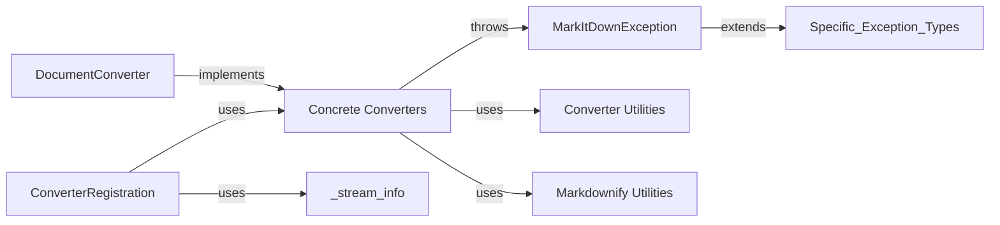

## Component Details

One paragraph explaining the functionality which is represented by this graph. What the main flow is and what is its purpose.

### DocumentConverter
Defines the contract for all concrete converters. Specifies the core `convert` method (likely taking a file path and returning a Markdown string).

**Related Classes/Methods**:

- <a href="https://github.com/microsoft/markitdown/blob/master/packages/markitdown/src/markitdown/_base_converter.py#L1-L100" target="_blank" rel="noopener noreferrer">`markitdown._base_converter.py` (1:100)</a>

### Concrete Converters
A group of classes (e.g., `DocxConverter`, `PdfConverter`, `HtmlConverter`) each implementing the `DocumentConverter` interface for a specific file type. Contains the actual conversion logic.

**Related Classes/Methods**:

- `markitdown.converters` (1:100)

### ConverterRegistration
Maps document file extensions to the appropriate converter class. Acts as a factory or dispatcher, selecting the correct converter based on the input file type.

**Related Classes/Methods**:

- <a href="https://github.com/microsoft/markitdown/blob/master/packages/markitdown/src/markitdown/_markitdown.py#L1-L100" target="_blank" rel="noopener noreferrer">`markitdown._markitdown.py` (1:100)</a>

### MarkItDownException
Base class for all custom exceptions within the `markitdown` package. Ensures consistent error handling.

**Related Classes/Methods**:

- <a href="https://github.com/microsoft/markitdown/blob/master/packages/markitdown/src/markitdown/_exceptions.py#L1-L100" target="_blank" rel="noopener noreferrer">`markitdown._exceptions.py` (1:100)</a>

### Converter Utilities
Helper functions and classes used by the concrete converters to perform common tasks (e.g., file I/O, format-specific processing). The example mentions DOCX processing utilities.

**Related Classes/Methods**:

- `markitdown.converter_utils` (1:100)

### Markdownify Utilities
Functions to format the converted output as Markdown.

**Related Classes/Methods**:

- <a href="https://github.com/microsoft/markitdown/blob/master/packages/markitdown/src/markitdown/converters/_markdownify.py#L1-L100" target="_blank" rel="noopener noreferrer">`markitdown.converters._markdownify.py` (1:100)</a>

### _stream_info
Handles information about input streams (files).

**Related Classes/Methods**:

- <a href="https://github.com/microsoft/markitdown/blob/master/packages/markitdown/src/markitdown/_stream_info.py#L1-L100" target="_blank" rel="noopener noreferrer">`markitdown._stream_info.py` (1:100)</a>

### [FAQ](https://github.com/CodeBoarding/GeneratedOnBoardings/tree/main?tab=readme-ov-file#faq)