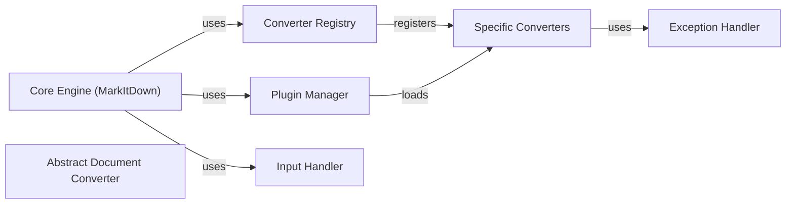

## Component Details

Component overview of the MarkItDown conversion system.

### Core Engine (MarkItDown)
Main orchestrator for the conversion process.

**Related Classes/Methods**:

- <a href="https://github.com/microsoft/markitdown/blob/master/packages/markitdown/src/markitdown/_markitdown.py#L92-L770" target="_blank" rel="noopener noreferrer">`packages.markitdown.src.markitdown._markitdown.MarkItDown` (92:770)</a>

### Converter Registry
Manages registration of all available converters.

**Related Classes/Methods**:

- <a href="https://github.com/microsoft/markitdown/blob/master/packages/markitdown/src/markitdown/_markitdown.py#L628-L658" target="_blank" rel="noopener noreferrer">`packages.markitdown.src.markitdown._markitdown.MarkItDown.register_converter` (628:658)</a>

### Plugin Manager
Loads and manages external plugins.

**Related Classes/Methods**:

- <a href="https://github.com/microsoft/markitdown/blob/master/packages/markitdown/src/markitdown/_markitdown.py#L64-L81" target="_blank" rel="noopener noreferrer">`packages.markitdown.src.markitdown._markitdown._load_plugins` (64:81)</a>

### Abstract Document Converter
Abstract base class for all specific converters.

**Related Classes/Methods**:

- <a href="https://github.com/microsoft/markitdown/blob/master/packages/markitdown/src/markitdown/_base_converter.py#L41-L104" target="_blank" rel="noopener noreferrer">`markitdown._base_converter.DocumentConverter` (41:104)</a>

### Specific Converters
Individual converters for different file formats.

**Related Classes/Methods**:

- `markitdown.converters.PdfConverter` (100:150)
- `markitdown.converters.DocxConverter` (151:250)

### Input Handler
Handles various input types.

**Related Classes/Methods**: _None_

### Exception Handler
Centralized error handling.

**Related Classes/Methods**:

- <a href="https://github.com/microsoft/markitdown/blob/master/packages/markitdown/src/markitdown/_exceptions.py#L1-L50" target="_blank" rel="noopener noreferrer">`markitdown._exceptions` (1:50)</a>

### [FAQ](https://github.com/CodeBoarding/GeneratedOnBoardings/tree/main?tab=readme-ov-file#faq)