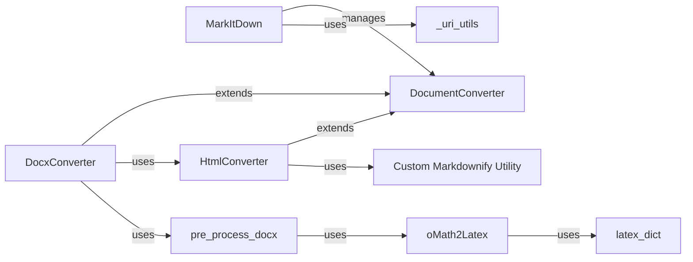

## Component Details

This analysis details the core components and their relationships within the `markitdown` project, a library designed for converting various document formats to Markdown. It highlights the modular and extensible architecture, including the central orchestrator, abstract converter interfaces, and specialized converters for formats like HTML and DOCX, along with their supporting utilities.

### MarkItDown
The central orchestrator of the `markitdown` library. It is responsible for identifying the input type (e.g., file, URL), selecting the appropriate `DocumentConverter` implementation, and delegating the conversion task. It also manages the loading of built-in and plugin converters.

**Related Classes/Methods**:

- <a href="https://github.com/microsoft/markitdown/blob/master/packages/markitdown/src/markitdown/_markitdown.py#L1-L1" target="_blank" rel="noopener noreferrer">`markitdown._markitdown` (1:1)</a>

### DocumentConverter
An abstract base class that defines the standard interface for all document converters within the `markitdown` system. It mandates `accepts()` (to determine if a converter can handle a given input stream) and `convert()` (to perform the actual conversion to Markdown), ensuring a consistent and extensible API.

**Related Classes/Methods**:

- <a href="https://github.com/microsoft/markitdown/blob/master/packages/markitdown/src/markitdown/_base_converter.py#L41-L104" target="_blank" rel="noopener noreferrer">`markitdown._base_converter.DocumentConverter` (41:104)</a>
- <a href="https://github.com/microsoft/markitdown/blob/master/packages/markitdown/src/markitdown/_base_converter.py#L44-L81" target="_blank" rel="noopener noreferrer">`markitdown._base_converter.DocumentConverter:accepts` (44:81)</a>
- <a href="https://github.com/microsoft/markitdown/blob/master/packages/markitdown/src/markitdown/_base_converter.py#L83-L104" target="_blank" rel="noopener noreferrer">`markitdown._base_converter.DocumentConverter:convert` (83:104)</a>

### _uri_utils
This module provides essential utility functions for parsing and handling various URI schemes, including `file://` and `data:` URIs. It assists in resolving input paths and extracting data from diverse input formats, which is crucial for `MarkItDown` to process different source types.

**Related Classes/Methods**:

- <a href="https://github.com/microsoft/markitdown/blob/master/packages/markitdown/src/markitdown/_uri_utils.py#L1-L1" target="_blank" rel="noopener noreferrer">`markitdown._uri_utils` (1:1)</a>

### HtmlConverter
A concrete implementation of `DocumentConverter` specifically designed to transform HTML content into Markdown. It serves as a critical intermediate step for other converters (e.g., `DocxConverter`, `EpubConverter`) that first convert their native formats to HTML before the final Markdown conversion. It delegates the core HTML parsing and Markdown generation to the `_CustomMarkdownify` utility.

**Related Classes/Methods**:

- <a href="https://github.com/microsoft/markitdown/blob/master/packages/markitdown/src/markitdown/converters/_html_converter.py#L19-L89" target="_blank" rel="noopener noreferrer">`markitdown.converters._html_converter.HtmlConverter` (19:89)</a>

### Custom Markdownify Utility
This utility extends the third-party `markdownify.MarkdownConverter` class to provide tailored HTML-to-Markdown conversion. It implements custom rules for: Headings: Ensures headings (`convert_hn`) always start with a new line for consistent formatting. Hyperlinks: Sanitizes hyperlinks (`convert_a`) by removing JavaScript links and restricting allowed URI schemes to `http`, `https`, and `file`. It also properly escapes URIs to prevent conflicts with Markdown syntax. Image Data URIs: Manages image data URIs (`convert_img`) by truncating large `data:` URI sources by default, unless explicitly configured to keep them.

**Related Classes/Methods**:

- <a href="https://github.com/microsoft/markitdown/blob/master/packages/markitdown/src/markitdown/converters/_markdownify.py#L7-L110" target="_blank" rel="noopener noreferrer">`markitdown.converters._markdownify._CustomMarkdownify` (7:110)</a>
- <a href="https://github.com/microsoft/markitdown/blob/master/packages/markitdown/src/markitdown/converters/_markdownify.py#L23-L36" target="_blank" rel="noopener noreferrer">`markitdown.converters._markdownify._CustomMarkdownify:convert_hn` (23:36)</a>
- <a href="https://github.com/microsoft/markitdown/blob/master/packages/markitdown/src/markitdown/converters/_markdownify.py#L38-L82" target="_blank" rel="noopener noreferrer">`markitdown.converters._markdownify._CustomMarkdownify:convert_a` (38:82)</a>
- <a href="https://github.com/microsoft/markitdown/blob/master/packages/markitdown/src/markitdown/converters/_markdownify.py#L84-L107" target="_blank" rel="noopener noreferrer">`markitdown.converters._markdownify._CustomMarkdownify:convert_img` (84:107)</a>

### DocxConverter
A concrete implementation of `DocumentConverter` tailored for converting Microsoft Word (.docx) files into Markdown. It leverages the `mammoth` library for the initial DOCX to HTML conversion and then utilizes the `HtmlConverter` to transform the resulting HTML into Markdown. It also includes a pre-processing step for mathematical equations.

**Related Classes/Methods**:

- <a href="https://github.com/microsoft/markitdown/blob/master/packages/markitdown/src/markitdown/converters/_docx_converter.py#L27-L79" target="_blank" rel="noopener noreferrer">`markitdown.converters._docx_converter.DocxConverter` (27:79)</a>

### pre_process_docx
A utility function responsible for pre-processing DOCX files before their conversion to HTML. Its primary function is to identify and convert Office Math Markup Language (OMML) equations embedded within the DOCX XML structure into LaTeX format, ensuring they are correctly rendered in the final Markdown output.

**Related Classes/Methods**:

- <a href="https://github.com/microsoft/markitdown/blob/master/packages/markitdown/src/markitdown/converter_utils/docx/pre_process.py#L117-L155" target="_blank" rel="noopener noreferrer">`markitdown.converter_utils.docx.pre_process.pre_process_docx` (117:155)</a>

### oMath2Latex
A utility function used by `pre_process_docx` to convert Office Math Markup Language (OMML) equations found within DOCX files into LaTeX format. This ensures mathematical expressions are correctly rendered in the final Markdown output.

**Related Classes/Methods**:

- <a href="https://github.com/microsoft/markitdown/blob/master/packages/markitdown/src/markitdown/converter_utils/docx/math/omml.py#L169-L399" target="_blank" rel="noopener noreferrer">`markitdown.converter_utils.docx.math.omml.oMath2Latex` (169:399)</a>

### latex_dict
A dictionary containing mappings from various OMML elements and structures to their corresponding LaTeX representations. It serves as a lookup table for the `oMath2Latex` function during the conversion of mathematical equations.

**Related Classes/Methods**:

- <a href="https://github.com/microsoft/markitdown/blob/master/packages/markitdown/src/markitdown/converter_utils/docx/math/latex_dict.py#L1-L1" target="_blank" rel="noopener noreferrer">`markitdown.converter_utils.docx.math.latex_dict.latex_dict` (1:1)</a>

### [FAQ](https://github.com/CodeBoarding/GeneratedOnBoardings/tree/main?tab=readme-ov-file#faq)