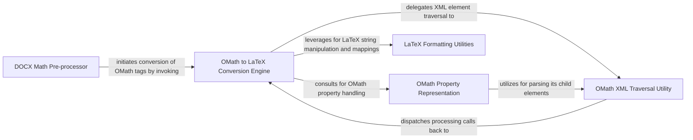

## Component Details

This graph represents the DOCX Conversion Utilities subsystem, which specializes in pre-processing mathematical equations within DOCX documents. Its main purpose is to convert Office Math Markup Language (OMML) to LaTeX by manipulating the DOCX XML structure in memory, ensuring accurate representation of mathematical notation for further processing.

### DOCX Math Pre-processor
This component is responsible for identifying and preparing mathematical equations embedded within a DOCX document for subsequent conversion. It handles the initial parsing of the document to locate OMath tags and orchestrates the process of replacing them with their LaTeX equivalents.

**Related Classes/Methods**:

- <a href="https://github.com/microsoft/markitdown/blob/master/packages/markitdown/src/markitdown/converter_utils/docx/pre_process.py#L52-L71" target="_blank" rel="noopener noreferrer">`packages.markitdown.src.markitdown.converter_utils.docx.pre_process:_get_omath_tag_replacement` (52:71)</a>
- <a href="https://github.com/microsoft/markitdown/blob/master/packages/markitdown/src/markitdown/converter_utils/docx/pre_process.py#L33-L49" target="_blank" rel="noopener noreferrer">`packages.markitdown.src.markitdown.converter_utils.docx.pre_process:_convert_omath_to_latex` (33:49)</a>
- <a href="https://github.com/microsoft/markitdown/blob/master/packages/markitdown/src/markitdown/converter_utils/docx/pre_process.py#L74-L96" target="_blank" rel="noopener noreferrer">`packages.markitdown.src.markitdown.converter_utils.docx.pre_process:_replace_equations` (74:96)</a>
- <a href="https://github.com/microsoft/markitdown/blob/master/packages/markitdown/src/markitdown/converter_utils/docx/pre_process.py#L99-L115" target="_blank" rel="noopener noreferrer">`packages.markitdown.src.markitdown.converter_utils.docx.pre_process:_pre_process_math` (99:115)</a>
- <a href="https://github.com/microsoft/markitdown/blob/master/packages/markitdown/src/markitdown/converter_utils/docx/pre_process.py#L118-L156" target="_blank" rel="noopener noreferrer">`packages.markitdown.src.markitdown.converter_utils.docx.pre_process:pre_process_docx` (118:156)</a>

### OMath to LaTeX Conversion Engine
This is the core component responsible for transforming Office Math Markup Language (OMML) structures into their corresponding LaTeX representations. It utilizes a comprehensive set of methods, each designed to handle specific OMath elements and their attributes, ensuring accurate mathematical notation conversion. It also leverages the Tag2Method for XML traversal.

**Related Classes/Methods**:

- <a href="https://github.com/microsoft/markitdown/blob/master/packages/markitdown/src/markitdown/converter_utils/docx/math/omml.py#L43-L46" target="_blank" rel="noopener noreferrer">`packages.markitdown.src.markitdown.converter_utils.docx.math.omml:load` (43:46)</a>
- <a href="https://github.com/microsoft/markitdown/blob/master/packages/markitdown/src/markitdown/converter_utils/docx/math/omml.py#L49-L52" target="_blank" rel="noopener noreferrer">`packages.markitdown.src.markitdown.converter_utils.docx.math.omml:load_string` (49:52)</a>
- <a href="https://github.com/microsoft/markitdown/blob/master/packages/markitdown/src/markitdown/converter_utils/docx/math/omml.py#L170-L400" target="_blank" rel="noopener noreferrer">`packages.markitdown.src.markitdown.converter_utils.docx.math.omml.oMath2Latex` (170:400)</a>
- <a href="https://github.com/microsoft/markitdown/blob/master/packages/markitdown/src/markitdown/converter_utils/docx/math/omml.py#L179-L180" target="_blank" rel="noopener noreferrer">`packages.markitdown.src.markitdown.converter_utils.docx.math.omml.oMath2Latex:__init__` (179:180)</a>
- <a href="https://github.com/microsoft/markitdown/blob/master/packages/markitdown/src/markitdown/converter_utils/docx/math/omml.py#L185-L186" target="_blank" rel="noopener noreferrer">`packages.markitdown.src.markitdown.converter_utils.docx.math.omml.oMath2Latex:__unicode__` (185:186)</a>
- <a href="https://github.com/microsoft/markitdown/blob/master/packages/markitdown/src/markitdown/converter_utils/docx/math/omml.py#L182-L183" target="_blank" rel="noopener noreferrer">`packages.markitdown.src.markitdown.converter_utils.docx.math.omml.oMath2Latex.__str__` (182:183)</a>
- <a href="https://github.com/microsoft/markitdown/blob/master/packages/markitdown/src/markitdown/converter_utils/docx/math/omml.py#L188-L194" target="_blank" rel="noopener noreferrer">`packages.markitdown.src.markitdown.converter_utils.docx.math.omml.oMath2Latex:process_unknow` (188:194)</a>
- <a href="https://github.com/microsoft/markitdown/blob/master/packages/markitdown/src/markitdown/converter_utils/docx/math/omml.py#L200-L208" target="_blank" rel="noopener noreferrer">`packages.markitdown.src.markitdown.converter_utils.docx.math.omml.oMath2Latex:do_acc` (200:208)</a>
- <a href="https://github.com/microsoft/markitdown/blob/master/packages/markitdown/src/markitdown/converter_utils/docx/math/omml.py#L210-L217" target="_blank" rel="noopener noreferrer">`packages.markitdown.src.markitdown.converter_utils.docx.math.omml.oMath2Latex:do_bar` (210:217)</a>
- <a href="https://github.com/microsoft/markitdown/blob/master/packages/markitdown/src/markitdown/converter_utils/docx/math/omml.py#L219-L232" target="_blank" rel="noopener noreferrer">`packages.markitdown.src.markitdown.converter_utils.docx.math.omml.oMath2Latex:do_d` (219:232)</a>
- <a href="https://github.com/microsoft/markitdown/blob/master/packages/markitdown/src/markitdown/converter_utils/docx/math/omml.py#L240-L242" target="_blank" rel="noopener noreferrer">`packages.markitdown.src.markitdown.converter_utils.docx.math.omml.oMath2Latex:do_sub` (240:242)</a>
- <a href="https://github.com/microsoft/markitdown/blob/master/packages/markitdown/src/markitdown/converter_utils/docx/math/omml.py#L244-L246" target="_blank" rel="noopener noreferrer">`packages.markitdown.src.markitdown.converter_utils.docx.math.omml.oMath2Latex:do_sup` (244:246)</a>
- <a href="https://github.com/microsoft/markitdown/blob/master/packages/markitdown/src/markitdown/converter_utils/docx/math/omml.py#L248-L255" target="_blank" rel="noopener noreferrer">`packages.markitdown.src.markitdown.converter_utils.docx.math.omml.oMath2Latex:do_f` (248:255)</a>
- <a href="https://github.com/microsoft/markitdown/blob/master/packages/markitdown/src/markitdown/converter_utils/docx/math/omml.py#L257-L263" target="_blank" rel="noopener noreferrer">`packages.markitdown.src.markitdown.converter_utils.docx.math.omml.oMath2Latex:do_func` (257:263)</a>
- <a href="https://github.com/microsoft/markitdown/blob/master/packages/markitdown/src/markitdown/converter_utils/docx/math/omml.py#L265-L279" target="_blank" rel="noopener noreferrer">`packages.markitdown.src.markitdown.converter_utils.docx.math.omml.oMath2Latex:do_fname` (265:279)</a>
- <a href="https://github.com/microsoft/markitdown/blob/master/packages/markitdown/src/markitdown/converter_utils/docx/math/omml.py#L281-L288" target="_blank" rel="noopener noreferrer">`packages.markitdown.src.markitdown.converter_utils.docx.math.omml.oMath2Latex:do_groupchr` (281:288)</a>
- <a href="https://github.com/microsoft/markitdown/blob/master/packages/markitdown/src/markitdown/converter_utils/docx/math/omml.py#L290-L300" target="_blank" rel="noopener noreferrer">`packages.markitdown.src.markitdown.converter_utils.docx.math.omml.oMath2Latex:do_rad` (290:300)</a>
- <a href="https://github.com/microsoft/markitdown/blob/master/packages/markitdown/src/markitdown/converter_utils/docx/math/omml.py#L302-L310" target="_blank" rel="noopener noreferrer">`packages.markitdown.src.markitdown.converter_utils.docx.math.omml.oMath2Latex:do_eqarr` (302:310)</a>
- <a href="https://github.com/microsoft/markitdown/blob/master/packages/markitdown/src/markitdown/converter_utils/docx/math/omml.py#L312-L321" target="_blank" rel="noopener noreferrer">`packages.markitdown.src.markitdown.converter_utils.docx.math.omml.oMath2Latex:do_limlow` (312:321)</a>
- <a href="https://github.com/microsoft/markitdown/blob/master/packages/markitdown/src/markitdown/converter_utils/docx/math/omml.py#L323-L328" target="_blank" rel="noopener noreferrer">`packages.markitdown.src.markitdown.converter_utils.docx.math.omml.oMath2Latex:do_limupp` (323:328)</a>
- <a href="https://github.com/microsoft/markitdown/blob/master/packages/markitdown/src/markitdown/converter_utils/docx/math/omml.py#L330-L334" target="_blank" rel="noopener noreferrer">`packages.markitdown.src.markitdown.converter_utils.docx.math.omml.oMath2Latex:do_lim` (330:334)</a>
- <a href="https://github.com/microsoft/markitdown/blob/master/packages/markitdown/src/markitdown/converter_utils/docx/math/omml.py#L336-L346" target="_blank" rel="noopener noreferrer">`packages.markitdown.src.markitdown.converter_utils.docx.math.omml.oMath2Latex:do_m` (336:346)</a>
- <a href="https://github.com/microsoft/markitdown/blob/master/packages/markitdown/src/markitdown/converter_utils/docx/math/omml.py#L348-L354" target="_blank" rel="noopener noreferrer">`packages.markitdown.src.markitdown.converter_utils.docx.math.omml.oMath2Latex:do_mr` (348:354)</a>
- <a href="https://github.com/microsoft/markitdown/blob/master/packages/markitdown/src/markitdown/converter_utils/docx/math/omml.py#L356-L367" target="_blank" rel="noopener noreferrer">`packages.markitdown.src.markitdown.converter_utils.docx.math.omml.oMath2Latex:do_nary` (356:367)</a>
- <a href="https://github.com/microsoft/markitdown/blob/master/packages/markitdown/src/markitdown/converter_utils/docx/math/omml.py#L369-L379" target="_blank" rel="noopener noreferrer">`packages.markitdown.src.markitdown.converter_utils.docx.math.omml.oMath2Latex:do_r` (369:379)</a>

### OMath XML Traversal Utility
This utility component provides a generalized mechanism for navigating and processing the hierarchical structure of OMath XML elements. It includes methods for iterating through child nodes, whether organized as lists or dictionaries, and dynamically invoking appropriate handler methods based on the XML tag names. Pr and oMath2Latex inherit from this class to leverage its traversal capabilities.

**Related Classes/Methods**:

- <a href="https://github.com/microsoft/markitdown/blob/master/packages/markitdown/src/markitdown/converter_utils/docx/math/omml.py#L75-L124" target="_blank" rel="noopener noreferrer">`packages.markitdown.src.markitdown.converter_utils.docx.math.omml.Tag2Method` (75:124)</a>
- <a href="https://github.com/microsoft/markitdown/blob/master/packages/markitdown/src/markitdown/converter_utils/docx/math/omml.py#L86-L101" target="_blank" rel="noopener noreferrer">`packages.markitdown.src.markitdown.converter_utils.docx.math.omml.Tag2Method:process_children_list` (86:101)</a>
- <a href="https://github.com/microsoft/markitdown/blob/master/packages/markitdown/src/markitdown/converter_utils/docx/math/omml.py#L103-L110" target="_blank" rel="noopener noreferrer">`packages.markitdown.src.markitdown.converter_utils.docx.math.omml.Tag2Method:process_children_dict` (103:110)</a>
- <a href="https://github.com/microsoft/markitdown/blob/master/packages/markitdown/src/markitdown/converter_utils/docx/math/omml.py#L112-L121" target="_blank" rel="noopener noreferrer">`packages.markitdown.src.markitdown.converter_utils.docx.math.omml.Tag2Method:process_children` (112:121)</a>
- <a href="https://github.com/microsoft/markitdown/blob/master/packages/markitdown/src/markitdown/converter_utils/docx/math/omml.py#L76-L84" target="_blank" rel="noopener noreferrer">`packages.markitdown.src.markitdown.converter_utils.docx.math.omml.Tag2Method:call_method` (76:84)</a>
- <a href="https://github.com/microsoft/markitdown/blob/master/packages/markitdown/src/markitdown/converter_utils/docx/math/omml.py#L123-L124" target="_blank" rel="noopener noreferrer">`packages.markitdown.src.markitdown.converter_utils.docx.math.omml.Tag2Method:process_unknow` (123:124)</a>

### OMath Property Representation
This component encapsulates the handling and representation of properties (Pr) within OMath structures. It defines how these properties are initialized and converted to string representations, which are crucial for correctly interpreting and converting mathematical elements. It inherits from Tag2Method to process its child elements.

**Related Classes/Methods**:

- <a href="https://github.com/microsoft/markitdown/blob/master/packages/markitdown/src/markitdown/converter_utils/docx/math/omml.py#L127-L167" target="_blank" rel="noopener noreferrer">`packages.markitdown.src.markitdown.converter_utils.docx.math.omml.Pr` (127:167)</a>
- <a href="https://github.com/microsoft/markitdown/blob/master/packages/markitdown/src/markitdown/converter_utils/docx/math/omml.py#L136-L138" target="_blank" rel="noopener noreferrer">`packages.markitdown.src.markitdown.converter_utils.docx.math.omml.Pr:__init__` (136:138)</a>
- <a href="https://github.com/microsoft/markitdown/blob/master/packages/markitdown/src/markitdown/converter_utils/docx/math/omml.py#L143-L144" target="_blank" rel="noopener noreferrer">`packages.markitdown.src.markitdown.converter_utils.docx.math.omml.Pr:__unicode__` (143:144)</a>
- <a href="https://github.com/microsoft/markitdown/blob/master/packages/markitdown/src/markitdown/converter_utils/docx/math/omml.py#L140-L141" target="_blank" rel="noopener noreferrer">`packages.markitdown.src.markitdown.converter_utils.docx.math.omml.Pr.__str__` (140:141)</a>

### LaTeX Formatting Utilities
This component provides essential helper functions for formatting and preparing data for LaTeX output. It includes utilities for extracting values from XML elements and escaping special characters to ensure valid and correctly rendered LaTeX syntax. It also includes the latex_dict for LaTeX mappings.

**Related Classes/Methods**:

- <a href="https://github.com/microsoft/markitdown/blob/master/packages/markitdown/src/markitdown/converter_utils/docx/math/omml.py#L68-L72" target="_blank" rel="noopener noreferrer">`packages.markitdown.src.markitdown.converter_utils.docx.math.omml.get_val` (68:72)</a>
- <a href="https://github.com/microsoft/markitdown/blob/master/packages/markitdown/src/markitdown/converter_utils/docx/math/omml.py#L55-L65" target="_blank" rel="noopener noreferrer">`packages.markitdown.src.markitdown.converter_utils.docx.math.omml.escape_latex` (55:65)</a>
- `packages.markitdown.src.markitdown.converter_utils.docx.math.latex_dict` (full file reference)

### [FAQ](https://github.com/CodeBoarding/GeneratedOnBoardings/tree/main?tab=readme-ov-file#faq)