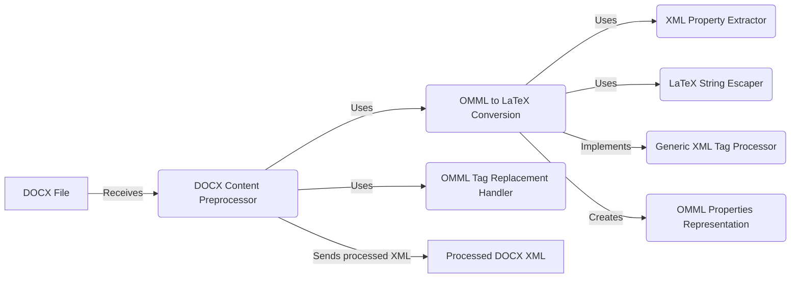

## DOCX Preprocessing Tools Overview

This document provides an overview of the DOCX Preprocessing Tools component, which is responsible for preparing DOCX files for conversion to Markdown, with a particular focus on handling equations and other complex formatting elements. The core functionality revolves around converting OMML (Office Math Markup Language) equations to LaTeX format for better rendering in Markdown.

### Data Flow Diagram

### Component Descriptions

*   **DOCX File:** Represents the input DOCX file that needs to be preprocessed.
    *   *Interaction:* Provides the initial DOCX content to the `DOCX Content Preprocessor`.
    *   *Relevant source files:* N/A (Input)

*   **DOCX Content Preprocessor:** Pre-processes the content of DOCX files by identifying and replacing specific XML elements, such as OMML math equations, with their LaTeX equivalents. This component orchestrates the overall preprocessing flow.
    *   *Interaction:* Receives the DOCX file, uses `OMML to LaTeX Conversion` to convert equations, and sends the processed XML to the next stage.
    *   *Relevant source files:* `markitdown.converter_utils.docx.pre_process.pre_process_docx`, `markitdown.converter_utils.docx.pre_process._pre_process_math`

*   **OMML to LaTeX Conversion:** Converts Office Math Markup Language (OMML) elements within a DOCX file to LaTeX format. This is a central component responsible for the core conversion logic.
    *   *Interaction:* Receives OMML elements from the `DOCX Content Preprocessor`, uses `XML Property Extractor` and `LaTeX String Escaper`, implements `Generic XML Tag Processor`, creates `OMML Properties Representation`, and returns LaTeX equivalents.
    *   *Relevant source files:* `markitdown.converter_utils.docx.math.omml.oMath2Latex`, `markitdown.converter_utils.docx.pre_process._convert_omath_to_latex`

*   **XML Property Extractor:** Extracts values from XML elements, providing a consistent way to access attributes within the OMML structure.
    *   *Interaction:* Used by `OMML to LaTeX Conversion` to extract properties from XML elements.
    *   *Relevant source files:* `markitdown.converter_utils.docx.math.omml.get_val`

*   **LaTeX String Escaper:** Escapes special characters in strings to ensure proper rendering in LaTeX format.
    *   *Interaction:* Used by `OMML to LaTeX Conversion` to escape special characters in LaTeX strings.
    *   *Relevant source files:* `markitdown.converter_utils.docx.math.omml.escape_latex`

*   **Generic XML Tag Processor:** Base class for processing XML tags, providing a framework for handling different OMML elements.
    *   *Interaction:* Implemented by `OMML to LaTeX Conversion` to provide a generic XML tag processing framework.
    *   *Relevant source files:* `markitdown.converter_utils.docx.math.omml.Tag2Method`

*   **OMML Properties Representation:** Represents the properties of an OMML element, storing attributes and values associated with the element.
    *   *Interaction:* Created and used by `OMML to LaTeX Conversion` to represent OMML element properties.
    *   *Relevant source files:* `markitdown.converter_utils.docx.math.omml.Pr`

*   **OMML Tag Replacement Handler:** Handles the replacement of OMML tags with LaTeX equivalents, creating new tags to represent the converted equations.
    *   *Interaction:* Used by `DOCX Content Preprocessor` to replace OMML tags with LaTeX equivalents.
    *   *Relevant source files:* `markitdown.converter_utils.docx.pre_process._get_omath_tag_replacement`, `markitdown.converter_utils.docx.pre_process._replace_equations`

*   **Processed DOCX XML:** Represents the DOCX XML content after preprocessing, with OMML equations converted to LaTeX.
    *   *Interaction:* Output of the `DOCX Content Preprocessor`.
    *   *Relevant source files:* N/A (Output)
