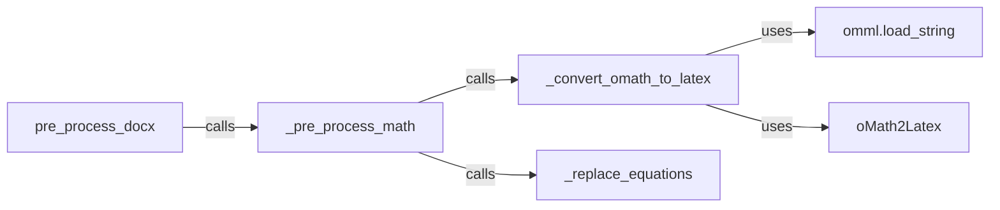

## Component Details

The DOCX Preprocessor component focuses on converting mathematical equations from OMML (Office Math Markup Language) to LaTeX format within DOCX files. This ensures accurate representation of mathematical content when converting DOCX files to Markdown. The process involves identifying OMML equations, parsing them, converting them to LaTeX, and replacing the original equations with their LaTeX equivalents in the DOCX content. The core functionality relies on the `omml` module for parsing OMML and the `oMath2Latex` class for the actual conversion to LaTeX.

### pre_process_docx
This function serves as the entry point for preprocessing DOCX files, specifically handling mathematical equations. It orchestrates the process of identifying and converting OMML equations to LaTeX format within the DOCX content.
- **Related Classes/Methods**: `markitdown.packages.markitdown.src.markitdown.converter_utils.docx.pre_process:pre_process_docx`

### _pre_process_math
This function preprocesses the mathematical equations within a DOCX file. It converts OMath to LaTeX and replaces the original equations with the converted LaTeX.
- **Related Classes/Methods**: `markitdown.packages.markitdown.src.markitdown.converter_utils.docx.pre_process:_pre_process_math`

### _convert_omath_to_latex
This function converts Office Math (OMML) equations to LaTeX format. It uses the `omml.load_string` function to parse the OMML string and then converts it to LaTeX.
- **Related Classes/Methods**: `markitdown.packages.markitdown.src.markitdown.converter_utils.docx.pre_process:_convert_omath_to_latex`

### _replace_equations
This function replaces the original equations in the DOCX content with their LaTeX equivalents.
- **Related Classes/Methods**: `markitdown.packages.markitdown.src.markitdown.converter_utils.docx.pre_process:_replace_equations`

### omml.load_string
This function loads and parses an OMML string.
- **Related Classes/Methods**: `markitdown.packages.markitdown.src.markitdown.converter_utils.docx.math.omml:load_string`

### oMath2Latex
This class converts an OMML object to LaTeX format. It contains methods for handling different OMML tags and converting them to their LaTeX equivalents.
- **Related Classes/Methods**: `markitdown.packages.markitdown.src.markitdown.converter_utils.docx.math.omml.oMath2Latex`
