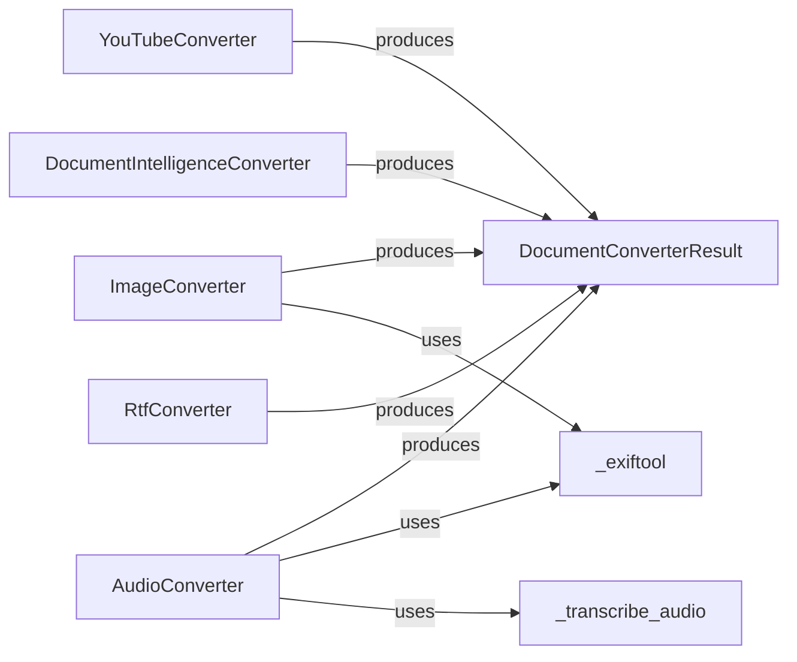

## Component Details

This section provides a detailed overview of the "Direct Content Converters" subsystem within the markitdown project. This category encompasses DocumentConverter implementations that directly transform content into Markdown or leverage external services/libraries for conversion, bypassing the internal HTML-to-Markdown pipeline. These converters are fundamental as they extend the system's capability to handle diverse content types beyond standard web pages.

### DocumentConverterResult
This class serves as a standardized container for the outcome of any document conversion. It encapsulates the converted Markdown text and an optional title, ensuring a consistent output format across all DocumentConverter implementations. This consistency is vital for downstream processing and integration within the markitdown system.

**Related Classes/Methods**:

- <a href="https://github.com/microsoft/markitdown/blob/master/packages/markitdown/src/markitdown/_base_converter.py#L4-L38" target="_blank" rel="noopener noreferrer">`markitdown._base_converter.DocumentConverterResult` (4:38)</a>

### YouTubeConverter
This converter is specifically designed to process YouTube-related content. It parses the HTML of YouTube URLs to extract essential video metadata such as title, description, views, keywords, and runtime. If the youtube_transcript_api dependency is available, it also fetches and includes the video transcript, providing a comprehensive Markdown representation of the YouTube content. It includes internal helper methods for robust data extraction and operation retries.

**Related Classes/Methods**:

- <a href="https://github.com/microsoft/markitdown/blob/master/packages/markitdown/src/markitdown/converters/_youtube_converter.py#L36-L237" target="_blank" rel="noopener noreferrer">`markitdown.converters._youtube_converter.YouTubeConverter` (36:237)</a>

### DocumentIntelligenceConverter
This converter leverages external document intelligence services (e.g., Azure Document Intelligence) to extract text and structural information from a wide array of document types, including DOCX, PPTX, XLSX, PDF, and various image formats. It performs checks for accepted file extensions and MIME types and manages authentication with the external service. It dynamically determines which analysis features are applicable based on the document's type.

**Related Classes/Methods**:

- <a href="https://github.com/microsoft/markitdown/blob/master/packages/markitdown/src/markitdown/converters/_doc_intel_converter.py#L124-L248" target="_blank" rel="noopener noreferrer">`markitdown.converters._doc_intel_converter.DocumentIntelligenceConverter` (124:248)</a>

### ImageConverter
This converter specializes in processing image files. It extracts rich metadata from images by utilizing the exiftool_metadata utility function. Furthermore, if a Large Language Model (LLM) client is configured, it can generate a textual description of the image content using a multimodal LLM, effectively converting visual information into descriptive Markdown.

**Related Classes/Methods**:

- <a href="https://github.com/microsoft/markitdown/blob/master/packages/markitdown/src/markitdown/converters/_image_converter.py#L15-L137" target="_blank" rel="noopener noreferrer">`markitdown.converters._image_converter.ImageConverter` (15:137)</a>

### AudioConverter
This converter is responsible for handling audio files. It extracts metadata from audio files using the exiftool_metadata utility function. A key functionality is its ability to transcribe spoken content into text using the transcribe_audio utility function, converting audio information into textual Markdown. It supports various audio formats, including WAV, MP3, and MP4.

**Related Classes/Methods**:

- <a href="https://github.com/microsoft/markitdown/blob/master/packages/markitdown/src/markitdown/converters/_audio_converter.py#L22-L100" target="_blank" rel="noopener noreferrer">`markitdown.converters._audio_converter.AudioConverter` (22:100)</a>

### _exiftool
This is a utility function that facilitates the extraction of comprehensive metadata from various file types (e.g., images, audio) by interacting with an external exiftool executable. It reads the provided file stream, executes exiftool with the stream as input, and parses the resulting JSON output. It serves as a shared, crucial dependency for both ImageConverter and AudioConverter.

**Related Classes/Methods**:

- <a href="https://github.com/microsoft/markitdown/blob/master/packages/markitdown/src/markitdown/converters/_exiftool.py#L6-L29" target="_blank" rel="noopener noreferrer">`markitdown.converters._exiftool.exiftool_metadata` (6:29)</a>

### _transcribe_audio
This utility function performs speech-to-text transcription of audio files. It leverages the speech_recognition library (and pydub for audio format conversion) to process audio streams and return the transcribed text. It is a core component for the AudioConverter and handles different audio formats, raising a MissingDependencyException if necessary dependencies are not met.

**Related Classes/Methods**:

- <a href="https://github.com/microsoft/markitdown/blob/master/packages/markitdown/src/markitdown/converters/_transcribe_audio.py#L22-L48" target="_blank" rel="noopener noreferrer">`markitdown.converters._transcribe_audio.transcribe_audio` (22:48)</a>

### RtfConverter
This converter, provided as part of a sample plugin, illustrates how external modules can seamlessly integrate with and extend the markitdown system. Its specific function is to convert Rich Text Format (RTF) documents into plain text Markdown using a straightforward rtf_to_text function. It demonstrates the extensibility of the markitdown architecture for handling diverse document formats via plugins.

**Related Classes/Methods**:

- <a href="https://github.com/microsoft/markitdown/blob/master/packages/markitdown-sample-plugin/src/markitdown_sample_plugin/_plugin.py#L33-L70" target="_blank" rel="noopener noreferrer">`markitdown_sample_plugin._plugin.RtfConverter` (33:70)</a>

### [FAQ](https://github.com/CodeBoarding/GeneratedOnBoardings/tree/main?tab=readme-ov-file#faq)