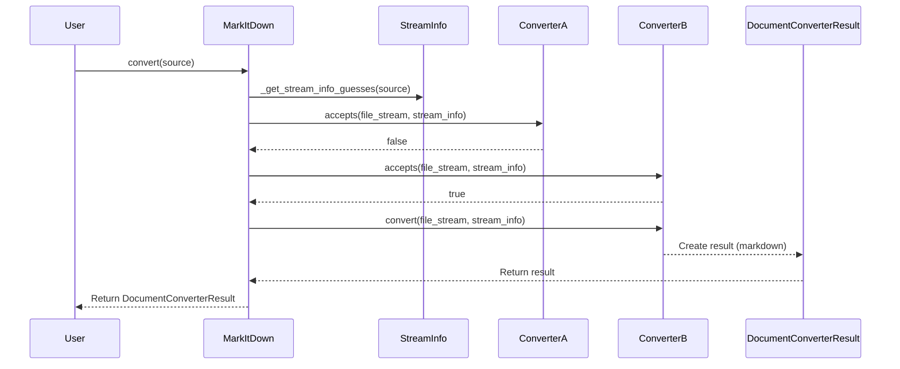
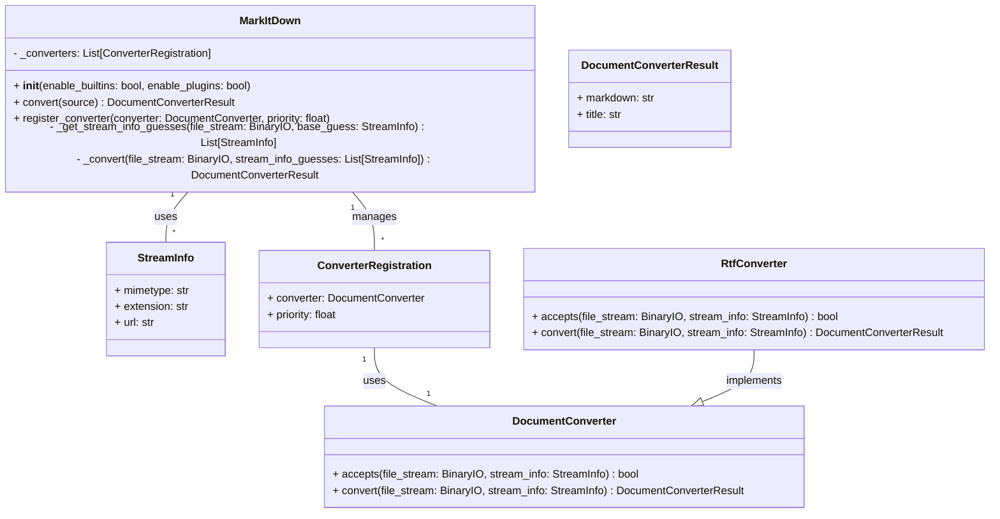

Based on the source code and previous insights, here's a refined overview of the `markitdown` component:

**Component Overview: Markdown Conversion Orchestration**

The `markitdown` component is responsible for converting various document formats into Markdown. It handles the entire process, from accepting different input types (files, URLs, streams) to identifying the file type, converting the content, and producing a Markdown output. The core of the component is the `MarkItDown` class, which manages a collection of `DocumentConverter` instances. These converters are responsible for handling specific file formats.

**Main Classes and Their Purposes:**

*   **`MarkItDown`**: This is the central class that orchestrates the conversion process. It maintains a list of registered `DocumentConverter` instances, handles input from various sources (local files, URLs, streams), determines the appropriate converter for a given input, and manages the overall conversion workflow. It also handles enabling built-in converters and plugins.
*   **`DocumentConverter`**: An abstract base class for all document converters. Subclasses of `DocumentConverter` are responsible for converting specific file formats (e.g., RTF, HTML, PDF) into Markdown. It defines the `accepts` and `convert` methods.
*   **`DocumentConverterResult`**: A simple data class that encapsulates the result of a document conversion. It contains the converted Markdown text and an optional title.
*   **`StreamInfo`**: A data class that holds metadata about the input stream, such as the MIME type, file extension, and URL. This information is used to determine the appropriate converter to use.
*   **`RtfConverter`**: A concrete implementation of `DocumentConverter` that handles RTF files. (Example from plugin).

**Main Flow (Sequence Diagram):**

**Component Structure (Class Diagram):**

**Onboarding Document:**

Welcome to the `markitdown` component! This component is designed to convert various document formats into Markdown. Here's a quick overview to get you started:

1.  **Purpose:** The `markitdown` component automates document conversion to Markdown, supporting various input types and file formats.
2.  **Main Classes:**
    *   `MarkItDown`: The central class that manages the conversion process. It handles input, selects the appropriate converter, and orchestrates the conversion workflow.
    *   `DocumentConverter`: An abstract base class for converters. Subclasses handle specific file formats. The `accepts` method determines if a converter can handle a given input, and the `convert` method performs the actual conversion.
    *   `DocumentConverterResult`: A data class that stores the converted Markdown and an optional title.
    *   `StreamInfo`: A data class that stores metadata about the input stream (MIME type, extension, URL).
3.  **Workflow:**
    a. The user calls the `convert` method of the `MarkItDown` class with the source document (file path, URL, or stream).
    b. `MarkItDown` uses `StreamInfo` to guess the file type.
    c. `MarkItDown` iterates through its registered `DocumentConverter` instances, calling the `accepts` method of each converter to find one that can handle the input.
    d. The selected converter's `convert` method is called to perform the conversion.
    e. The `convert` method returns a `DocumentConverterResult` object containing the converted Markdown.
4.  **Adding a New Converter:** To support a new file format, you need to create a new class that inherits from `DocumentConverter` and implements the `accepts` and `convert` methods. Then, register your new converter with the `MarkItDown` instance using the `register_converter` method.