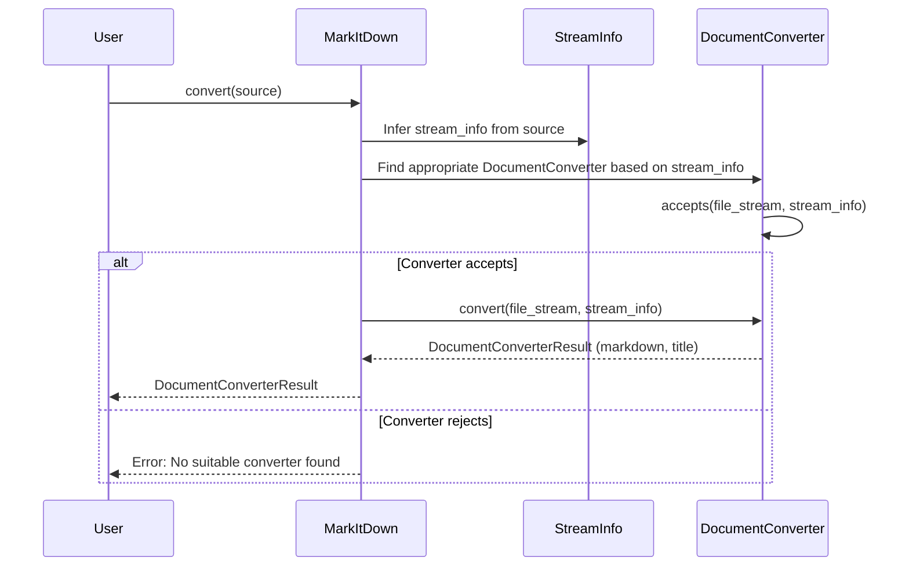
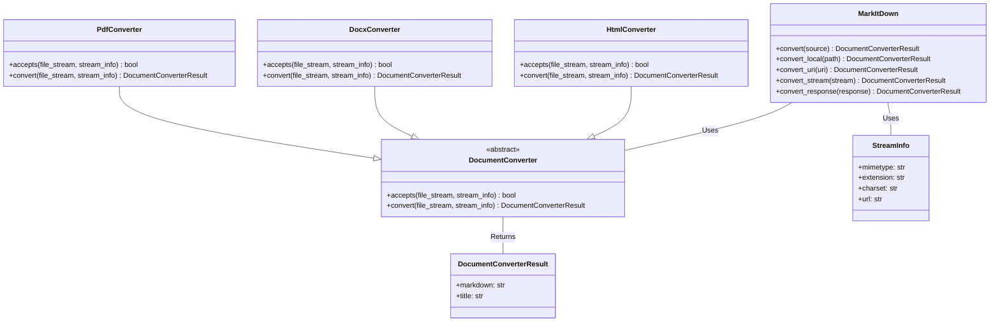

I apologize for the error in the previous response. It seems I was unable to locate the source code for `markitdown.main.markdown_convert`. I will proceed without it, focusing on the other identified components and modules.

**Component Description:**

The `markitdown` library provides a way to convert various document types into Markdown format. The core of the library revolves around the `MarkItDown` class, which orchestrates the conversion process. It receives a source (local file, URL, stream, etc.) and uses appropriate `DocumentConverter` implementations to perform the conversion. The `DocumentConverter` abstract class defines the interface for all converters, with concrete implementations for different file types like HTML, DOCX, PDF, etc.

**Main Flow:**

The main flow involves the `MarkItDown` class receiving a conversion request, determining the input type, selecting the appropriate `DocumentConverter`, and then using the converter to generate the Markdown output.

**Main Structure:**

The library's structure is centered around the `MarkItDown` class and the `DocumentConverter` abstract class. Specific converter implementations inherit from `DocumentConverter`.

