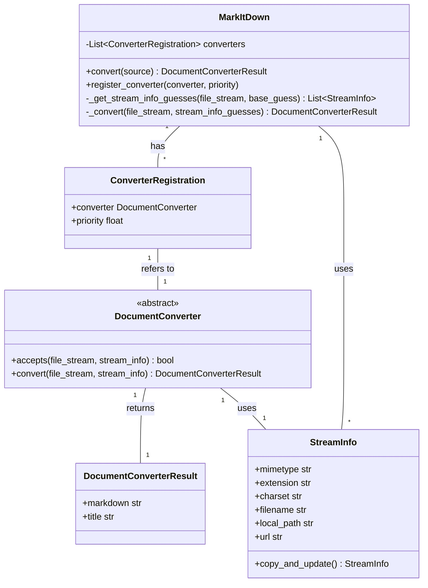

Based on the code analysis, here's a breakdown of the `Document Conversion Orchestration` component:

**Description:**

The `Document Conversion Orchestration` component is responsible for converting documents of various formats (local files, URLs, streams, etc.) into Markdown. It handles the overall conversion process, including:

-   Determining the input type (local file, URL, stream, etc.).
-   Inferring file metadata (MIME type, extension, encoding) using `StreamInfo` and `magika`.
-   Selecting the appropriate `DocumentConverter` based on file metadata.
-   Executing the conversion using the selected converter.
-   Handling fallback mechanisms and error reporting.

**Main Classes and Their Purposes:**

1.  **`MarkItDown`**: This is the main class that orchestrates the document conversion process. It holds a list of registered `DocumentConverter` instances and provides the `convert` method to initiate the conversion. It also handles stream information guessing using `magika`.
2.  **`DocumentConverter`**: An abstract base class for all document converters. Subclasses implement the `accepts` method to determine if they can handle a specific file type and the `convert` method to perform the actual conversion.
3.  **`DocumentConverterResult`**: A simple data class that holds the result of a document conversion, including the converted Markdown text and an optional title.
4.  **`StreamInfo`**: A data class that stores metadata about a file stream, such as MIME type, extension, character set, filename, local path, and URL. This information is used to select the appropriate converter and to provide context for the conversion process.
5.  **`ConverterRegistration`**: A data class that associates a `DocumentConverter` with a priority. This is used to determine the order in which converters are tried during the conversion process.

**Main Flow (Sequence Diagram):**

```mermaid
sequenceDiagram
    participant Client
    participant MarkItDown
    participant StreamInfo
    participant Magika
    participant ConverterRegistration
    participant DocumentConverter
    participant DocumentConverterResult

    Client->>MarkItDown: convert(source)
    MarkItDown->>StreamInfo: Create StreamInfo (base_guess)
    MarkItDown->>Magika: _get_stream_info_guesses(file_stream, base_guess)
    Magika-->>MarkItDown: List[StreamInfo] (guesses)
    loop For each stream_info in guesses
        loop For each converter_registration in sorted_registrations
            MarkItDown->>ConverterRegistration: Get converter
            MarkItDown->>DocumentConverter: accepts(file_stream, stream_info)
            DocumentConverter-->>MarkItDown: True/False
            alt accepts == True
                MarkItDown->>DocumentConverter: convert(file_stream, stream_info)
                DocumentConverter-->>DocumentConverterResult: Result (markdown, title)
                DocumentConverterResult-->>MarkItDown: DocumentConverterResult
                MarkItDown-->>Client: DocumentConverterResult
                break
            end
        end
    end
    alt No converter found
        MarkItDown-->>Client: Exception (UnsupportedFormatException)
    end
```

**Main Structure (Class Diagram):**

