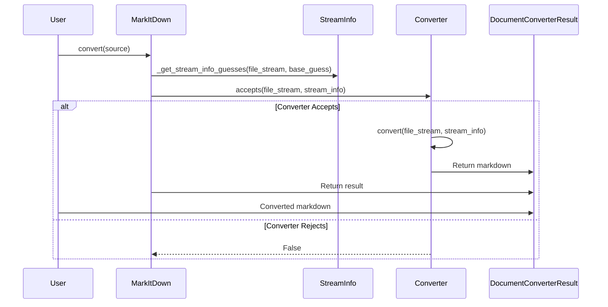
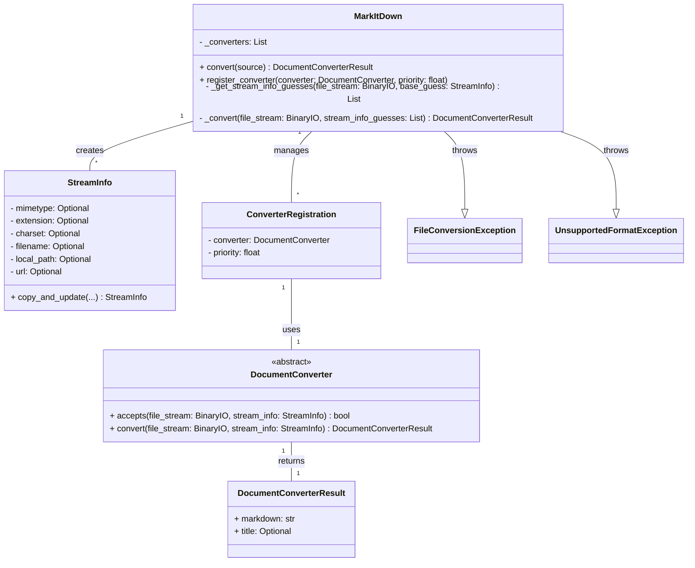

## Component Overview: Document Conversion Orchestration

This component orchestrates the conversion of various document formats into Markdown. It handles the selection of appropriate converters based on file type and content, manages input streams, and provides a unified interface for conversion.

**Main Classes and Their Purposes:**

*   **`MarkItDown`**: The central class responsible for managing the conversion process. It registers converters, determines the appropriate converter for a given input, and orchestrates the conversion. It handles different input types like local files, URLs, and streams.
*   **`StreamInfo`**: A data class that encapsulates metadata about the input stream, such as MIME type, file extension, character set, filename, and URL. It's used to help select the appropriate converter and pass relevant information to it.
*   **`DocumentConverter`**: An abstract base class for all document converters. Subclasses implement the `accepts` method to determine if they can handle a given input and the `convert` method to perform the actual conversion.
*   **`DocumentConverterResult`**: A data class that holds the result of a document conversion, including the Markdown content and an optional title.
*   **`ConverterRegistration`**: A data class that associates a `DocumentConverter` with a priority, used to determine the order in which converters are tried.

### Main Flow (Sequence Diagram)

The following diagram illustrates the main flow of the document conversion process, focusing on the core interactions between the key classes:

### Component Structure (Class Diagram)

This diagram shows the main classes in the component and their relationships:

