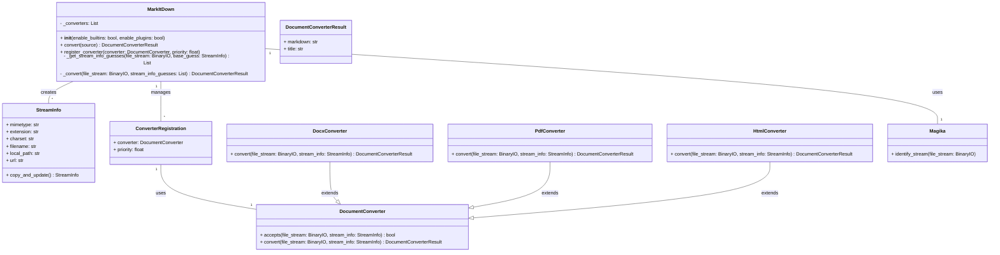

Okay, I have examined the source code of the core modules and converters. Here's a breakdown of the component, its structure, flow, and purpose:

**Component Description: Core Document Conversion**

The `markitdown` library provides a way to convert various document formats (docx, pdf, html, etc.) into Markdown. The core component orchestrates this conversion process, handling file type detection, converter registration, and the actual conversion. It uses a chain-of-responsibility pattern where different converters are tried until one successfully converts the document.

**Main Classes and Their Purposes:**

*   **`MarkItDown`**: This is the main class that users interact with. It manages the registered converters, handles different input types (local files, URLs, streams), and orchestrates the conversion process. It uses `magika` to identify the file type and selects the appropriate converter.
*   **`DocumentConverter`**: This is an abstract base class for all converters. Subclasses implement the `accepts()` method to determine if they can handle a given file type and the `convert()` method to perform the actual conversion.
*   **`StreamInfo`**: A dataclass that holds metadata about the input stream, such as mimetype, extension, charset, filename, and URL. This information is used by the converters to determine if they can handle the input and how to convert it.
*   **`ConverterRegistration`**: A dataclass that associates a `DocumentConverter` with a priority. This is used to sort the converters before attempting conversion.
*   **`DocxConverter`, `PdfConverter`, `HtmlConverter`**: These are concrete implementations of `DocumentConverter` for specific file types. They use external libraries like `mammoth`, `pdfminer`, and `BeautifulSoup` to extract content and convert it to Markdown.

**Main Flow (Sequence Diagram):**

```mermaid
sequenceDiagram
    participant User
    participant MarkItDown
    participant StreamInfo
    participant Magika
    participant ConverterA
    participant ConverterB
    participant DocumentConverterResult

    User->>MarkItDown: convert(source)
    MarkItDown->>StreamInfo: Create StreamInfo from source
    MarkItDown->>Magika: identify_stream(file_stream)
    Magika-->>MarkItDown: StreamInfo Guesses
    loop For each StreamInfo guess
        loop For each registered Converter
            MarkItDown->>ConverterA: accepts(file_stream, stream_info)
            ConverterA-->>MarkItDown: True/False
            alt accepts == True
                MarkItDown->>ConverterA: convert(file_stream, stream_info)
                ConverterA-->>DocumentConverterResult: Markdown
                MarkItDown-->>User: DocumentConverterResult
                break
            else accepts == False
                MarkItDown->>ConverterB: accepts(file_stream, stream_info)
                ConverterB-->>MarkItDown: True/False
            end
        end
    end
    MarkItDown-->>User: Exception (if no converter succeeds)
```

**Main Structure (Class Diagram):**

