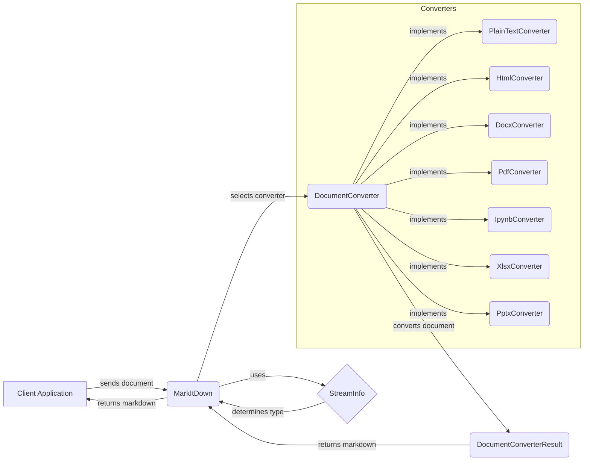

## Document Converter Subsystem Overview

This diagram illustrates the flow of document conversion within the MarkItDown system. It begins with the `MarkItDown` component receiving a document, which then uses `StreamInfo` to determine the document's type. Based on this, the `MarkItDown` component selects the appropriate `DocumentConverter` implementation (e.g., `PlainTextConverter`, `HtmlConverter`, `DocxConverter`, etc.) to perform the conversion. The selected converter processes the document and returns a `DocumentConverterResult` containing the converted markdown content.

### Component Descriptions:

- **Client Application**
  - *Description*: The external application that initiates the document conversion process by sending a document to the `MarkItDown` component.
  - *Functionality*: Sends documents for conversion and receives the converted markdown.
  - *Neighbouring Components*: `MarkItDown`

- **MarkItDown**
  - *Description*: The central component that manages the document conversion process. It determines the appropriate converter based on the document type and orchestrates the conversion.
  - *Functionality*: Receives documents, determines their type using `StreamInfo`, selects the appropriate `DocumentConverter`, and returns the converted markdown.
  - *Neighbouring Components*: `Client Application`, `StreamInfo`, `DocumentConverter`, `DocumentConverterResult`
  - *Relevant source files*: `repos.markitdown.packages.markitdown.src.markitdown._markitdown.MarkItDown`

- **StreamInfo**
  - *Description*: Provides metadata about the input stream, such as filename, extension, and MIME type, which is used to determine the appropriate converter.
  - *Functionality*: Analyzes the input stream and provides metadata to the `MarkItDown` component.
  - *Neighbouring Components*: `MarkItDown`
  - *Relevant source files*: `repos.markitdown.packages.markitdown.src.markitdown._stream_info.StreamInfo`

- **DocumentConverter**
  - *Description*: An abstract base class that defines the interface for all document converters. It includes methods for accepting documents and converting them to markdown.
  - *Functionality*: Defines the `accepts` and `convert` methods that concrete converters must implement.
  - *Neighbouring Components*: `MarkItDown`, `PlainTextConverter`, `HtmlConverter`, `DocxConverter`, `PdfConverter`, `IpynbConverter`, `XlsxConverter`, `PptxConverter`, `DocumentConverterResult`
  - *Relevant source files*: `repos.markitdown.packages.markitdown.src.markitdown._base_converter.DocumentConverter`

- **PlainTextConverter**
  - *Description*: A concrete `DocumentConverter` implementation for plain text files.
  - *Functionality*: Reads the content of the plain text file and returns it as markdown.
  - *Neighbouring Components*: `DocumentConverter`, `DocumentConverterResult`
  - *Relevant source files*: `repos.markitdown.packages.markitdown.src.markitdown.converters._plain_text_converter.PlainTextConverter`

- **HtmlConverter**
  - *Description*: A concrete `DocumentConverter` implementation for HTML files.
  - *Functionality*: Converts HTML content to markdown using the `markdownify` library.
  - *Neighbouring Components*: `DocumentConverter`, `DocumentConverterResult`
  - *Relevant source files*: `repos.markitdown.packages.markitdown.src.markitdown.converters._html_converter.HtmlConverter`

- **DocxConverter**
  - *Description*: A concrete `DocumentConverter` implementation for DOCX files.
  - *Functionality*: Extracts text and formatting from DOCX files and converts it to markdown, leveraging the `HtmlConverter`.
  - *Neighbouring Components*: `DocumentConverter`, `DocumentConverterResult`
  - *Relevant source files*: `repos.markitdown.packages.markitdown.src.markitdown.converters._docx_converter.DocxConverter`

- **PdfConverter**
  - *Description*: A concrete `DocumentConverter` implementation for PDF files.
  - *Functionality*: Extracts text from PDF files and converts it to markdown.
  - *Neighbouring Components*: `DocumentConverter`, `DocumentConverterResult`
  - *Relevant source files*: `repos.markitdown.packages.markitdown.src.markitdown.converters._pdf_converter.PdfConverter`

- **IpynbConverter**
  - *Description*: A concrete `DocumentConverter` implementation for Jupyter Notebook files.
  - *Functionality*: Extracts code and markdown cells from the notebook and converts them to markdown.
  - *Neighbouring Components*: `DocumentConverter`, `DocumentConverterResult`
  - *Relevant source files*: `repos.markitdown.packages.markitdown.src.markitdown.converters._ipynb_converter.IpynbConverter`

- **XlsxConverter**
  - *Description*: A concrete `DocumentConverter` implementation for XLSX files.
  - *Functionality*: Extracts data from spreadsheets and converts it to markdown tables, leveraging the `HtmlConverter`.
  - *Neighbouring Components*: `DocumentConverter`, `DocumentConverterResult`
  - *Relevant source files*: `repos.markitdown.packages.markitdown.src.markitdown.converters._xlsx_converter.XlsxConverter`

- **PptxConverter**
  - *Description*: A concrete `DocumentConverter` implementation for PPTX files.
  - *Functionality*: Extracts text and formatting from presentations and converts it to markdown, leveraging the `HtmlConverter`.
  - *Neighbouring Components*: `DocumentConverter`, `DocumentConverterResult`
  - *Relevant source files*: `repos.markitdown.packages.markitdown.src.markitdown.converters._pptx_converter.PptxConverter`

- **DocumentConverterResult**
  - *Description*: Represents the result of a document conversion, containing the markdown content.
  - *Functionality*: Stores the converted markdown content and provides access to it.
  - *Neighbouring Components*: `DocumentConverter`, `MarkItDown`
  - *Relevant source files*: `repos.markitdown.packages.markitdown.src.markitdown._base_converter.DocumentConverterResult`