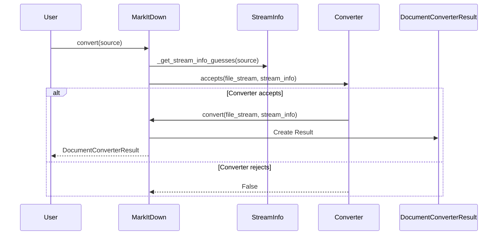
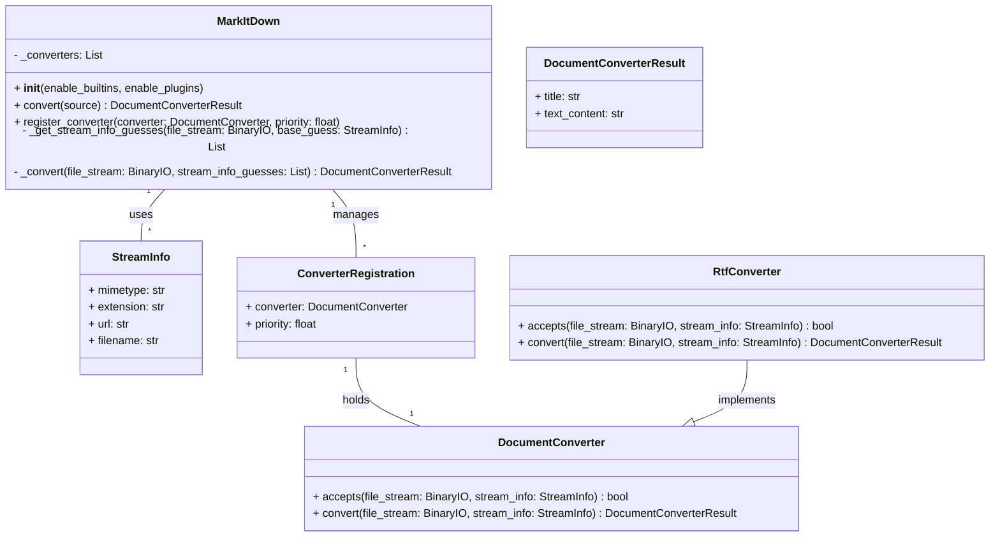

Okay, I have examined the source code for the core components: `MarkItDown`, `DocumentConverter`, and `RtfConverter`. Now I can provide a comprehensive overview of the `MarkItDown` component.

**Component Description:**

The `MarkItDown` component is a versatile document conversion tool that transforms various file types and web resources into Markdown format. At its core, it orchestrates the conversion process by intelligently selecting and applying appropriate converters based on the input stream's characteristics. The component supports built-in converters for common file types (e.g., HTML, PDF, DOCX) and allows for extending its capabilities through plugins.

**Main Classes and Their Purposes:**

*   **`MarkItDown`**: This is the central orchestrator class. It manages converter registration, stream information detection, and the overall conversion process. It initializes with options to enable built-in converters and plugins. The `convert` method is the entry point for converting documents from various sources (local files, URLs, streams).
*   **`DocumentConverter`**: An abstract base class that defines the interface for all document converters. Subclasses must implement the `accepts` method to determine if the converter can handle a given document and the `convert` method to perform the actual conversion.
*   **`StreamInfo`**: A data class that encapsulates metadata about the input stream, such as MIME type, file extension, and URL. It's used to help converters determine if they can handle the input and to provide context for the conversion process.
*   **`ConverterRegistration`**: A simple data class that associates a `DocumentConverter` instance with a priority. This allows the `MarkItDown` class to sort converters based on priority.
*   **`RtfConverter`**: A concrete implementation of `DocumentConverter` that handles RTF files. It uses the `striprtf` library to extract text from RTF and returns the result as Markdown.

**Main Flow (Sequence Diagram):**

**Main Structure (Class Diagram):**

