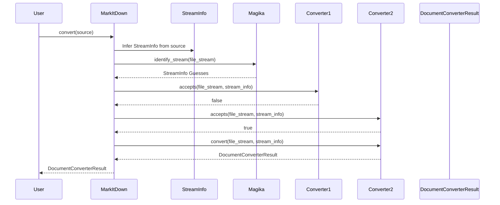
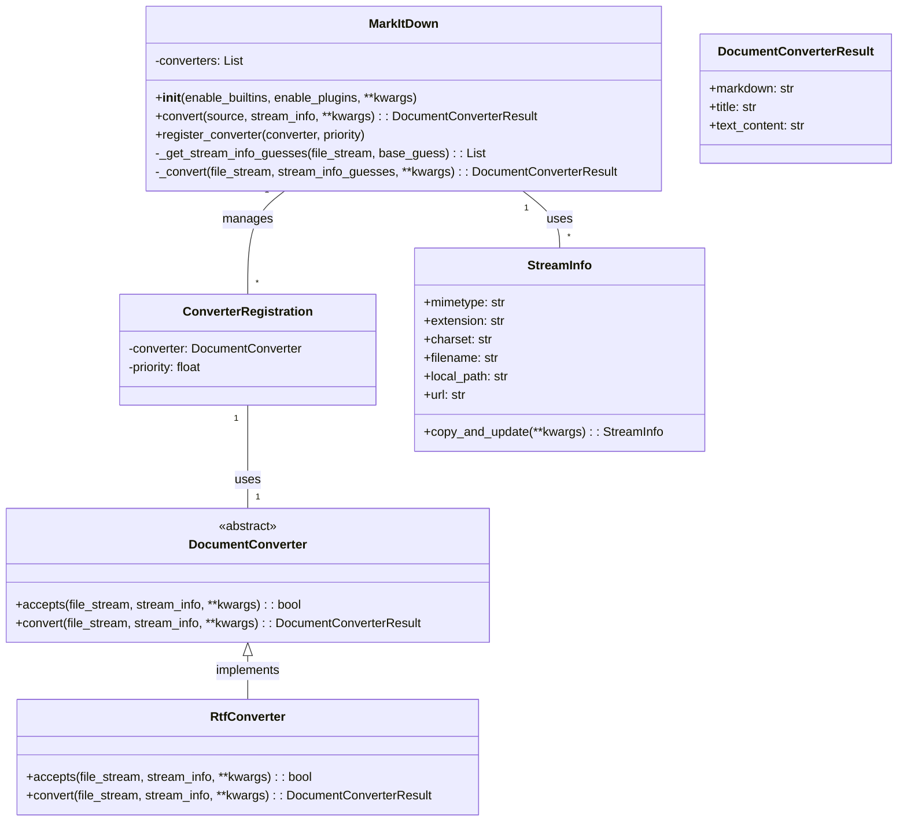

Okay, I have examined the source code of the core components. Here's a refined understanding of the `MarkItDown` component:

**Component Description:**

The `MarkItDown` component is a document conversion orchestrator. It takes a document in various formats (local file, URL, stream, etc.) and converts it to Markdown. It achieves this by:

1.  **Converter Registration:** Maintaining a list of `DocumentConverter` instances. Converters are registered with a priority, influencing the order in which they are tried. Built-in converters are enabled by default, and plugins can register additional converters.
2.  **Format Detection:** Using `StreamInfo` to store and infer metadata about the input stream (mimetype, extension, URL, etc.). It uses `magika` to guess the file type from the stream content.
3.  **Converter Selection:** Iterating through the registered converters, sorted by priority, and calling the `accepts()` method of each converter to determine if it can handle the input format.
4.  **Conversion:** If a converter accepts the input, its `convert()` method is called to perform the conversion to Markdown.
5.  **Result Handling:** The `convert()` method returns a `DocumentConverterResult` object containing the converted Markdown and an optional title.

**Main Classes and Their Purposes:**

*   **`MarkItDown`:** The central orchestrator class.
    *   `__init__()`: Initializes the MarkItDown instance, registers built-in and plugin converters.
    *   `convert(source, stream_info, **kwargs)`: The main entry point for converting a document. It handles different source types (file path, URL, stream) and delegates the conversion to the appropriate converter.
    *   `register_converter(converter, priority)`: Registers a `DocumentConverter` with a given priority.
*   **`DocumentConverter` (Abstract Class):** Defines the interface for document converters.
    *   `accepts(file_stream, stream_info, **kwargs)`: Determines if the converter can handle the given input format.
    *   `convert(file_stream, stream_info, **kwargs)`: Converts the input stream to Markdown.
*   **`DocumentConverterResult`:** Represents the result of a document conversion.
    *   `__init__(markdown, title)`: Initializes the result with the converted Markdown and an optional title.
    *   `markdown`: The converted Markdown text.
    *   `title`: The title of the document.
*   **`StreamInfo`:** A data class that stores information about a file stream, such as mimetype, extension, charset, filename, local path, and URL.

**On-boarding Document:**

**Sequence Diagram:**

**Class Diagram:**

**Brief Description:**

The `MarkItDown` component is a versatile document conversion tool that transforms various file formats and web content into Markdown. At its core lies the `MarkItDown` class, which orchestrates the conversion process by managing a collection of `DocumentConverter` instances. These converters, adhering to the `DocumentConverter` interface, are responsible for handling specific file types. The `StreamInfo` class plays a crucial role in providing metadata about the input stream, aiding in format detection. The component supports a flexible plugin system, allowing developers to extend its capabilities with custom converters. The conversion result is encapsulated in the `DocumentConverterResult` class, containing the converted Markdown content and an optional title.