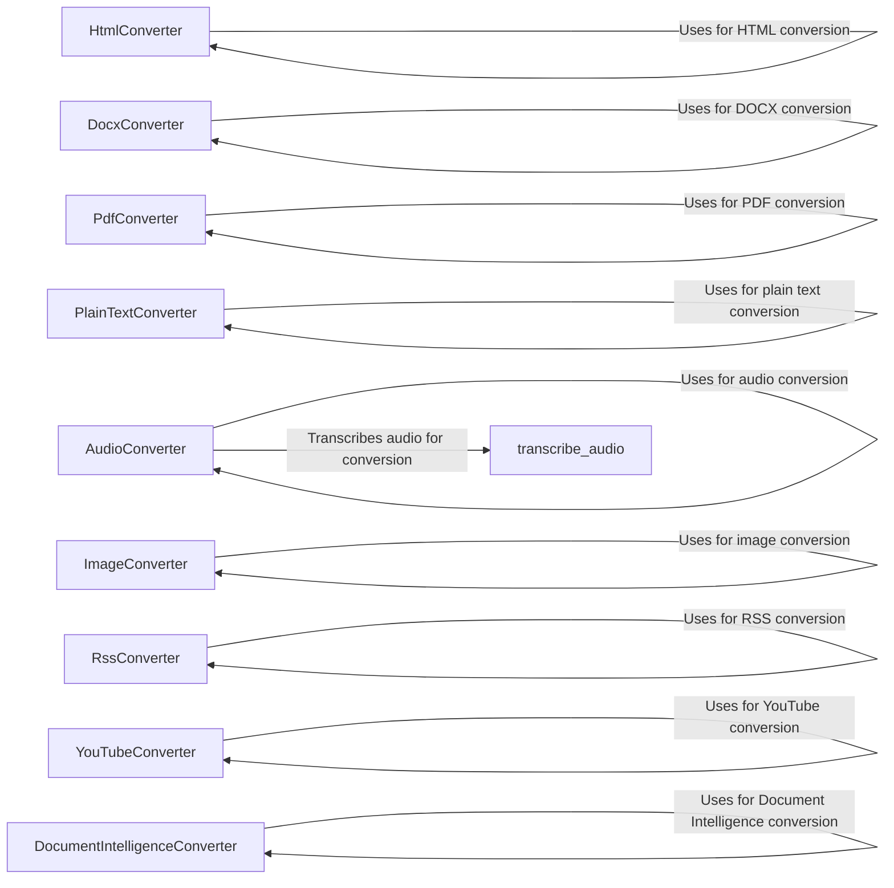

## Component Details

The Document Converters subsystem is responsible for converting various document formats into Markdown. It consists of a collection of converter classes, each dedicated to handling a specific format. The main flow involves selecting the appropriate converter based on the input document type and then using that converter to extract the content and format it into Markdown. This subsystem enables the application to process a wide range of document types and present them in a consistent Markdown format.

### HtmlConverter
Converts HTML content to markdown format. It provides methods to convert both entire HTML documents and HTML strings, leveraging libraries like `markdownify` for the conversion process.
- **Related Classes/Methods**: `markitdown.packages.markitdown.src.markitdown.converters._html_converter.HtmlConverter:convert`, `markitdown.packages.markitdown.src.markitdown.converters._html_converter.HtmlConverter:convert_string`

### DocxConverter
Converts DOCX documents to markdown format. It handles the extraction of text and formatting from DOCX files using libraries like `docx`. The converter initializes with configurations and then converts the document.
- **Related Classes/Methods**: `markitdown.packages.markitdown.src.markitdown.converters._docx_converter.DocxConverter:__init__`, `markitdown.packages.markitdown.src.markitdown.converters._docx_converter.DocxConverter:convert`

### PdfConverter
Converts PDF documents to markdown format. It extracts text from PDF files and structures it into markdown. It uses libraries like `pdfminer` to extract the text.
- **Related Classes/Methods**: `markitdown.packages.markitdown.src.markitdown.converters._pdf_converter.PdfConverter:convert`

### PlainTextConverter
Converts plain text content to markdown format. This involves minimal formatting or escaping of special characters to ensure proper markdown rendering.
- **Related Classes/Methods**: `markitdown.packages.markitdown.src.markitdown.converters._plain_text_converter.PlainTextConverter:convert`

### ImageConverter
Converts images to markdown format. This involves creating markdown image links with appropriate alt text, allowing images to be embedded in the final markdown output.
- **Related Classes/Methods**: `markitdown.packages.markitdown.src.markitdown.converters._image_converter.ImageConverter:convert`

### AudioConverter
Converts audio files to markdown format. This involves transcribing the audio to text using `transcribe_audio` and then formatting it as markdown.
- **Related Classes/Methods**: `markitdown.packages.markitdown.src.markitdown.converters._audio_converter.AudioConverter:convert`

### RssConverter
Converts RSS and Atom feeds to markdown format. It parses the feed content and structures it into markdown, handling different feed types and content formats.
- **Related Classes/Methods**: `markitdown.packages.markitdown.src.markitdown.converters._rss_converter.RssConverter:accepts`, `markitdown.packages.markitdown.src.markitdown.converters._rss_converter.RssConverter:_check_xml`, `markitdown.packages.markitdown.src.markitdown.converters._rss_converter.RssConverter:convert`, `markitdown.packages.markitdown.src.markitdown.converters._rss_converter.RssConverter:_parse_atom_type`, `markitdown.packages.markitdown.src.markitdown.converters._rss_converter.RssConverter:_parse_rss_type`, `markitdown.packages.markitdown.src.markitdown.converters._rss_converter.RssConverter:_parse_content`

### YouTubeConverter
Converts YouTube video information to markdown format. It extracts video details and creates a markdown representation, including video titles and descriptions.
- **Related Classes/Methods**: `markitdown.packages.markitdown.src.markitdown.converters._youtube_converter.YouTubeConverter:convert`, `markitdown.packages.markitdown.src.markitdown.converters._youtube_converter.YouTubeConverter:_findKey`

### DocumentIntelligenceConverter
Converts documents analyzed by Azure Document Intelligence to markdown format. It leverages the analysis results to structure the content, extracting text and layout information.
- **Related Classes/Methods**: `markitdown.packages.markitdown.src.markitdown.converters._doc_intel_converter.DocumentIntelligenceConverter:__init__`, `markitdown.packages.markitdown.src.markitdown.converters._doc_intel_converter.DocumentIntelligenceConverter:accepts`, `markitdown.packages.markitdown.src.markitdown.converters._doc_intel_converter.DocumentIntelligenceConverter:_analysis_features`, `markitdown.packages.markitdown.src.markitdown.converters._doc_intel_converter.DocumentIntelligenceConverter:convert`

### transcribe_audio
Transcribes audio files to text, which can then be converted to markdown. This component is used by the `AudioConverter` to process audio content.
- **Related Classes/Methods**: `markitdown.packages.markitdown.src.markitdown.converters._transcribe_audio:transcribe_audio`
