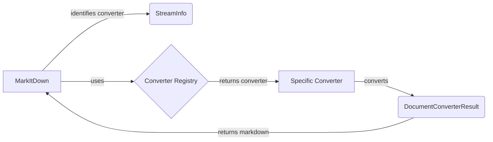

```markdown
## Document Converters Overview

The Document Converters subsystem is responsible for converting various file types and data sources into Markdown format. It consists of a collection of specialized converters, each designed to handle a specific type of input. The `MarkItDown` class orchestrates the conversion process by identifying the appropriate converter based on the input stream's metadata (provided by `StreamInfo`) and then invoking the converter to generate Markdown.

Here's a high-level data flow diagram illustrating the interaction between the main components:



### Component Descriptions:

*   **MarkItDown:** The central class that receives the input stream, uses `StreamInfo` to identify the file type, selects the appropriate converter from the `Converter Registry`, and orchestrates the conversion process. It receives the converted Markdown from the specific converter and returns it as the final result.
    *   Relevant source files:
        *   `repos.markitdown.packages.markitdown.src.markitdown._markitdown.MarkItDown`

*   **StreamInfo:** Encapsulates metadata about the input stream, such as mimetype, extension, and charset. This information is used to determine the appropriate converter to use. It provides the necessary context for the `MarkItDown` class to make informed decisions about the conversion process.
    *   Relevant source files:
        *   `repos.markitdown.packages.markitdown.src.markitdown._stream_info.StreamInfo`

*   **Converter Registry:** A conceptual component representing the collection of available converters. The `MarkItDown` class consults this registry to find the appropriate converter for a given file type. It is not a single class, but rather the collection of all specific converter classes.
    *   Relevant source files:
        *   `repos.markitdown.packages.markitdown.src.markitdown.converters._html_converter.HtmlConverter`
        *   `repos.markitdown.packages.markitdown.src.markitdown.converters._docx_converter.DocxConverter`
        *   `repos.markitdown.packages.markitdown.src.markitdown.converters._pdf_converter.PdfConverter`
        *   `repos.markitdown.packages.markitdown.src.markitdown.converters._pptx_converter.PptxConverter`
        *   `repos.markitdown.packages.markitdown.src.markitdown.converters._xlsx_converter.XlsxConverter`
        *   `repos.markitdown.packages.markitdown.src.markitdown.converters._youtube_converter.YouTubeConverter`
        *   `repos.markitdown.packages.markitdown.src.markitdown.converters._doc_intel_converter.DocumentIntelligenceConverter`
        *   `repos.markitdown.packages.markitdown.src.markitdown.converters._wikipedia_converter.WikipediaConverter`
        *   `repos.markitdown.packages.markitdown.src.markitdown.converters._rss_converter.RssConverter`
        *   `repos.markitdown.packages.markitdown.src.markitdown.converters._epub_converter.EpubConverter`
        *   `repos.markitdown.packages.markitdown.src.markitdown.converters._plain_text_converter.PlainTextConverter`
        *   `repos.markitdown.packages.markitdown.src.markitdown.converters._zip_converter.ZipConverter`
        *   `repos.markitdown.packages.markitdown.src.markitdown.converters._image_converter.ImageConverter`
        *   `repos.markitdown.packages.markitdown.src.markitdown.converters._outlook_msg_converter.OutlookMsgConverter`
        *   `repos.markitdown.packages.markitdown.src.markitdown.converters._audio_converter.AudioConverter`
        *   `repos.markitdown.packages.markitdown.src.markitdown.converters._ipynb_converter.IpynbConverter`
        *   `repos.markitdown.packages.markitdown.src.markitdown.converters._csv_converter.CsvConverter`
        *   `repos.markitdown.packages.markitdown.src.markitdown.converters._bing_serp_converter.BingSerpConverter`

*   **Specific Converter:** A concrete converter class responsible for converting a specific file type to Markdown. It receives the input stream from the `MarkItDown` class, performs the conversion, and returns the converted Markdown as a `DocumentConverterResult`.
    *   Relevant source files: (See list above under Converter Registry)

*   **DocumentConverterResult:** Encapsulates the result of the conversion, including the converted Markdown text. It is returned by the specific converter to the `MarkItDown` class.
    *   Relevant source files:
        *   `repos.markitdown.packages.markitdown.src.markitdown._base_converter.DocumentConverterResult`
```