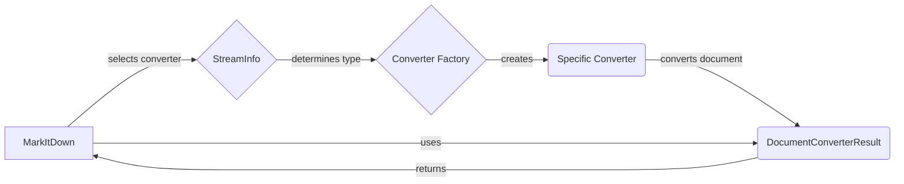

## Document Converters Overview

This document provides an overview of the Document Converters component within the MarkItDown project. This component is responsible for converting various document formats (HTML, DOCX, PDF, etc.) into Markdown.

### Data Flow Diagram

### Component Descriptions

*   **MarkItDown:** The main class that orchestrates the conversion process. It receives a document, determines its type, selects the appropriate converter, and returns the converted Markdown.
    *   **Purpose:** Coordinates the document conversion workflow.
    *   **Interaction:** Receives documents, uses `StreamInfo` to determine the document type, calls the `Converter Factory` to get the appropriate converter, and receives the `DocumentConverterResult`.
    *   **Relevant Source Files:** `repos.markitdown.packages.markitdown.src.markitdown._markitdown.MarkItDown`

*   **StreamInfo:** Determines the document type based on its content and extension. This information is used to select the appropriate converter.
    *   **Purpose:** Identifies the document type.
    *   **Interaction:** Receives the document stream from `MarkItDown` and provides type information to the `Converter Factory`.
    *   **Relevant Source Files:** `repos.markitdown.packages.markitdown.src.markitdown._stream_info.StreamInfo`

*   **Converter Factory:** A factory that creates the appropriate converter based on the document type. It encapsulates the logic for selecting and instantiating the correct converter.
    *   **Purpose:** Creates specific converters based on document type.
    *   **Interaction:** Receives document type information from `StreamInfo` and returns the appropriate `Specific Converter` to `MarkItDown`.
    *   **Relevant Source Files:** (Implicit, likely within `MarkItDown` or a dedicated module)

*   **Specific Converter:** A concrete converter for a specific document type (e.g., HTMLConverter, DocxConverter, PdfConverter). It implements the conversion logic for that type.
    *   **Purpose:** Converts a specific document type to Markdown.
    *   **Interaction:** Receives the document from `MarkItDown`, converts it to Markdown, and returns the `DocumentConverterResult`.
    *   **Relevant Source Files:** `repos.markitdown.packages.markitdown.src.markitdown.converters._html_converter.HtmlConverter`, `repos.markitdown.packages.markitdown.src.markitdown.converters._docx_converter.DocxConverter`, `repos.markitdown.packages.markitdown.src.markitdown.converters._pdf_converter.PdfConverter`, etc.

*   **DocumentConverterResult:** Represents the result of the document conversion, containing the Markdown content and any relevant metadata.
    *   **Purpose:** Holds the converted Markdown content.
    *   **Interaction:** Returned by the `Specific Converter` to `MarkItDown`.
    *   **Relevant Source Files:** `repos.markitdown.packages.markitdown.src.markitdown._base_converter.DocumentConverterResult`
