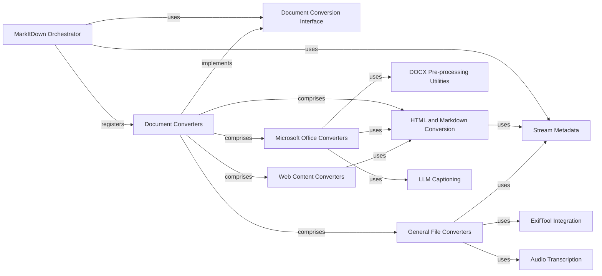

## Component Details

The MarkItDown system facilitates the conversion of various document formats into a standardized Markdown format. The central flow involves the MarkItDown Orchestrator, which initializes the system and registers a diverse collection of Document Converters. Upon receiving an input stream, the Orchestrator utilizes Stream Metadata to identify the document type and select the appropriate Document Converter. Each Document Converter adheres to the Document Conversion Interface, ensuring a consistent conversion process. Specialized converters, such as those for Microsoft Office files, web content, and general file types, leverage internal utilities like HTML and Markdown Conversion, DOCX Pre-processing Utilities, ExifTool Integration, Audio Transcription, and LLM Captioning to accurately transform content into Markdown.

### MarkItDown Orchestrator
The core component responsible for initializing the MarkItDown system, registering various document converters, and orchestrating the conversion process from different input sources (local files, streams, URLs, HTTP responses) to Markdown. It determines the appropriate converter based on stream information and handles conversion attempts and exceptions.

**Related Classes/Methods**:

- <a href="https://github.com/microsoft/markitdown/blob/master/packages/markitdown/src/markitdown/_markitdown.py#L93-L771" target="_blank" rel="noopener noreferrer">`markitdown.packages.markitdown.src.markitdown._markitdown.MarkItDown` (93:771)</a>
- <a href="https://github.com/microsoft/markitdown/blob/master/packages/markitdown/src/markitdown/_markitdown.py#L132-L221" target="_blank" rel="noopener noreferrer">`markitdown.packages.markitdown.src.markitdown._markitdown.MarkItDown:enable_builtins` (132:221)</a>
- <a href="https://github.com/microsoft/markitdown/blob/master/packages/markitdown/src/markitdown/_markitdown.py#L529-L619" target="_blank" rel="noopener noreferrer">`markitdown.packages.markitdown.src.markitdown._markitdown.MarkItDown:_convert` (529:619)</a>
- <a href="https://github.com/microsoft/markitdown/blob/master/packages/markitdown/src/markitdown/_markitdown.py#L629-L659" target="_blank" rel="noopener noreferrer">`markitdown.packages.markitdown.src.markitdown._markitdown.MarkItDown.register_converter` (629:659)</a>

### Stream Metadata
A data class that encapsulates metadata about a file stream, such as its MIME type, file extension, character set, filename, local path, and URL. This information is crucial for the MarkItDown Orchestrator and individual converters to identify and process the input correctly.

**Related Classes/Methods**:

- <a href="https://github.com/microsoft/markitdown/blob/master/packages/markitdown/src/markitdown/_stream_info.py#L6-L32" target="_blank" rel="noopener noreferrer">`markitdown.packages.markitdown.src.markitdown._stream_info.StreamInfo` (6:32)</a>
- <a href="https://github.com/microsoft/markitdown/blob/master/packages/markitdown/src/markitdown/_stream_info.py#L20-L32" target="_blank" rel="noopener noreferrer">`markitdown.packages.markitdown.src.markitdown._stream_info.StreamInfo:copy_and_update` (20:32)</a>

### Document Conversion Interface
Defines the abstract contract for all document converters within the MarkItDown system. It specifies methods like `accepts` (to determine if a converter can handle a given stream) and `convert` (to perform the actual conversion to Markdown). It also includes `DocumentConverterResult`, the standardized output format for all conversions.

**Related Classes/Methods**:

- <a href="https://github.com/microsoft/markitdown/blob/master/packages/markitdown/src/markitdown/_base_converter.py#L42-L105" target="_blank" rel="noopener noreferrer">`markitdown.packages.markitdown.src.markitdown._base_converter.DocumentConverter` (42:105)</a>
- <a href="https://github.com/microsoft/markitdown/blob/master/packages/markitdown/src/markitdown/_base_converter.py#L5-L39" target="_blank" rel="noopener noreferrer">`markitdown.packages.markitdown.src.markitdown._base_converter.DocumentConverterResult` (5:39)</a>

### Document Converters
A comprehensive collection of specialized modules, each designed to convert a specific document format (e.g., HTML, PDF, DOCX, XLSX, images, audio, plain text, ZIP archives, web content) into a standardized Markdown format. These converters implement the `DocumentConverter` interface and leverage various internal utilities and external libraries to achieve accurate and structured conversions.

**Related Classes/Methods**:

- <a href="https://github.com/microsoft/markitdown/blob/master/packages/markitdown/src/markitdown/converters/_plain_text_converter.py#L33-L71" target="_blank" rel="noopener noreferrer">`markitdown.packages.markitdown.src.markitdown.converters._plain_text_converter.PlainTextConverter` (33:71)</a>
- <a href="https://github.com/microsoft/markitdown/blob/master/packages/markitdown/src/markitdown/converters/_zip_converter.py#L22-L116" target="_blank" rel="noopener noreferrer">`markitdown.packages.markitdown.src.markitdown.converters._zip_converter.ZipConverter` (22:116)</a>
- <a href="https://github.com/microsoft/markitdown/blob/master/packages/markitdown/src/markitdown/converters/_html_converter.py#L20-L90" target="_blank" rel="noopener noreferrer">`markitdown.packages.markitdown.src.markitdown.converters._html_converter.HtmlConverter` (20:90)</a>
- <a href="https://github.com/microsoft/markitdown/blob/master/packages/markitdown/src/markitdown/converters/_rss_converter.py#L29-L192" target="_blank" rel="noopener noreferrer">`markitdown.packages.markitdown.src.markitdown.converters._rss_converter.RssConverter` (29:192)</a>
- <a href="https://github.com/microsoft/markitdown/blob/master/packages/markitdown/src/markitdown/converters/_wikipedia_converter.py#L20-L87" target="_blank" rel="noopener noreferrer">`markitdown.packages.markitdown.src.markitdown.converters._wikipedia_converter.WikipediaConverter` (20:87)</a>
- <a href="https://github.com/microsoft/markitdown/blob/master/packages/markitdown/src/markitdown/converters/_youtube_converter.py#L37-L238" target="_blank" rel="noopener noreferrer">`markitdown.packages.markitdown.src.markitdown.converters._youtube_converter.YouTubeConverter` (37:238)</a>
- <a href="https://github.com/microsoft/markitdown/blob/master/packages/markitdown/src/markitdown/converters/_bing_serp_converter.py#L23-L120" target="_blank" rel="noopener noreferrer">`markitdown.packages.markitdown.src.markitdown.converters._bing_serp_converter.BingSerpConverter` (23:120)</a>
- <a href="https://github.com/microsoft/markitdown/blob/master/packages/markitdown/src/markitdown/converters/_docx_converter.py#L28-L80" target="_blank" rel="noopener noreferrer">`markitdown.packages.markitdown.src.markitdown.converters._docx_converter.DocxConverter` (28:80)</a>
- <a href="https://github.com/microsoft/markitdown/blob/master/packages/markitdown/src/markitdown/converters/_xlsx_converter.py#L36-L95" target="_blank" rel="noopener noreferrer">`markitdown.packages.markitdown.src.markitdown.converters._xlsx_converter.XlsxConverter` (36:95)</a>
- <a href="https://github.com/microsoft/markitdown/blob/master/packages/markitdown/src/markitdown/converters/_xlsx_converter.py#L98-L157" target="_blank" rel="noopener noreferrer">`markitdown.packages.markitdown.src.markitdown.converters._xlsx_converter.XlsConverter` (98:157)</a>
- <a href="https://github.com/microsoft/markitdown/blob/master/packages/markitdown/src/markitdown/converters/_pptx_converter.py#L34-L252" target="_blank" rel="noopener noreferrer">`markitdown.packages.markitdown.src.markitdown.converters._pptx_converter.PptxConverter` (34:252)</a>
- <a href="https://github.com/microsoft/markitdown/blob/master/packages/markitdown/src/markitdown/converters/_audio_converter.py#L23-L101" target="_blank" rel="noopener noreferrer">`markitdown.packages.markitdown.src.markitdown.converters._audio_converter.AudioConverter` (23:101)</a>
- <a href="https://github.com/microsoft/markitdown/blob/master/packages/markitdown/src/markitdown/converters/_image_converter.py#L16-L138" target="_blank" rel="noopener noreferrer">`markitdown.packages.markitdown.src.markitdown.converters._image_converter.ImageConverter` (16:138)</a>
- <a href="https://github.com/microsoft/markitdown/blob/master/packages/markitdown/src/markitdown/converters/_ipynb_converter.py#L15-L96" target="_blank" rel="noopener noreferrer">`markitdown.packages.markitdown.src.markitdown.converters._ipynb_converter.IpynbConverter` (15:96)</a>
- <a href="https://github.com/microsoft/markitdown/blob/master/packages/markitdown/src/markitdown/converters/_pdf_converter.py#L31-L77" target="_blank" rel="noopener noreferrer">`markitdown.packages.markitdown.src.markitdown.converters._pdf_converter.PdfConverter` (31:77)</a>
- <a href="https://github.com/microsoft/markitdown/blob/master/packages/markitdown/src/markitdown/converters/_outlook_msg_converter.py#L24-L149" target="_blank" rel="noopener noreferrer">`markitdown.packages.markitdown.src.markitdown.converters._outlook_msg_converter.OutlookMsgConverter` (24:149)</a>
- <a href="https://github.com/microsoft/markitdown/blob/master/packages/markitdown/src/markitdown/converters/_epub_converter.py#L26-L146" target="_blank" rel="noopener noreferrer">`markitdown.packages.markitdown.src.markitdown.converters._epub_converter.EpubConverter` (26:146)</a>
- <a href="https://github.com/microsoft/markitdown/blob/master/packages/markitdown/src/markitdown/converters/_csv_converter.py#L15-L77" target="_blank" rel="noopener noreferrer">`markitdown.packages.markitdown.src.markitdown.converters._csv_converter.CsvConverter` (15:77)</a>
- <a href="https://github.com/microsoft/markitdown/blob/master/packages/markitdown/src/markitdown/converters/_doc_intel_converter.py#L125-L249" target="_blank" rel="noopener noreferrer">`markitdown.packages.markitdown.src.markitdown.converters._doc_intel_converter.DocumentIntelligenceConverter` (125:249)</a>

### HTML and Markdown Conversion
This component is responsible for converting HTML content into Markdown. It utilizes a custom Markdownify implementation to ensure proper formatting and handling of various HTML elements, including the removal of scripts and styles, and the correct escaping of URIs.

**Related Classes/Methods**:

- <a href="https://github.com/microsoft/markitdown/blob/master/packages/markitdown/src/markitdown/converters/_html_converter.py#L20-L90" target="_blank" rel="noopener noreferrer">`markitdown.packages.markitdown.src.markitdown.converters._html_converter.HtmlConverter` (20:90)</a>
- <a href="https://github.com/microsoft/markitdown/blob/master/packages/markitdown/src/markitdown/converters/_html_converter.py#L41-L71" target="_blank" rel="noopener noreferrer">`markitdown.packages.markitdown.src.markitdown.converters._html_converter.HtmlConverter:convert` (41:71)</a>
- <a href="https://github.com/microsoft/markitdown/blob/master/packages/markitdown/src/markitdown/converters/_html_converter.py#L73-L90" target="_blank" rel="noopener noreferrer">`markitdown.packages.markitdown.src.markitdown.converters._html_converter.HtmlConverter:convert_string` (73:90)</a>
- <a href="https://github.com/microsoft/markitdown/blob/master/packages/markitdown/src/markitdown/converters/_markdownify.py#L8-L111" target="_blank" rel="noopener noreferrer">`markitdown.packages.markitdown.src.markitdown.converters._markdownify._CustomMarkdownify` (8:111)</a>
- <a href="https://github.com/microsoft/markitdown/blob/master/packages/markitdown/src/markitdown/converters/_markdownify.py#L110-L111" target="_blank" rel="noopener noreferrer">`markitdown.packages.markitdown.src.markitdown.converters._markdownify._CustomMarkdownify:convert_soup` (110:111)</a>

### Microsoft Office Converters
A collection of converters specifically designed to process Microsoft Office document formats (DOCX, PPTX, XLSX, XLS) and transform their content into Markdown. These converters often leverage the HTML and Markdown Conversion component for the final Markdown rendering.

**Related Classes/Methods**:

- <a href="https://github.com/microsoft/markitdown/blob/master/packages/markitdown/src/markitdown/converters/_docx_converter.py#L28-L80" target="_blank" rel="noopener noreferrer">`markitdown.packages.markitdown.src.markitdown.converters._docx_converter.DocxConverter` (28:80)</a>
- <a href="https://github.com/microsoft/markitdown/blob/master/packages/markitdown/src/markitdown/converters/_docx_converter.py#L33-L35" target="_blank" rel="noopener noreferrer">`markitdown.packages.markitdown.src.markitdown.converters._docx_converter.DocxConverter:__init__` (33:35)</a>
- <a href="https://github.com/microsoft/markitdown/blob/master/packages/markitdown/src/markitdown/converters/_docx_converter.py#L55-L80" target="_blank" rel="noopener noreferrer">`markitdown.packages.markitdown.src.markitdown.converters._docx_converter.DocxConverter:convert` (55:80)</a>
- <a href="https://github.com/microsoft/markitdown/blob/master/packages/markitdown/src/markitdown/converters/_pptx_converter.py#L34-L252" target="_blank" rel="noopener noreferrer">`markitdown.packages.markitdown.src.markitdown.converters._pptx_converter.PptxConverter` (34:252)</a>
- <a href="https://github.com/microsoft/markitdown/blob/master/packages/markitdown/src/markitdown/converters/_pptx_converter.py#L39-L41" target="_blank" rel="noopener noreferrer">`markitdown.packages.markitdown.src.markitdown.converters._pptx_converter.PptxConverter:__init__` (39:41)</a>
- <a href="https://github.com/microsoft/markitdown/blob/master/packages/markitdown/src/markitdown/converters/_pptx_converter.py#L61-L188" target="_blank" rel="noopener noreferrer">`markitdown.packages.markitdown.src.markitdown.converters._pptx_converter.PptxConverter:convert` (61:188)</a>
- <a href="https://github.com/microsoft/markitdown/blob/master/packages/markitdown/src/markitdown/converters/_pptx_converter.py#L203-L221" target="_blank" rel="noopener noreferrer">`markitdown.packages.markitdown.src.markitdown.converters._pptx_converter.PptxConverter:_convert_table_to_markdown` (203:221)</a>
- <a href="https://github.com/microsoft/markitdown/blob/master/packages/markitdown/src/markitdown/converters/_xlsx_converter.py#L36-L95" target="_blank" rel="noopener noreferrer">`markitdown.packages.markitdown.src.markitdown.converters._xlsx_converter.XlsxConverter` (36:95)</a>
- <a href="https://github.com/microsoft/markitdown/blob/master/packages/markitdown/src/markitdown/converters/_xlsx_converter.py#L41-L43" target="_blank" rel="noopener noreferrer">`markitdown.packages.markitdown.src.markitdown.converters._xlsx_converter.XlsxConverter:__init__` (41:43)</a>
- <a href="https://github.com/microsoft/markitdown/blob/master/packages/markitdown/src/markitdown/converters/_xlsx_converter.py#L63-L95" target="_blank" rel="noopener noreferrer">`markitdown.packages.markitdown.src.markitdown.converters._xlsx_converter.XlsxConverter:convert` (63:95)</a>
- <a href="https://github.com/microsoft/markitdown/blob/master/packages/markitdown/src/markitdown/converters/_xlsx_converter.py#L98-L157" target="_blank" rel="noopener noreferrer">`markitdown.packages.markitdown.src.markitdown.converters._xlsx_converter.XlsConverter` (98:157)</a>
- <a href="https://github.com/microsoft/markitdown/blob/master/packages/markitdown/src/markitdown/converters/_xlsx_converter.py#L103-L105" target="_blank" rel="noopener noreferrer">`markitdown.packages.markitdown.src.markitdown.converters._xlsx_converter.XlsConverter:__init__` (103:105)</a>
- <a href="https://github.com/microsoft/markitdown/blob/master/packages/markitdown/src/markitdown/converters/_xlsx_converter.py#L125-L157" target="_blank" rel="noopener noreferrer">`markitdown.packages.markitdown.src.markitdown.converters._xlsx_converter.XlsConverter:convert` (125:157)</a>

### DOCX Pre-processing Utilities
A utility component specifically for pre-processing DOCX files before their main conversion. Its primary function is to convert Office Math Markup Language (OMML) equations embedded in DOCX files into LaTeX format, ensuring mathematical expressions are correctly represented in the final Markdown output.

**Related Classes/Methods**:

- `markitdown.packages.markitdown.src.markitdown.converter_utils.docx.pre_process` (full file reference)
- <a href="https://github.com/microsoft/markitdown/blob/master/packages/markitdown/src/markitdown/converter_utils/docx/pre_process.py#L118-L156" target="_blank" rel="noopener noreferrer">`markitdown.packages.markitdown.src.markitdown.converter_utils.docx.pre_process:pre_process_docx` (118:156)</a>
- <a href="https://github.com/microsoft/markitdown/blob/master/packages/markitdown/src/markitdown/converter_utils/docx/pre_process.py#L33-L49" target="_blank" rel="noopener noreferrer">`markitdown.packages.markitdown.src.markitdown.converter_utils.docx.pre_process:_convert_omath_to_latex` (33:49)</a>
- `markitdown.packages.markitdown.src.markitdown.converter_utils.docx.math.omml` (full file reference)
- <a href="https://github.com/microsoft/markitdown/blob/master/packages/markitdown/src/markitdown/converter_utils/docx/math/omml.py#L170-L400" target="_blank" rel="noopener noreferrer">`markitdown.packages.markitdown.src.markitdown.converter_utils.docx.math.omml.oMath2Latex` (170:400)</a>

### Web Content Converters
This component group handles the conversion of content from specific web-based sources, such as YouTube videos, RSS feeds, Wikipedia pages, and Bing search results, into a structured Markdown format. They extract relevant information and often use HTML parsing and Markdown conversion utilities.

**Related Classes/Methods**:

- <a href="https://github.com/microsoft/markitdown/blob/master/packages/markitdown/src/markitdown/converters/_youtube_converter.py#L37-L238" target="_blank" rel="noopener noreferrer">`markitdown.packages.markitdown.src.markitdown.converters._youtube_converter.YouTubeConverter` (37:238)</a>
- <a href="https://github.com/microsoft/markitdown/blob/master/packages/markitdown/src/markitdown/converters/_youtube_converter.py#L70-L197" target="_blank" rel="noopener noreferrer">`markitdown.packages.markitdown.src.markitdown.converters._youtube_converter.YouTubeConverter:convert` (70:197)</a>
- <a href="https://github.com/microsoft/markitdown/blob/master/packages/markitdown/src/markitdown/converters/_rss_converter.py#L29-L192" target="_blank" rel="noopener noreferrer">`markitdown.packages.markitdown.src.markitdown.converters._rss_converter.RssConverter` (29:192)</a>
- <a href="https://github.com/microsoft/markitdown/blob/master/packages/markitdown/src/markitdown/converters/_rss_converter.py#L84-L99" target="_blank" rel="noopener noreferrer">`markitdown.packages.markitdown.src.markitdown.converters._rss_converter.RssConverter:convert` (84:99)</a>
- <a href="https://github.com/microsoft/markitdown/blob/master/packages/markitdown/src/markitdown/converters/_wikipedia_converter.py#L20-L87" target="_blank" rel="noopener noreferrer">`markitdown.packages.markitdown.src.markitdown.converters._wikipedia_converter.WikipediaConverter` (20:87)</a>
- <a href="https://github.com/microsoft/markitdown/blob/master/packages/markitdown/src/markitdown/converters/_wikipedia_converter.py#L51-L87" target="_blank" rel="noopener noreferrer">`markitdown.packages.markitdown.src.markitdown.converters._wikipedia_converter.WikipediaConverter:convert` (51:87)</a>
- <a href="https://github.com/microsoft/markitdown/blob/master/packages/markitdown/src/markitdown/converters/_bing_serp_converter.py#L23-L120" target="_blank" rel="noopener noreferrer">`markitdown.packages.markitdown.src.markitdown.converters._bing_serp_converter.BingSerpConverter` (23:120)</a>
- <a href="https://github.com/microsoft/markitdown/blob/master/packages/markitdown/src/markitdown/converters/_bing_serp_converter.py#L57-L120" target="_blank" rel="noopener noreferrer">`markitdown.packages.markitdown.src.markitdown.converters._bing_serp_converter.BingSerpConverter:convert` (57:120)</a>

### General File Converters
A broad category encompassing converters for various common file types not covered by the specialized Office or Web Content converters. This includes plain text, zip archives, images, audio, PDFs, Jupyter notebooks, Outlook messages, EPUBs, CSVs, and documents processed by Document Intelligence.

**Related Classes/Methods**:

- <a href="https://github.com/microsoft/markitdown/blob/master/packages/markitdown/src/markitdown/converters/_plain_text_converter.py#L33-L71" target="_blank" rel="noopener noreferrer">`markitdown.packages.markitdown.src.markitdown.converters._plain_text_converter.PlainTextConverter` (33:71)</a>
- <a href="https://github.com/microsoft/markitdown/blob/master/packages/markitdown/src/markitdown/converters/_plain_text_converter.py#L60-L71" target="_blank" rel="noopener noreferrer">`markitdown.packages.markitdown.src.markitdown.converters._plain_text_converter.PlainTextConverter:convert` (60:71)</a>
- <a href="https://github.com/microsoft/markitdown/blob/master/packages/markitdown/src/markitdown/converters/_zip_converter.py#L22-L116" target="_blank" rel="noopener noreferrer">`markitdown.packages.markitdown.src.markitdown.converters._zip_converter.ZipConverter` (22:116)</a>
- <a href="https://github.com/microsoft/markitdown/blob/master/packages/markitdown/src/markitdown/converters/_zip_converter.py#L87-L116" target="_blank" rel="noopener noreferrer">`markitdown.packages.markitdown.src.markitdown.converters._zip_converter.ZipConverter:convert` (87:116)</a>
- <a href="https://github.com/microsoft/markitdown/blob/master/packages/markitdown/src/markitdown/converters/_image_converter.py#L16-L138" target="_blank" rel="noopener noreferrer">`markitdown.packages.markitdown.src.markitdown.converters._image_converter.ImageConverter` (16:138)</a>
- <a href="https://github.com/microsoft/markitdown/blob/master/packages/markitdown/src/markitdown/converters/_image_converter.py#L39-L85" target="_blank" rel="noopener noreferrer">`markitdown.packages.markitdown.src.markitdown.converters._image_converter.ImageConverter:convert` (39:85)</a>
- <a href="https://github.com/microsoft/markitdown/blob/master/packages/markitdown/src/markitdown/converters/_audio_converter.py#L23-L101" target="_blank" rel="noopener noreferrer">`markitdown.packages.markitdown.src.markitdown.converters._audio_converter.AudioConverter` (23:101)</a>
- <a href="https://github.com/microsoft/markitdown/blob/master/packages/markitdown/src/markitdown/converters/_audio_converter.py#L46-L101" target="_blank" rel="noopener noreferrer">`markitdown.packages.markitdown.src.markitdown.converters._audio_converter.AudioConverter:convert` (46:101)</a>
- <a href="https://github.com/microsoft/markitdown/blob/master/packages/markitdown/src/markitdown/converters/_pdf_converter.py#L31-L77" target="_blank" rel="noopener noreferrer">`markitdown.packages.markitdown.src.markitdown.converters._pdf_converter.PdfConverter` (31:77)</a>
- <a href="https://github.com/microsoft/markitdown/blob/master/packages/markitdown/src/markitdown/converters/_pdf_converter.py#L54-L77" target="_blank" rel="noopener noreferrer">`markitdown.packages.markitdown.src.markitdown.converters._pdf_converter.PdfConverter:convert` (54:77)</a>
- <a href="https://github.com/microsoft/markitdown/blob/master/packages/markitdown/src/markitdown/converters/_ipynb_converter.py#L15-L96" target="_blank" rel="noopener noreferrer">`markitdown.packages.markitdown.src.markitdown.converters._ipynb_converter.IpynbConverter` (15:96)</a>
- <a href="https://github.com/microsoft/markitdown/blob/master/packages/markitdown/src/markitdown/converters/_ipynb_converter.py#L46-L55" target="_blank" rel="noopener noreferrer">`markitdown.packages.markitdown.src.markitdown.converters._ipynb_converter.IpynbConverter:convert` (46:55)</a>
- <a href="https://github.com/microsoft/markitdown/blob/master/packages/markitdown/src/markitdown/converters/_outlook_msg_converter.py#L24-L149" target="_blank" rel="noopener noreferrer">`markitdown.packages.markitdown.src.markitdown.converters._outlook_msg_converter.OutlookMsgConverter` (24:149)</a>
- <a href="https://github.com/microsoft/markitdown/blob/master/packages/markitdown/src/markitdown/converters/_outlook_msg_converter.py#L73-L125" target="_blank" rel="noopener noreferrer">`markitdown.packages.markitdown.src.markitdown.converters._outlook_msg_converter.OutlookMsgConverter:convert` (73:125)</a>
- <a href="https://github.com/microsoft/markitdown/blob/master/packages/markitdown/src/markitdown/converters/_epub_converter.py#L26-L146" target="_blank" rel="noopener noreferrer">`markitdown.packages.markitdown.src.markitdown.converters._epub_converter.EpubConverter` (26:146)</a>
- <a href="https://github.com/microsoft/markitdown/blob/master/packages/markitdown/src/markitdown/converters/_epub_converter.py#L53-L130" target="_blank" rel="noopener noreferrer">`markitdown.packages.markitdown.src.markitdown.converters._epub_converter.EpubConverter:convert` (53:130)</a>
- <a href="https://github.com/microsoft/markitdown/blob/master/packages/markitdown/src/markitdown/converters/_csv_converter.py#L15-L77" target="_blank" rel="noopener noreferrer">`markitdown.packages.markitdown.src.markitdown.converters._csv_converter.CsvConverter` (15:77)</a>
- <a href="https://github.com/microsoft/markitdown/blob/master/packages/markitdown/src/markitdown/converters/_csv_converter.py#L38-L77" target="_blank" rel="noopener noreferrer">`markitdown.packages.markitdown.src.markitdown.converters._csv_converter.CsvConverter:convert` (38:77)</a>
- <a href="https://github.com/microsoft/markitdown/blob/master/packages/markitdown/src/markitdown/converters/_doc_intel_converter.py#L125-L249" target="_blank" rel="noopener noreferrer">`markitdown.packages.markitdown.src.markitdown.converters._doc_intel_converter.DocumentIntelligenceConverter` (125:249)</a>
- <a href="https://github.com/microsoft/markitdown/blob/master/packages/markitdown/src/markitdown/converters/_doc_intel_converter.py#L232-L249" target="_blank" rel="noopener noreferrer">`markitdown.packages.markitdown.src.markitdown.converters._doc_intel_converter.DocumentIntelligenceConverter:convert` (232:249)</a>

### ExifTool Integration
Provides functionality to extract metadata from various file types, particularly images and audio, using the ExifTool utility. This component is leveraged by converters that require rich metadata for accurate content processing.

**Related Classes/Methods**:

- `markitdown.packages.markitdown.src.markitdown.converters._exiftool` (full file reference)

### Audio Transcription
Handles the transcription of audio content into text, enabling audio files to be converted into Markdown. This component integrates with external transcription services or libraries.

**Related Classes/Methods**:

- `markitdown.packages.markitdown.src.markitdown.converters._transcribe_audio` (full file reference)

### LLM Captioning
Provides functionality to generate captions or descriptions for content, potentially using Large Language Models (LLMs). This is specifically used by the PPTX converter to enhance the Markdown output with descriptive text for visual elements.

**Related Classes/Methods**:

- `markitdown.packages.markitdown.src.markitdown.converters._llm_caption` (full file reference)

### [FAQ](https://github.com/CodeBoarding/GeneratedOnBoardings/tree/main?tab=readme-ov-file#faq)