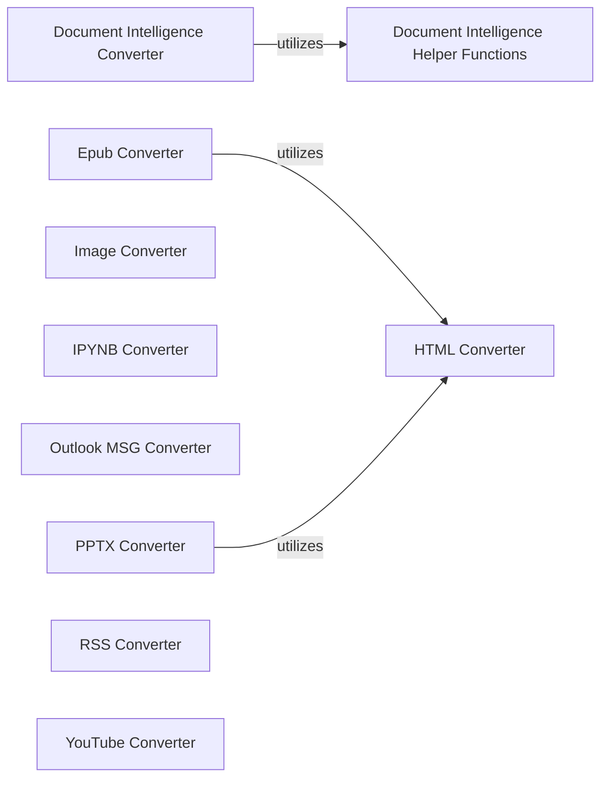

## Component Details

A collection of specialized modules, each responsible for transforming a specific document format (e.g., DOCX, EPUB, HTML, Images, Jupyter, Outlook MSG, PowerPoint, RSS, YouTube) into Markdown. They implement `accepts` and `convert` methods.

### Document Intelligence Converter
This component is responsible for converting various document types into markdown format using Azure Document Intelligence. It handles file type acceptance, determines appropriate analysis features based on the document type, and performs the conversion by interacting with the Azure Document Intelligence client.

**Related Classes/Methods**:

- <a href="https://github.com/microsoft/markitdown/blob/master/packages/markitdown/src/markitdown/converters/_doc_intel_converter.py#L125-L249" target="_blank" rel="noopener noreferrer">`packages.markitdown.src.markitdown.converters._doc_intel_converter.DocumentIntelligenceConverter` (125:249)</a>
- <a href="https://github.com/microsoft/markitdown/blob/master/packages/markitdown/src/markitdown/converters/_doc_intel_converter.py#L184-L200" target="_blank" rel="noopener noreferrer">`packages.markitdown.src.markitdown.converters._doc_intel_converter.DocumentIntelligenceConverter:accepts` (184:200)</a>
- <a href="https://github.com/microsoft/markitdown/blob/master/packages/markitdown/src/markitdown/converters/_doc_intel_converter.py#L202-L230" target="_blank" rel="noopener noreferrer">`packages.markitdown.src.markitdown.converters._doc_intel_converter.DocumentIntelligenceConverter:_analysis_features` (202:230)</a>
- <a href="https://github.com/microsoft/markitdown/blob/master/packages/markitdown/src/markitdown/converters/_doc_intel_converter.py#L232-L249" target="_blank" rel="noopener noreferrer">`packages.markitdown.src.markitdown.converters._doc_intel_converter.DocumentIntelligenceConverter:convert` (232:249)</a>

### Document Intelligence Helper Functions
This component provides helper functions for the Document Intelligence Converter, specifically for determining file extensions and MIME type prefixes supported by the Document Intelligence service. These functions are crucial for the converter to correctly identify and process different document formats.

**Related Classes/Methods**:

- <a href="https://github.com/microsoft/markitdown/blob/master/packages/markitdown/src/markitdown/converters/_doc_intel_converter.py#L101-L122" target="_blank" rel="noopener noreferrer">`packages.markitdown.src.markitdown.converters._doc_intel_converter._get_file_extensions` (101:122)</a>
- <a href="https://github.com/microsoft/markitdown/blob/master/packages/markitdown/src/markitdown/converters/_doc_intel_converter.py#L71-L98" target="_blank" rel="noopener noreferrer">`packages.markitdown.src.markitdown.converters._doc_intel_converter._get_mime_type_prefixes` (71:98)</a>

### Epub Converter
This component is responsible for converting EPUB files into a readable text format. It navigates the EPUB's internal structure to extract text content from various nodes.

**Related Classes/Methods**:

- <a href="https://github.com/microsoft/markitdown/blob/master/packages/markitdown/src/markitdown/converters/_epub_converter.py#L26-L146" target="_blank" rel="noopener noreferrer">`packages.markitdown.src.markitdown.converters._epub_converter.EpubConverter` (26:146)</a>
- <a href="https://github.com/microsoft/markitdown/blob/master/packages/markitdown/src/markitdown/converters/_epub_converter.py#L53-L130" target="_blank" rel="noopener noreferrer">`packages.markitdown.src.markitdown.converters._epub_converter.EpubConverter:convert` (53:130)</a>
- <a href="https://github.com/microsoft/markitdown/blob/master/packages/markitdown/src/markitdown/converters/_epub_converter.py#L132-L138" target="_blank" rel="noopener noreferrer">`packages.markitdown.src.markitdown.converters._epub_converter.EpubConverter:_get_text_from_node` (132:138)</a>
- <a href="https://github.com/microsoft/markitdown/blob/master/packages/markitdown/src/markitdown/converters/_epub_converter.py#L140-L146" target="_blank" rel="noopener noreferrer">`packages.markitdown.src.markitdown.converters._epub_converter.EpubConverter:_get_all_texts_from_nodes` (140:146)</a>

### HTML Converter
This component handles the conversion of HTML strings into a desired output format. It primarily acts as a wrapper, delegating the actual conversion logic to another internal method.

**Related Classes/Methods**:

- <a href="https://github.com/microsoft/markitdown/blob/master/packages/markitdown/src/markitdown/converters/_html_converter.py#L20-L90" target="_blank" rel="noopener noreferrer">`packages.markitdown.src.markitdown.converters._html_converter.HtmlConverter` (20:90)</a>
- <a href="https://github.com/microsoft/markitdown/blob/master/packages/markitdown/src/markitdown/converters/_html_converter.py#L73-L90" target="_blank" rel="noopener noreferrer">`packages.markitdown.src.markitdown.converters._html_converter.HtmlConverter:convert_string` (73:90)</a>
- <a href="https://github.com/microsoft/markitdown/blob/master/packages/markitdown/src/markitdown/converters/_html_converter.py#L41-L71" target="_blank" rel="noopener noreferrer">`packages.markitdown.src.markitdown.converters._html_converter.HtmlConverter:convert` (41:71)</a>

### Image Converter
This component is designed to convert images by generating a description using a Large Language Model (LLM). It focuses on extracting meaningful textual representations from image data.

**Related Classes/Methods**:

- <a href="https://github.com/microsoft/markitdown/blob/master/packages/markitdown/src/markitdown/converters/_image_converter.py#L16-L138" target="_blank" rel="noopener noreferrer">`packages.markitdown.src.markitdown.converters._image_converter.ImageConverter` (16:138)</a>
- <a href="https://github.com/microsoft/markitdown/blob/master/packages/markitdown/src/markitdown/converters/_image_converter.py#L39-L85" target="_blank" rel="noopener noreferrer">`packages.markitdown.src.markitdown.converters._image_converter.ImageConverter:convert` (39:85)</a>
- <a href="https://github.com/microsoft/markitdown/blob/master/packages/markitdown/src/markitdown/converters/_image_converter.py#L87-L138" target="_blank" rel="noopener noreferrer">`packages.markitdown.src.markitdown.converters._image_converter.ImageConverter:_get_llm_description` (87:138)</a>

### IPYNB Converter
This component is responsible for converting Jupyter Notebook (IPYNB) files. It encapsulates the core conversion logic within a private method.

**Related Classes/Methods**:

- <a href="https://github.com/microsoft/markitdown/blob/master/packages/markitdown/src/markitdown/converters/_ipynb_converter.py#L15-L96" target="_blank" rel="noopener noreferrer">`packages.markitdown.src.markitdown.converters._ipynb_converter.IpynbConverter` (15:96)</a>
- <a href="https://github.com/microsoft/markitdown/blob/master/packages/markitdown/src/markitdown/converters/_ipynb_converter.py#L46-L55" target="_blank" rel="noopener noreferrer">`packages.markitdown.src.markitdown.converters._ipynb_converter.IpynbConverter:convert` (46:55)</a>
- <a href="https://github.com/microsoft/markitdown/blob/master/packages/markitdown/src/markitdown/converters/_ipynb_converter.py#L57-L96" target="_blank" rel="noopener noreferrer">`packages.markitdown.src.markitdown.converters._ipynb_converter.IpynbConverter:_convert` (57:96)</a>

### Outlook MSG Converter
This component specializes in converting Outlook Message (MSG) files. Its primary function involves extracting stream data from the MSG file for further processing.

**Related Classes/Methods**:

- <a href="https://github.com/microsoft/markitdown/blob/master/packages/markitdown/src/markitdown/converters/_outlook_msg_converter.py#L24-L149" target="_blank" rel="noopener noreferrer">`packages.markitdown.src.markitdown.converters._outlook_msg_converter.OutlookMsgConverter` (24:149)</a>
- <a href="https://github.com/microsoft/markitdown/blob/master/packages/markitdown/src/markitdown/converters/_outlook_msg_converter.py#L73-L125" target="_blank" rel="noopener noreferrer">`packages.markitdown.src.markitdown.converters._outlook_msg_converter.OutlookMsgConverter:convert` (73:125)</a>
- <a href="https://github.com/microsoft/markitdown/blob/master/packages/markitdown/src/markitdown/converters/_outlook_msg_converter.py#L127-L149" target="_blank" rel="noopener noreferrer">`packages.markitdown.src.markitdown.converters._outlook_msg_converter.OutlookMsgConverter:_get_stream_data` (127:149)</a>

### PPTX Converter
This component converts PowerPoint (PPTX) presentations into markdown. It identifies and processes various elements within a slide, such as pictures, tables, and charts, converting them into their markdown equivalents.

**Related Classes/Methods**:

- <a href="https://github.com/microsoft/markitdown/blob/master/packages/markitdown/src/markitdown/converters/_pptx_converter.py#L34-L252" target="_blank" rel="noopener noreferrer">`packages.markitdown.src.markitdown.converters._pptx_converter.PptxConverter` (34:252)</a>
- <a href="https://github.com/microsoft/markitdown/blob/master/packages/markitdown/src/markitdown/converters/_pptx_converter.py#L61-L188" target="_blank" rel="noopener noreferrer">`packages.markitdown.src.markitdown.converters._pptx_converter.PptxConverter:convert` (61:188)</a>
- <a href="https://github.com/microsoft/markitdown/blob/master/packages/markitdown/src/markitdown/converters/_pptx_converter.py#L190-L196" target="_blank" rel="noopener noreferrer">`packages.markitdown.src.markitdown.converters._pptx_converter.PptxConverter._is_picture` (190:196)</a>
- <a href="https://github.com/microsoft/markitdown/blob/master/packages/markitdown/src/markitdown/converters/_pptx_converter.py#L198-L201" target="_blank" rel="noopener noreferrer">`packages.markitdown.src.markitdown.converters._pptx_converter.PptxConverter._is_table` (198:201)</a>
- <a href="https://github.com/microsoft/markitdown/blob/master/packages/markitdown/src/markitdown/converters/_pptx_converter.py#L203-L221" target="_blank" rel="noopener noreferrer">`packages.markitdown.src.markitdown.converters._pptx_converter.PptxConverter._convert_table_to_markdown` (203:221)</a>
- <a href="https://github.com/microsoft/markitdown/blob/master/packages/markitdown/src/markitdown/converters/_pptx_converter.py#L223-L252" target="_blank" rel="noopener noreferrer">`packages.markitdown.src.markitdown.converters._pptx_converter.PptxConverter._convert_chart_to_markdown` (223:252)</a>

### RSS Converter
This component is designed to convert RSS and Atom feeds into a structured format. It includes methods for checking XML validity, determining feed types, and parsing content from both RSS and Atom formats.

**Related Classes/Methods**:

- <a href="https://github.com/microsoft/markitdown/blob/master/packages/markitdown/src/markitdown/converters/_rss_converter.py#L29-L192" target="_blank" rel="noopener noreferrer">`packages.markitdown.src.markitdown.converters._rss_converter.RssConverter` (29:192)</a>
- <a href="https://github.com/microsoft/markitdown/blob/master/packages/markitdown/src/markitdown/converters/_rss_converter.py#L36-L61" target="_blank" rel="noopener noreferrer">`packages.markitdown.src.markitdown.converters._rss_converter.RssConverter:accepts` (36:61)</a>
- <a href="https://github.com/microsoft/markitdown/blob/master/packages/markitdown/src/markitdown/converters/_rss_converter.py#L63-L72" target="_blank" rel="noopener noreferrer">`packages.markitdown.src.markitdown.converters._rss_converter.RssConverter:_check_xml` (63:72)</a>
- <a href="https://github.com/microsoft/markitdown/blob/master/packages/markitdown/src/markitdown/converters/_rss_converter.py#L74-L82" target="_blank" rel="noopener noreferrer">`packages.markitdown.src.markitdown.converters._rss_converter.RssConverter:_feed_type` (74:82)</a>
- <a href="https://github.com/microsoft/markitdown/blob/master/packages/markitdown/src/markitdown/converters/_rss_converter.py#L84-L99" target="_blank" rel="noopener noreferrer">`packages.markitdown.src.markitdown.converters._rss_converter.RssConverter:convert` (84:99)</a>
- <a href="https://github.com/microsoft/markitdown/blob/master/packages/markitdown/src/markitdown/converters/_rss_converter.py#L101-L131" target="_blank" rel="noopener noreferrer">`packages.markitdown.src.markitdown.converters._rss_converter.RssConverter:_parse_atom_type` (101:131)</a>
- <a href="https://github.com/microsoft/markitdown/blob/master/packages/markitdown/src/markitdown/converters/_rss_converter.py#L133-L168" target="_blank" rel="noopener noreferrer">`packages.markitdown.src.markitdown.converters._rss_converter.RssConverter:_parse_rss_type` (133:168)</a>
- <a href="https://github.com/microsoft/markitdown/blob/master/packages/markitdown/src/markitdown/converters/_rss_converter.py#L179-L192" target="_blank" rel="noopener noreferrer">`packages.markitdown.src.markitdown.converters._rss_converter.RssConverter:_get_data_by_tag_name` (179:192)</a>
- <a href="https://github.com/microsoft/markitdown/blob/master/packages/markitdown/src/markitdown/converters/_rss_converter.py#L170-L177" target="_blank" rel="noopener noreferrer">`packages.markitdown.src.markitdown.converters._rss_converter.RssConverter:_parse_content` (170:177)</a>

### YouTube Converter
This component is responsible for converting YouTube content, likely by extracting information from YouTube URLs or APIs. It includes methods for finding specific keys within data and handling retries for operations.

**Related Classes/Methods**:

- <a href="https://github.com/microsoft/markitdown/blob/master/packages/markitdown/src/markitdown/converters/_youtube_converter.py#L37-L238" target="_blank" rel="noopener noreferrer">`packages.markitdown.src.markitdown.converters._youtube_converter.YouTubeConverter` (37:238)</a>
- <a href="https://github.com/microsoft/markitdown/blob/master/packages/markitdown/src/markitdown/converters/_youtube_converter.py#L70-L197" target="_blank" rel="noopener noreferrer">`packages.markitdown.src.markitdown.converters._youtube_converter.YouTubeConverter:convert` (70:197)</a>
- <a href="https://github.com/microsoft/markitdown/blob/master/packages/markitdown/src/markitdown/converters/_youtube_converter.py#L211-L224" target="_blank" rel="noopener noreferrer">`packages.markitdown.src.markitdown.converters._youtube_converter.YouTubeConverter:_findKey` (211:224)</a>
- <a href="https://github.com/microsoft/markitdown/blob/master/packages/markitdown/src/markitdown/converters/_youtube_converter.py#L199-L209" target="_blank" rel="noopener noreferrer">`packages.markitdown.src.markitdown.converters._youtube_converter.YouTubeConverter:_get` (199:209)</a>
- <a href="https://github.com/microsoft/markitdown/blob/master/packages/markitdown/src/markitdown/converters/_youtube_converter.py#L226-L238" target="_blank" rel="noopener noreferrer">`packages.markitdown.src.markitdown.converters._youtube_converter.YouTubeConverter:_retry_operation` (226:238)</a>

### [FAQ](https://github.com/CodeBoarding/GeneratedOnBoardings/tree/main?tab=readme-ov-file#faq)