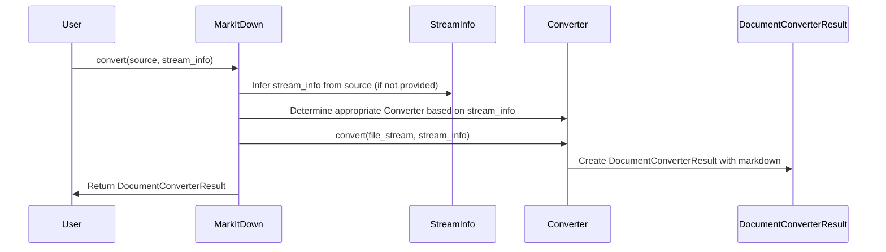
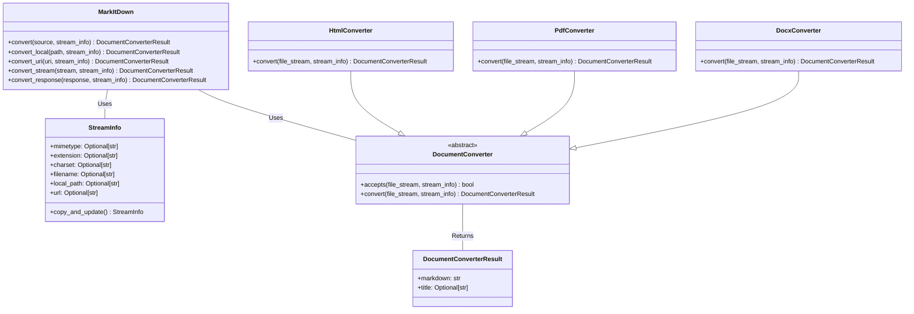

Okay, I have examined the source code of the core components. Here's a breakdown of the `Document Conversion Orchestration` component:

**Component Description:**

The `Document Conversion Orchestration` component is responsible for managing the conversion of various document formats into Markdown. It determines the appropriate converter to use based on the input document's type (identified by its mimetype, extension, or URL) and then orchestrates the conversion process. The main entry point is the `MarkItDown.convert` method. It handles different input types such as local files, URLs, request responses, and streams. It uses `StreamInfo` to store metadata about the input stream. The individual converters inherit from `DocumentConverter` and produce a `DocumentConverterResult`.

**Main Flow (Sequence Diagram):**

**Main Structure (Class Diagram):**

**Explanation of Classes:**

*   **`MarkItDown`**: This class is the main entry point for the document conversion process. The `convert` method accepts various input types (file path, URL, stream, etc.) and orchestrates the conversion. It determines the appropriate converter based on the file type and calls the converter's `convert` method.
*   **`StreamInfo`**: This data class holds metadata about the input stream, such as mimetype, extension, charset, and filename. It's used to help determine the correct converter to use and to provide context to the converter.
*   **`DocumentConverter`**: This is an abstract base class for all document converters. It defines the `accepts` method, which determines whether a converter can handle a given file type, and the `convert` method, which performs the actual conversion.
*   **`DocumentConverterResult`**: This data class holds the result of the conversion, including the converted Markdown text and an optional title.
*   **`HtmlConverter`**: Converts HTML files to Markdown using BeautifulSoup for parsing.
*   **`PdfConverter`**: Converts PDF files to Markdown using pdfminer.
*   **`DocxConverter`**: Converts DOCX files to Markdown by first converting them to HTML using mammoth and then using the `HtmlConverter`.