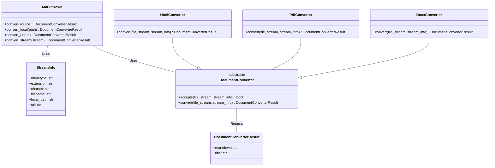

```text
## Component Description: Document Conversion

The `Document Conversion` component is responsible for converting documents of various formats (e.g., HTML, PDF, DOCX) into Markdown. The central class is `MarkItDown`, which orchestrates the conversion process. It receives a document source (local file path, URL, or stream), determines the appropriate converter based on the file type, and then uses that converter to generate Markdown output. The `StreamInfo` class stores metadata about the document stream, such as MIME type and file extension, which aids in converter selection. Individual converters inherit from the `DocumentConverter` abstract class and implement the `convert` method to perform the actual conversion. The result of a conversion is encapsulated in a `DocumentConverterResult` object, containing the Markdown content and an optional title.

**Main Classes and Their Purposes:**

*   **`MarkItDown`**: Orchestrates the document conversion process.
*   **`StreamInfo`**: Stores metadata about the document stream (MIME type, extension, etc.).
*   **`DocumentConverter`**: Abstract base class for document converters.
*   **`DocumentConverterResult`**: Encapsulates the result of a document conversion (Markdown content, title).
*   **`HtmlConverter`**: Converts HTML documents to Markdown.
*   **`PdfConverter`**: Converts PDF documents to Markdown.
*   **`DocxConverter`**: Converts DOCX documents to Markdown.

## Main Flow (Sequence Diagram)


## Component Structure (Class Diagram)

