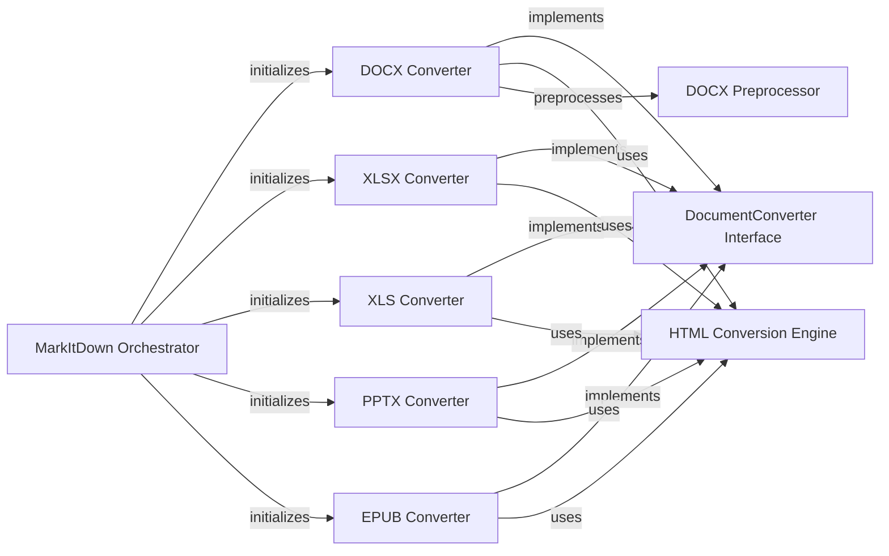

## Component Details

### MarkItDown Orchestrator
The central class responsible for orchestrating the document conversion process. It initializes the appropriate document converters based on the input file type and manages the overall conversion workflow.
- **Related Classes/Methods**: `repos.markitdown.packages.markitdown.src.markitdown._markitdown.MarkItDown`

### DocumentConverter Interface
An abstract base class that defines the common interface for all document converters. It specifies the `convert` method, which all concrete converters must implement to perform the actual conversion from a specific document format to Markdown.
- **Related Classes/Methods**: `repos.markitdown.packages.markitdown.src.markitdown._base_converter.DocumentConverter`, `repos.markitdown.packages.markitdown.src.markitdown._base_converter.DocumentConverterResult`

### HTML Conversion Engine
A core component that handles the conversion of HTML content to Markdown. It is used as an intermediate step by several document converters (e.g., DocxConverter, EpubConverter, XlsxConverter) to process HTML fragments embedded within those document formats.
- **Related Classes/Methods**: `repos.markitdown.packages.markitdown.src.markitdown.converters._html_converter.HtmlConverter`

### DOCX Converter
A specialized converter that transforms DOCX files into Markdown. It leverages the HTML Conversion Engine to handle HTML content within the DOCX and includes pre-processing steps to handle mathematical equations.
- **Related Classes/Methods**: `repos.markitdown.packages.markitdown.src.markitdown.converters._docx_converter.DocxConverter`

### XLSX Converter
A converter dedicated to transforming XLSX files into Markdown. It utilizes the HTML Conversion Engine for converting HTML content found within the XLSX files.
- **Related Classes/Methods**: `repos.markitdown.packages.markitdown.src.markitdown.converters._xlsx_converter.XlsxConverter`

### XLS Converter
Handles the conversion of older XLS files to Markdown, similar to XLSXConverter, using the HTML Conversion Engine for HTML content conversion.
- **Related Classes/Methods**: `repos.markitdown.packages.markitdown.src.markitdown.converters._xlsx_converter.XlsConverter`

### PPTX Converter
Responsible for converting PPTX files to Markdown, including handling of pictures, tables, and charts. It may use an LLM for captioning.
- **Related Classes/Methods**: `repos.markitdown.packages.markitdown.src.markitdown.converters._pptx_converter.PptxConverter`

### EPUB Converter
A converter designed to transform EPUB files into Markdown, extracting text content and utilizing the HTML Conversion Engine for any HTML content embedded within the EPUB.
- **Related Classes/Methods**: `repos.markitdown.packages.markitdown.src.markitdown.converters._epub_converter.EpubConverter`

### DOCX Preprocessor
A utility component that pre-processes DOCX files, specifically focusing on converting mathematical equations from Office Math Markup Language (OMML) to LaTeX format using external converter.
- **Related Classes/Methods**: `repos.markitdown.packages.markitdown.src.markitdown.converter_utils.docx.pre_process.pre_process_docx`, `repos.markitdown.packages.markitdown.src.markitdown.converter_utils.docx.pre_process:_convert_omath_to_latex`, `repos.markitdown.packages.markitdown.src.markitdown.converter_utils.docx.math.omml.oMath2Latex`
