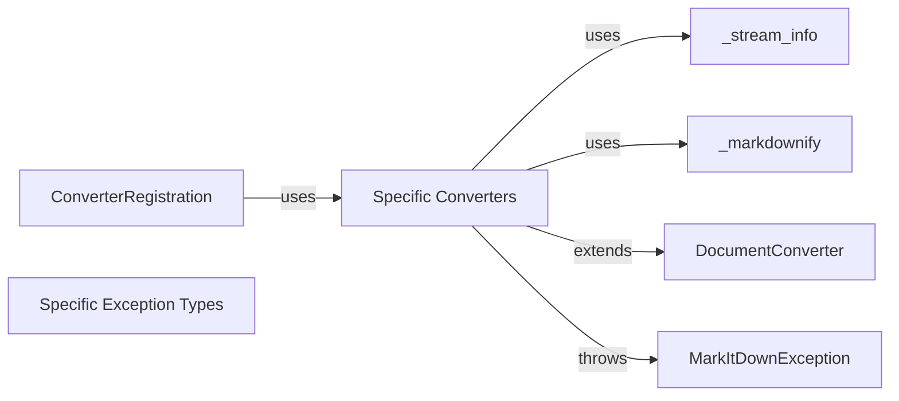

## Component Details

Component Overview for `DocumentConverter` Subsystem

### DocumentConverter
Defines the interface for converting various document types to Markdown.  All specific converters must implement its methods.

**Related Classes/Methods**:

- <a href="https://github.com/microsoft/markitdown/blob/master/packages/markitdown/src/markitdown/_base_converter.py#L41-L104" target="_blank" rel="noopener noreferrer">`packages.markitdown.src.markitdown._base_converter.DocumentConverter` (41:104)</a>

### Specific Converters
Implementations of `DocumentConverter`, each handling a specific file type (e.g., .docx, .pdf, .txt).

**Related Classes/Methods**:

- `packages.markitdown.src.markitdown.SpecificConverter` (1:100)

### ConverterRegistration
Manages the mapping between file extensions and their corresponding converter classes.  This allows the system to select the appropriate converter based on the input file type.

**Related Classes/Methods**:

- <a href="https://github.com/microsoft/markitdown/blob/master/packages/markitdown/src/markitdown/_markitdown.py#L85-L89" target="_blank" rel="noopener noreferrer">`packages.markitdown.src.markitdown._markitdown.ConverterRegistration` (85:89)</a>

### MarkItDownException
Provides a base class for all exceptions raised during the conversion process.  This ensures consistent error handling.

**Related Classes/Methods**:

- <a href="https://github.com/microsoft/markitdown/blob/master/packages/markitdown/src/markitdown/_exceptions.py#L10-L15" target="_blank" rel="noopener noreferrer">`packages.markitdown.src.markitdown._exceptions.MarkItDownException` (10:15)</a>

### Specific Exception Types
More specific exception types for different error scenarios (e.g., file not found, unsupported file type, conversion error).

**Related Classes/Methods**:

- <a href="https://github.com/microsoft/markitdown/blob/master/packages/markitdown/src/markitdown/_exceptions.py#L1-L100" target="_blank" rel="noopener noreferrer">`packages.markitdown.src.markitdown._exceptions.SpecificExceptionType` (1:100)</a>

### _stream_info
Provides functions for handling file streams and metadata, likely used by the converters to read and process files efficiently.

**Related Classes/Methods**:

- <a href="https://github.com/microsoft/markitdown/blob/master/packages/markitdown/src/markitdown/_stream_info.py#L1-L100" target="_blank" rel="noopener noreferrer">`packages.markitdown.src.markitdown._stream_info` (1:100)</a>

### _markdownify
Contains functions for formatting or processing Markdown text, potentially used for post-processing after conversion.

**Related Classes/Methods**:

- `packages.markitdown.src.markitdown._markdownify` (1:100)

### [FAQ](https://github.com/CodeBoarding/GeneratedOnBoardings/tree/main?tab=readme-ov-file#faq)