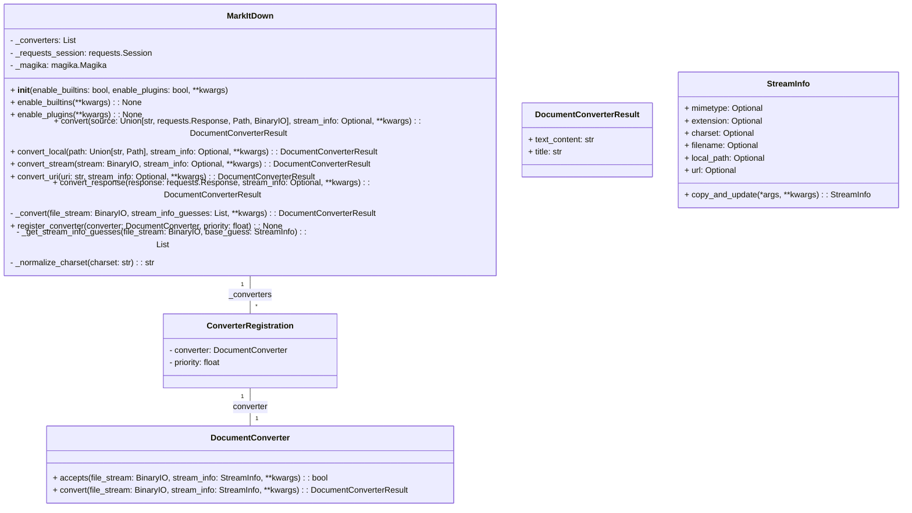

**Component Description:**

The `MarkItDown` component is responsible for converting various file formats and web resources into Markdown. It acts as an orchestrator, managing a collection of `DocumentConverter` instances, each specialized in handling a specific file type. The main class, `MarkItDown`, provides methods to convert content from local files, streams, URLs, and HTTP responses. It uses `StreamInfo` to store metadata about the input source, which helps in selecting the appropriate converter. The `DocumentConverter` is an abstract base class that defines the interface for all converters. Concrete converter implementations (e.g., `PdfConverter`, `DocxConverter`) inherit from `DocumentConverter` and provide the logic to convert specific file types to Markdown. The `ConverterRegistration` class associates a `DocumentConverter` with a priority, which determines the order in which converters are tried. The `DocumentConverterResult` class encapsulates the output of a conversion, containing the Markdown content and the document's title.

**Visualization:**

The class diagram above illustrates the structure of the `MarkItDown` component, highlighting the relationships between the main classes involved in the conversion process.