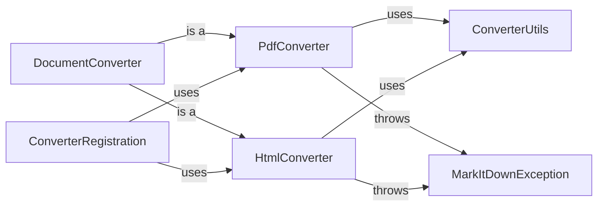

## Component Details

One paragraph explaining the functionality which is represented by this graph. What the main flow is and what is its purpose.

### DocumentConverter
Abstract base class defining the interface for all document converters. Specifies the convert method that subclasses must implement.

**Related Classes/Methods**:

- <a href="https://github.com/microsoft/markitdown/blob/master/packages/markitdown/src/markitdown/_base_converter.py#L1-L100" target="_blank" rel="noopener noreferrer">`markitdown._base_converter.py` (1:100)</a>

### PdfConverter
Concrete converter for PDF files. Implements the convert method from DocumentConverter.

**Related Classes/Methods**:

- <a href="https://github.com/microsoft/markitdown/blob/master/packages/markitdown/src/markitdown/converters/_pdf_converter.py#L1-L100" target="_blank" rel="noopener noreferrer">`markitdown.converters._pdf_converter.py` (1:100)</a>

### HtmlConverter
Concrete converter for HTML files. Implements the convert method from DocumentConverter.

**Related Classes/Methods**:

- <a href="https://github.com/microsoft/markitdown/blob/master/packages/markitdown/src/markitdown/converters/_html_converter.py#L1-L100" target="_blank" rel="noopener noreferrer">`markitdown.converters._html_converter.py` (1:100)</a>

### ConverterRegistration
Manages the mapping between file types (extensions) and the appropriate converter class.

**Related Classes/Methods**:

- <a href="https://github.com/microsoft/markitdown/blob/master/packages/markitdown/src/markitdown/_markitdown.py#L1-L100" target="_blank" rel="noopener noreferrer">`markitdown._markitdown.py` (1:100)</a>

### ConverterUtils
Contains utility functions used by multiple converters (e.g., common text processing, cleaning).

**Related Classes/Methods**:

- `markitdown.converter_utils.py` (1:100)

### MarkItDownException
Base class for custom exceptions within the system. Provides a consistent exception handling mechanism.

**Related Classes/Methods**:

- <a href="https://github.com/microsoft/markitdown/blob/master/packages/markitdown/src/markitdown/_exceptions.py#L1-L100" target="_blank" rel="noopener noreferrer">`markitdown._exceptions.py` (1:100)</a>

### [FAQ](https://github.com/CodeBoarding/GeneratedOnBoardings/tree/main?tab=readme-ov-file#faq)