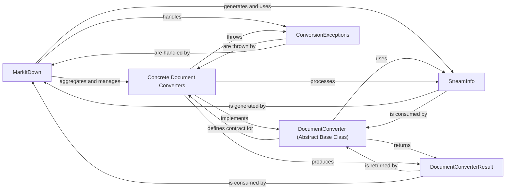

## Component Details

This subsystem, `markitdown`, is designed to convert various document formats into Markdown. Its architecture is built around a central orchestrator (`MarkItDown`) that leverages an extensible system of document converters. The core components facilitate input handling, conversion logic, and structured output/error management.

### MarkItDown
The central orchestrator of the `markitdown` subsystem. It manages the registration and selection of different document converters, handles various input sources (local files, URLs, binary streams, HTTP responses), and dispatches the conversion task to the appropriate converter. It also incorporates logic for guessing stream information (like mimetype and charset) using external libraries (`magika` and `charset_normalizer`).

**Related Classes/Methods**:

- <a href="https://github.com/microsoft/markitdown/blob/master/packages/markitdown/src/markitdown/_markitdown.py#L92-L770" target="_blank" rel="noopener noreferrer">`markitdown._markitdown.MarkItDown` (92:770)</a>

### DocumentConverter (Abstract Base Class)
Defined in `markitdown._base_converter.py`, this abstract base class establishes the common interface and contract for all document converters. It defines two key methods: `accepts()` for determining if a converter can handle a given stream, and `convert()` for performing the actual conversion. It ensures that all concrete converters adhere to a consistent API, making the subsystem extensible and easy to manage.

**Related Classes/Methods**:

- <a href="https://github.com/microsoft/markitdown/blob/master/packages/markitdown/src/markitdown/_base_converter.py#L41-L104" target="_blank" rel="noopener noreferrer">`markitdown._base_converter.DocumentConverter` (41:104)</a>
- <a href="https://github.com/microsoft/markitdown/blob/master/packages/markitdown/src/markitdown/_base_converter.py#L44-L81" target="_blank" rel="noopener noreferrer">`markitdown._base_converter.DocumentConverter:accepts` (44:81)</a>
- <a href="https://github.com/microsoft/markitdown/blob/master/packages/markitdown/src/markitdown/_base_converter.py#L83-L104" target="_blank" rel="noopener noreferrer">`markitdown._base_converter.DocumentConverter:convert` (83:104)</a>

### Concrete Document Converters
These are individual classes (e.g., `PlainTextConverter`, `HtmlConverter`, `PdfConverter`), each inheriting from `markitdown._base_converter.DocumentConverter`. Each concrete converter is responsible for converting a specific file format or content type into Markdown, implementing the `accepts` and `convert` methods defined by the abstract base class.

**Related Classes/Methods**:

- <a href="https://github.com/microsoft/markitdown/blob/master/packages/markitdown/src/markitdown/converters/_plain_text_converter.py#L32-L70" target="_blank" rel="noopener noreferrer">`markitdown.converters._plain_text_converter.PlainTextConverter` (32:70)</a>
- <a href="https://github.com/microsoft/markitdown/blob/master/packages/markitdown/src/markitdown/converters/_html_converter.py#L19-L89" target="_blank" rel="noopener noreferrer">`markitdown.converters._html_converter.HtmlConverter` (19:89)</a>
- <a href="https://github.com/microsoft/markitdown/blob/master/packages/markitdown/src/markitdown/converters/_pdf_converter.py#L30-L76" target="_blank" rel="noopener noreferrer">`markitdown.converters._pdf_converter.PdfConverter` (30:76)</a>

### StreamInfo
A data class (`markitdown._stream_info.StreamInfo`) used to encapsulate critical information about the input stream, such as mimetype, file extension, filename, local path, and URL. This information is crucial for `MarkItDown` to select the correct converter and for converters to process the input effectively.

**Related Classes/Methods**:

- <a href="https://github.com/microsoft/markitdown/blob/master/packages/markitdown/src/markitdown/_stream_info.py#L5-L31" target="_blank" rel="noopener noreferrer">`markitdown._stream_info.StreamInfo` (5:31)</a>

### DocumentConverterResult
A data class (`markitdown._base_converter.DocumentConverterResult`) representing the output of a successful conversion. It typically contains the converted Markdown text content and potentially other metadata relevant to the conversion outcome.

**Related Classes/Methods**:

- <a href="https://github.com/microsoft/markitdown/blob/master/packages/markitdown/src/markitdown/_base_converter.py#L4-L38" target="_blank" rel="noopener noreferrer">`markitdown._base_converter.DocumentConverterResult` (4:38)</a>

### ConversionExceptions
Custom exception classes (e.g., `FailedConversionAttempt`, `FileConversionException`, `UnsupportedFormatException`) defined in `markitdown._exceptions.py`. These are used to signal and handle various errors that can occur during the conversion process, providing clear and specific error reporting and handling mechanisms.

**Related Classes/Methods**:

- <a href="https://github.com/microsoft/markitdown/blob/master/packages/markitdown/src/markitdown/_exceptions.py#L41-L48" target="_blank" rel="noopener noreferrer">`markitdown._exceptions.FailedConversionAttempt` (41:48)</a>
- <a href="https://github.com/microsoft/markitdown/blob/master/packages/markitdown/src/markitdown/_exceptions.py#L51-L75" target="_blank" rel="noopener noreferrer">`markitdown._exceptions.FileConversionException` (51:75)</a>
- <a href="https://github.com/microsoft/markitdown/blob/master/packages/markitdown/src/markitdown/_exceptions.py#L33-L38" target="_blank" rel="noopener noreferrer">`markitdown._exceptions.UnsupportedFormatException` (33:38)</a>

### [FAQ](https://github.com/CodeBoarding/GeneratedOnBoardings/tree/main?tab=readme-ov-file#faq)