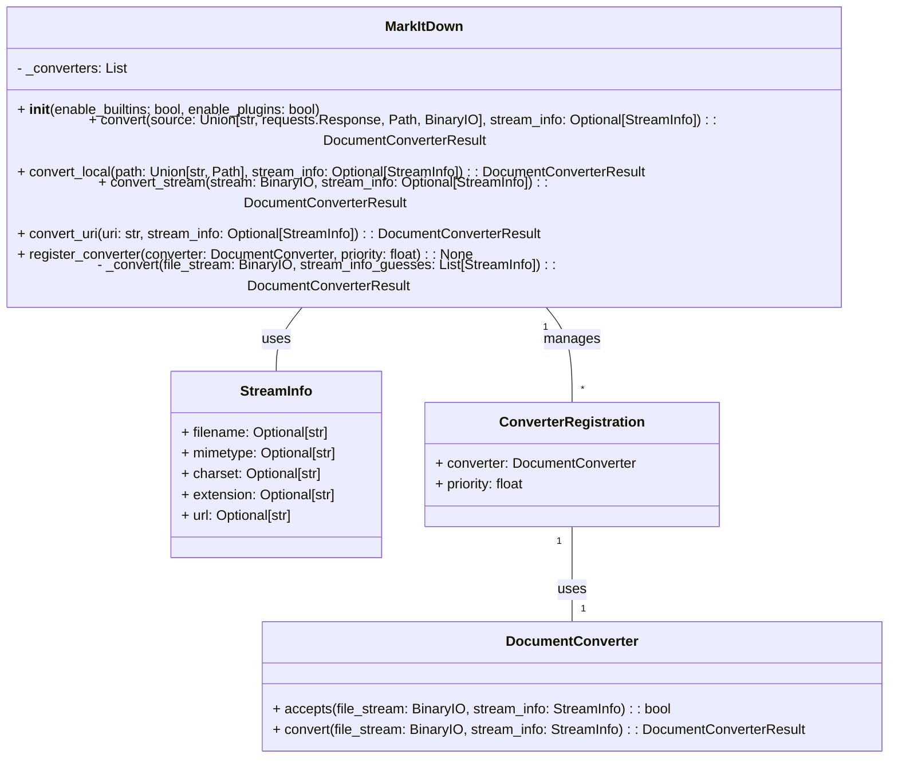

Based on the code analysis, here's a refined overview of the `markitdown` component:

**Description:**

The `markitdown` component is a versatile tool designed to convert various document formats and web resources into Markdown. It orchestrates the conversion process, leveraging a registry of `DocumentConverter` instances to handle different file types. The component supports local files, remote URLs, and standard input, providing flexibility in how documents are processed. It also incorporates plugin support, allowing for extending its conversion capabilities.

**Main Classes and Their Purposes:**

1.  **`MarkItDown`**: The central class responsible for managing the conversion process. It maintains a registry of `DocumentConverter` instances, handles stream information, and orchestrates the conversion workflow. Key methods include `convert`, `convert_local`, `convert_stream`, `convert_uri`, and `register_converter`.
2.  **`DocumentConverter`**: An abstract base class that defines the interface for all document converters. Subclasses must implement the `accepts` method to determine if the converter can handle a given file type and the `convert` method to perform the actual conversion.
3.  **`StreamInfo`**: A data class that encapsulates metadata about the input stream, such as filename, MIME type, and charset. It's used to provide context to the converters and aid in the conversion process.
4.  **`ConverterRegistration`**: A data class that associates a `DocumentConverter` with a priority. This allows for controlling the order in which converters are attempted during the conversion process.
5.  **`CLI` (markitdown.__main__.main)**: Handles command-line argument parsing, input/output operations, and instantiation of the `MarkItDown` class. It serves as the entry point for the application.

**Visualization:**

Below is a class diagram representing the structure of the `markitdown` component.

